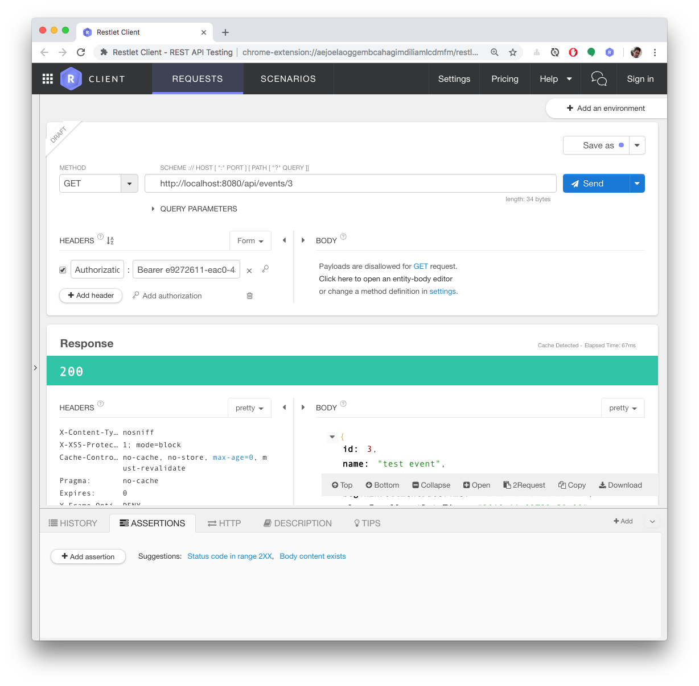
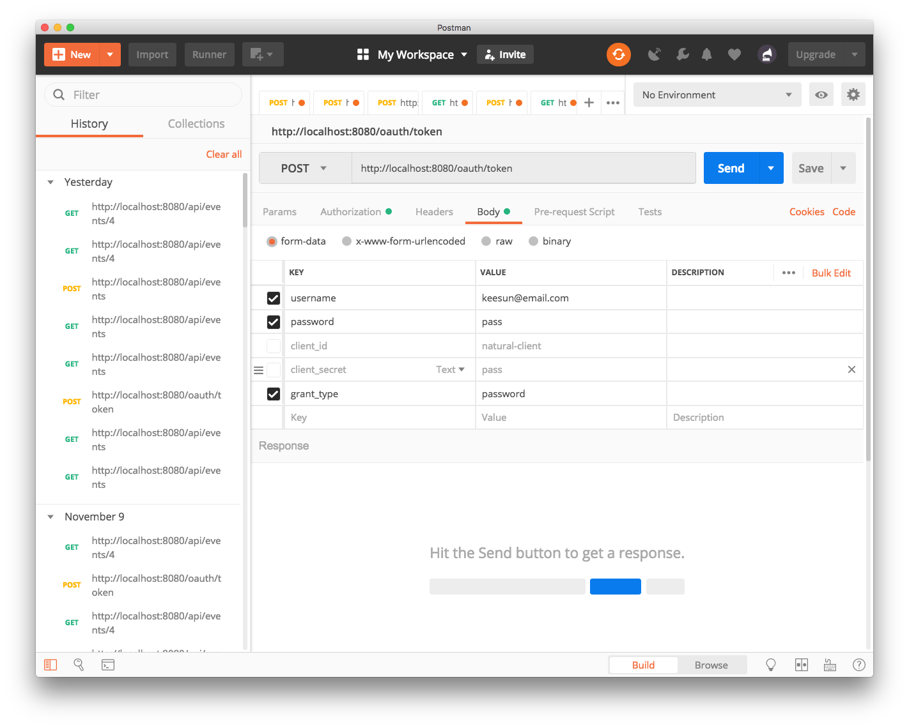

# Events API 사용 예제

1. (토큰 없이) 이벤트 목록 조회

   a. create 안 보임

2. access token 발급 받기 (A 사용자 로그인)

3. (유효한 A 토큰 가지고) 이벤트 목록 조회

   a. create event 보임

4. (유효한 A 토큰 가지고) 이벤트 만들기

5. (토큰 없이) 이벤트 조회

   a. update 링크 안 보임

6. (유효한 A 토큰 가지고) 이벤트 조회

   a. update 링크 보임

7. access token 발급 받기 (B 사용자 로그인)

8. (유효한 B 토큰 가지고) 이벤트 조회

   a. update 안 보임

REST API 테스트 클라이언트 애플리케이션

* 크롬 플러그인
  * Restlet
    
* 애플리케이션
  * Postman

---

