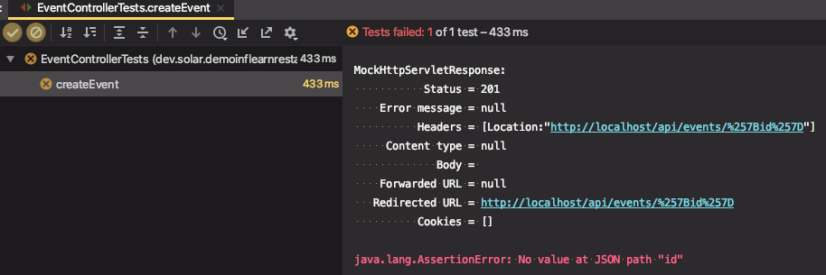
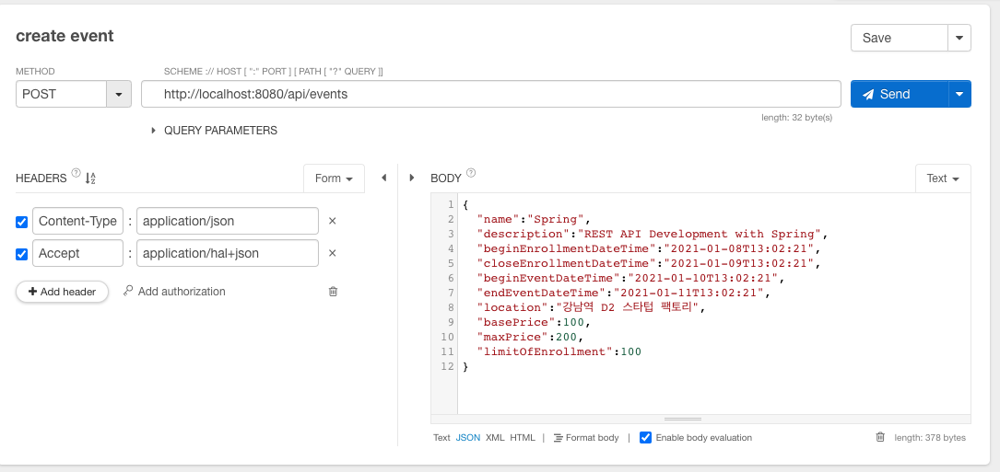
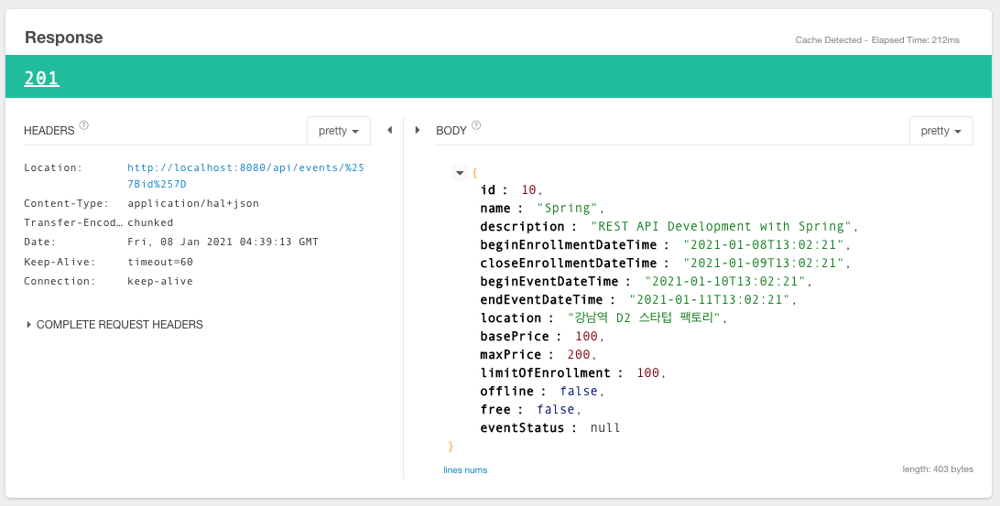

# Event 생성 API 구현: 201 응답 받기

@RestController

* @ResponseBody를 모든 메소드에 적용한 것과 동일하다.

ResponseEntity를 사용하는 이유

* 응답 코드, 헤더, 본문 모두 다루기 편한 API

Location URI 만들기

* (ResponseEntity.created() : 응답코드 생성시 URL 필요)

* HATEOS가 제공하는 linkTo(), methodOn() 사용

  ```java
  org.springframework.hateoas.server.mvc.WebMvcLinkBuilder.linkTo;
  org.springframework.hateoas.server.mvc.WebMvcLinkBuilder.methodOn;
  ```

객체를 JSON으로 변환

* ObjectMapper 사용

테스트 할 것

> * **입력값들을 전달하면 JSON 응답으로 201이 나오는지 확인.**
> * **Location 헤더에 생성된 이벤트를 조회할 수 있는 URI 담겨 있는지 확인.**
> * id는 DB에 들어갈 때 자동생성된 값으로 나오는지 확인

---

## 테스트를 통과하기 위한 EventController 생성

### 테스트 사항

* **입력값들을 전달하면 JSON 응답으로 201이 나오는지 확인.**
* **Location 헤더에 생성된 이벤트를 조회할 수 있는 URI 담겨 있는지 확인.**


#### 이벤트를 조회할 수 있는 URI를 만들어서 Header 의 Location 정보로 전달

* ResponseEntity.created(`URI` 정보)

  linkTo(`url정보`) : link를 생성

  url 정보 : methodOn(url이 있는 클래스위치).url맵핑된 메서드

  slash("{id}") : `/{id}` 로 id값에 해당하는 이벤트를 조회하는 경로

  toUri() : 링크를 uri로 변환

```java
@Controller
public class EventController {

    @PostMapping("/api/events")
    public ResponseEntity createEvent() {

        URI createdUri = linkTo(methodOn(EventController.class).createEvent()).slash("{id}").toUri();
        return ResponseEntity.created(createdUri).build();
    }
}
```

→ 테스트 통과

​	Location: http://localhost/api/events/{id}

```
MockHttpServletResponse:
           Status = 201 //<- * 응답코드
    Error message = null
          Headers = [Location:"http://localhost/api/events/%257Bid%257D"] //<- * 
     Content type = null
             Body = 
    Forwarded URL = null
   Redirected URL = http://localhost/api/events/%257Bid%257D
```


### 테스트 사항

* 응답으로 id값이 왔는지 확인
* 헤더에 "Location" 정보가 있는지
* 헤더에 "Content-Type" 정보가 맞는지

```java
.andExpect(jsonPath("id").exists());
.andExpect(header().exists("Location"))
  .andExpect(header().string("Content-Type", "application/hal+json"));
```

→ 테스트 실패




#### 제대로된 요청을 생성해보자 (테스트 코드) - 이벤트 생성을 위한 입력값들을 전달

(지금은 불완전한 상태로 응답이 제대로 올 수 없음)

Event 생성 API에서 필요한 입력값을 추가해서 요청을 보내자

* Event 생성 API는 다음의 입력 값을 받는다.
  * name
  * description
  * beginEnrollmentDateTime : 이벤트 등록 시작 시간
  * closeEnrollmentDateTime : 이벤트 등록 종료 시간
  * beginEventDateTime : 이벤트 시작 일시
  * endEventDateTime : 이벤트 종료 일시
  * location (optional) : 이벤트 장소 - 이게 없으면 온라인 모임
  * basePrice (optional) : 기본 등록비
  * maxPrice (optional)
  * limitOfEnrollment : 등록 참여인원 제한

※ [이벤트 비즈니스 로직 참고](./01_06_이벤트 비즈니스 로직.md)


헤더 정보에 맞게 본문을 JSON으로 변환해서 넘겨줘야한다. 

mapping jackson json이 의존성으로 들어가있으면 `ObjectMapper`를 자동으로 빈으로 등록해준다.

```java
@Autowired
ObjectMapper objectMapper;

@Test
public void createEvent() throws Exception {
    Event event = Event.builder() // Event 생성을 위한 데이터 
            .name("Spring")
            .description("REST API Development with Spring")
            .beginEnrollmentDateTime(LocalDateTime.of(2021, 1, 8, 13, 2, 21))
            .closeEnrollmentDateTime(LocalDateTime.of(2021, 1, 9, 13, 2, 21))
            .beginEventDateTime(LocalDateTime.of(2021, 1, 10, 13, 2, 21))
            .endEventDateTime(LocalDateTime.of(2021, 1, 11, 13, 2, 21))
            .basePrice(100)
            .maxPrice(200)
            .limitOfEnrollment(100)
            .location("강남역 D2 스타텁 팩토리")
            .build();

    mockMvc.perform(post("/api/events/")
    .contentType(MediaType.APPLICATION_JSON)
    .accept(MediaTypes.HAL_JSON) // Response 데이터 타입
    .content(objectMapper.writeValueAsString(event))) // 헤더 정보에 맞게 본문을 JSON으로 변환해서 넘겨줘야한다.
            .andDo(print())
            .andExpect(status().isCreated())
    .andExpect(jsonPath("id").exists());
}
```


#### Controller에서 넘겨받은 Event 정보를 Body에 JSON형태로 넘겨준다.

DB에 실제 저장을하지 않으므로 임의의 id값을 셋팅해서 반환하도록 코드 추가

응답 body에 넘겨받은 Event 정보를 그대로 담아서 전달한다.

```java
@Controller
@RequestMapping(value = "/api/events", produces = MediaTypes.HAL_JSON_VALUE)
public class EventController {

    @PostMapping()
    public ResponseEntity createEvent(@RequestBody Event event) {
        URI createdUri = linkTo(EventController.class).slash("{id}").toUri();
        event.setId(10); //임의의 id 값
        return ResponseEntity.created(createdUri).body(event); //body에 담아서 전달
    }
}
```


→ 테스트 결과

```
// 요청
MockHttpServletRequest:
      HTTP Method = POST
      Request URI = /api/events/
       Parameters = {}
          Headers = [Content-Type:"application/json;charset=UTF-8", Accept:"application/hal+json", Content-Length:"405"]
             Body = {"id":null,"name":"Spring","description":"REST API Development with Spring","beginEnrollmentDateTime":"2021-01-08T13:02:21","closeEnrollmentDateTime":"2021-01-09T13:02:21","beginEventDateTime":"2021-01-10T13:02:21","endEventDateTime":"2021-01-11T13:02:21","location":"강남역 D2 스타텁 팩토리","basePrice":100,"maxPrice":200,"limitOfEnrollment":100,"offline":false,"free":false,"eventStatus":null}
    Session Attrs = {}
    
//응답
MockHttpServletResponse:
           Status = 201
    Error message = null
          Headers = [Location:"http://localhost/api/events/%257Bid%257D", Content-Type:"application/hal+json"]
     Content type = application/hal+json
             Body = {"id":10,"name":"Spring","description":"REST API Development with Spring","beginEnrollmentDateTime":"2021-01-08T13:02:21","closeEnrollmentDateTime":"2021-01-09T13:02:21","beginEventDateTime":"2021-01-10T13:02:21","endEventDateTime":"2021-01-11T13:02:21","location":"강남역 D2 스타텁 팩토리","basePrice":100,"maxPrice":200,"limitOfEnrollment":100,"offline":false,"free":false,"eventStatus":null}
    Forwarded URL = null
   Redirected URL = http://localhost/api/events/%257Bid%257D
          Cookies = []
```


#### 리팩토링

```java
@Controller
public class EventController {

    @PostMapping("/api/events")
    public ResponseEntity createEvent(@RequestBody Event event) {
        URI createdUri = linkTo(methodOn(EventController.class).createEvent(null)).slash("{id}").toUri(); //createEvent에 매개변수를 추가해줘서 createEvent(null)에 null을 추가해줌
        return ResponseEntity.created(createdUri).build();
    }
}
```

→ 리팩토링 : baseUrl과 MediaType을 설정

컨트롤러 내의 모든 요청은 baseUrl 하위의 url에 맵핑되고, 지정한 MediaType으로 반환된다.

```java
@Controller
@RequestMapping(value = "/api/events", produces = MediaTypes.HAL_JSON_VALUE)
public class EventController {

    @PostMapping()
    public ResponseEntity createEvent(@RequestBody Event event) {
        URI createdUri = linkTo(EventController.class).slash("{id}").toUri();
        event.setId(10); //임의의 id 값
        return ResponseEntity.created(createdUri).body(event);
    }
}
```







---

#### 질문

> 질문 1
>
> Header 의 Location 정보는
>
> ResponseEntity.created(uri정보)에 의해 만들어 지는건가요?
>
> 질문 2
>
> 컨트롤러의 에노테이션이 @RestController이고 반환되는 데이터 타입이 객체(예: User)인 경우
>
> 디폴트로 json형태로 반환되는지요
>
> 질문3
>
> ResponseEntity로 반환 하는건 객체를 body에 담을 수도 있고 헤더 정보등을 셋팅 할수 있기 때문에 사용 하는 건지요

질문1. 네 맞습니다.

질문2. 이건 좀 복잡한데요. 요청에 들어있는 헤더 정보(Accept)와 스프링 MVC에 설정되어 있는 메시지 컨버터에 따라 달라지는데요. 그냥 기본으로 스프링 부트를 쓴다고 가정했을 때는 말씀하신대로 JSON으로 보여줍니다.

질문 3. 맞습니다.

> **한글 인코딩 문제**
>
> 
>
> MockMvc로 테스트 중입니다. 응답값이 한글이면 깨지길래 위와 같이 해결했습니다. 근데 너무 지저분해보입니다 ㅠ
>
> 혹시 더 좋은 방법 알고계시다면 알려주세요! 감사합니다!

흠.. 글쎄요. static final String으로 상수를 새로 정의해서 쓰시거나, charset=utf8이 필요없게 만들면 좋을거 같네요. 한글이 왜 깨지는지를 파고 드셔야 할거 같습니다. 서버의 기본 인코딩이 UTF8이 아닌가 보네요?

* @SpringBootTest 인 경우 적용되는 방법

  ```properties
  spring.http.encoding.charset=UTF-8
  spring.http.encoding.enabled=true
  spring.http.encoding.force=true
  ```

  application.properties 에 추가 하면 되네요 검색해보면 헤더나 필터에 직접 설정하는 방법이 나오던데 제경우엔 이렇게 하니 한글로 잘 출력 됩니다.

* 위 해결방법은 @WebMvcTest 슬라이싱 테스트할때 는 적용이 안되고 @SpringBootTest이여야 적용 되는것 같습니다. (application.properties적용하는 빈이 없어서 ?) @WebMvcTest 어노테이션으로 한글이 안깨지도록하려면 mockMvc 설정을 변경해서 해결했습니다

  ```java
  @Autowired
  private WebApplicationContext ctx;
  
  @Before
  public void setup() {
      this.mockMvc = MockMvcBuilders.webAppContextSetup(ctx)
              .addFilters(new CharacterEncodingFilter("UTF-8", true))  // 필터 추가
              .alwaysDo(print())
              .build();
  }
  ```

  ```
  MockHttpServletResponse:
             Status = 201
      Error message = null
            Headers = [Location:"http://localhost/api/events/%257Bid%257D", Content-Type:"application/hal+json;charset=UTF-8"]
       Content type = application/hal+json;charset=UTF-8
               Body = {"id":10,"name":"Spring","description":"REST API Development with Spring","beginEnrollmentDateTime":"2021-01-08T13:02:21","closeEnrollmentDateTime":"2021-01-09T13:02:21","beginEventDateTime":"2021-01-10T13:02:21","endEventDateTime":"2021-01-11T13:02:21","location":"강남역 D2 스타텁 팩토리","basePrice":100,"maxPrice":200,"limitOfEnrollment":100,"offline":false,"free":false,"eventStatus":null}
      Forwarded URL = null
     Redirected URL = http://localhost/api/events/%257Bid%257D
            Cookies = []
  ```

  