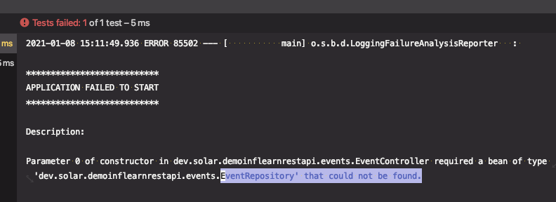

# Event 생성 API 구현: EventRepository 구현

스프링 데이터 JPA

* JpaRepository 상속 받아 만들기

Enum을 JPA 맵핑시 주의할 것

* @Enumerated(EnumType.STRING)

  기본은 EnumType.ORDINARY로 ENUM에 선언한 순서대로 숫자값 형태로 저장된다. 

  ⇒ 나중에 순서가 변경되면 문제가 발생할 수 있으므로 STRING으로 설정해줄 것

@MockBean

* Mockito를 사용해서 mock 객체를 만들고 빈으로 등록해 줌.
* (주의) 기존 빈을 테스트용 빈이 대체 한다.

테스트 할 것

> * 입력값들을 전달하면 JSON 응답으로 201이 나오는지 확인.
> * Location 헤더에 생성된 이벤트를 조회할 수 있는 URI 담겨 있는지 확인.
> * **id는 DB에 들어갈 때 자동생성된 값으로 나오는지 확인**

---

## 테스트를 통과하기 위한 EventRepository 구현

### 테스트 사항

* **id는 DB에 들어갈 때 자동생성된 값**으로 나오는지 확인


#### Event

1. Event를 엔티티로

   ```java
   @Entity
   public class Event {
   ```

2. id 값을 식별자로, 자동증가값

   ```java
   @Id
   @GeneratedValue
   private Integer id;
   ```

3. EventStatus Enum 타입을 @Enumerated 맵핑

   ```java
   @Enumerated(EnumType.STRING)
   private EventStatus eventStatus;
   ```


#### EventRepository 생성

```java
public interface EventRepository extends JpaRepository<Event, Integer> {
}
```


#### EventController

EventRepository 주입받아서 사용

생성자를 사용할 때, 생성자가 하나뿐이고 생성자로 받아올 파라미터가 이미 빈으로 등록되어 있다면 `@Autowird` 애노테이션을 생략할 수 있다.

DB에 전달받은 Event 저장 후, 반환된 저장된 Event의 ID값을 body에 담아서 반환

```java
@Controller
@RequestMapping(value = "/api/events", produces = MediaTypes.HAL_JSON_VALUE)
public class EventController {

    private final EventRepository eventRepository;

    public EventController(EventRepository eventRepository) {
        this.eventRepository = eventRepository;
    }

    @PostMapping()
    public ResponseEntity createEvent(@RequestBody Event event) {
        Event newEvent = this.eventRepository.save(event);
        URI createdUri = linkTo(EventController.class).slash(newEvent.getId()).toUri(); // DB에 저장된 ID 값
        return ResponseEntity.created(createdUri).body(newEvent); //저장된 Event 정보 반환
    }
}
```


⇒ 테스트 실패

`EventRepository`를 찾을 수 없다.




