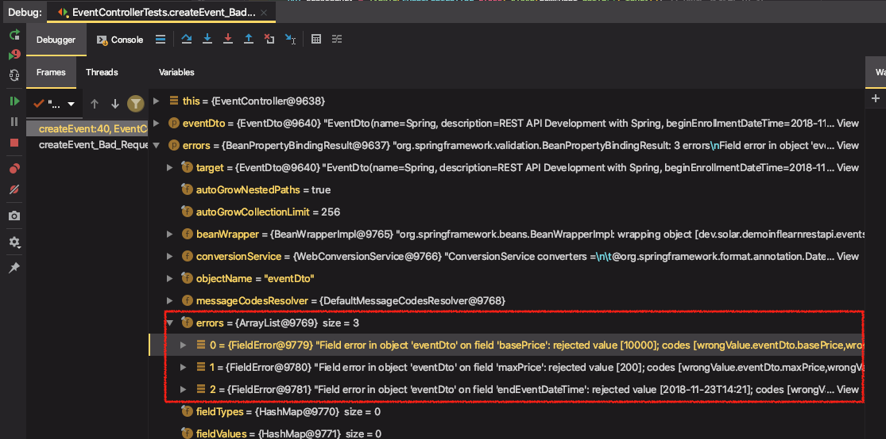
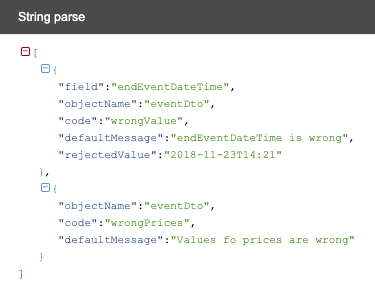

# Event 생성 API 구현: Bad Request 응답 본문 만들기

커스텀 JSON Serializer 만들기

* extends JsonSerializer<T> (Jackson JSON 제공)
* @JsonComponent (스프링 부트 제공)

BindingError

* FieldError 와 GlobalError (ObjectError)가 있음
* objectName
* defaultMessage
* codefield
* rejectedValue

테스트 할 것

> * 입력 데이터가 이상한 경우 Bad_Request로 응답
>   * 입력값이 이상한 경우 에러
>   * 비즈니스 로직으로 검사할 수 있는 에러
>   * **에러 응답 메시지에 에러에 대한 정보가 있어야 한다.**

---

## Bad Request 응답 본문 테스트

* 응답으로 다음 내용이 있는지 확인

에러 배열이 전달될 것이고, 에러 배열 중에 어떤 값을 담아서 응답으로 보내줄지 설정

objectName, 어떤 필드에서 발생, 기본 메시지, 어떤 에러 코드, 입력을 거절당한 (에러가 발생한) 값이 어떤 것인지

```java
@Test
@TestDescription("입력 값이 잘못된 경우에 에러가 발생하는 테스트")
public void createEvent_Bad_Request_Wrong_Input() throws Exception {
    EventDto eventDto = EventDto.builder()
            .name("Spring")
					//...
            .build();

    this.mockMvc.perform(post("/api/events")
            .contentType(MediaType.APPLICATION_JSON)
            .content(this.objectMapper.writeValueAsString(eventDto)))
            .andExpect(status().isBadRequest())
            .andExpect(jsonPath("$[0].objectName").exists()) // 응답 본문에 있어야 하는 값
            .andExpect(jsonPath("$[0].field").exists())
            .andExpect(jsonPath("$[0].defaultMessage").exists())
            .andExpect(jsonPath("$[0].code").exists())
            .andExpect(jsonPath("$[0].rejectedValue").exists())
    ;
}
```


응답 본문에 담아줄 정보들을 `Errors`에 들어있다.

다음 break point에서 디버깅을 해보자 (해당 테스트 디버깅)

```java
if (errors.hasErrors()) {
```

 


> error를 body()에 담으면 객체→ JSON으로 변환돼서 나가지 않을까?

Nope. event는 되는데 왜 error는 안되나?

Evnt는 자바 빈 스펙을 준수하기 때문에 ObjectMapper가 BeanSerializer를 통해서 Serialization(객체 → JSON)을 해주는 것이고, Error는 자바 빈 스펙을 준수하지 않기 때문에 BeanSerializer를 이용해서 JSON으로 변활할 수 없는 것이다.


## 커스텀 JSON Serializer 구현

* extends JsonSerializer<T> (Jackson JSON 제공)
  * ***serialize()*** 구현
* @JsonComponent (스프링 부트 제공)

BindingError

* FieldError 와 GlobalError (ObjectError)가 있음
  * FieldError : rejectValue(field, errorCode, defaultMessage)
  * GlobalError : rejectValue(errorCode, defaultMessage)
  * FiledError, GlobalError 배열 각각 두 가지를 맵핑해서 JSON에 담아줘야 한다.
* objectName
* defaultMessage
* codefield
* rejectedValue


1. errors에는 에러가 여러개이므로 이를 배열로 담아주기 위해서 writeStartArray(), writeEndArray()를 사용

   ```java
   gen.writeStartArray();
   //..
   gen.writeEndArray();
   ```


2. FiledError, GlobalError 배열 각각 두 가지를 맵핑해서 JSON에 담아줘야 한다.

   에러마다 객체를 만들어준다. 

   ```java
   // FieldError
   errors.getFieldErrors().forEach(e -> {
       gen.writeStartObject();
       // ...
       gen.writeEndObject();
   });
   
   // GlobalError
   errors.getGlobalErrors().forEach(e -> {
       gen.writeStartObject();
       // ...
       gen.writeEndObject();
   });
   ```


3. JSON Object 내용을 채우기

   fieldName와 값을 전달

   getRejectedValue()는 있을수도 없을수도 있음. 있는 경우에는 JSON에 담아줌

   ```java
   gen.writeStringField("field", e.getField());
   gen.writeStringField("objectName", e.getObjectName());
   gen.writeStringField("code", e.getCode());
   gen.writeStringField("defaultMessage", e.getDefaultMessage());
   Object rejectedValue = e.getRejectedValue();
   if (rejectedValue != null) {
       gen.writeStringField("rejectedValue", rejectedValue.toString());
   }
   ```


4. 구현한 Serializer을 ObjectMapper에 등록

   * @JsonComponent (스프링 부트 제공) 이용

   ```java
   @JsonComponent
   public class ErrorsSerializer  extends JsonSerializer<Errors> {
   ```


→ (테스트 성공)

Client에게 어떤 정보가 잘못되었는지 정보를 전달해줄 수 있다.




