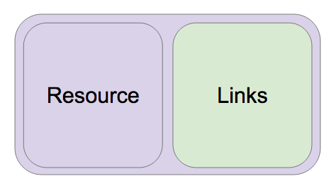

# 스프링 HATEOAS 소개

스프링 HATEOAS

* https://docs.spring.io/spring-hateoas/docs/current/reference/html/
* 링크 만드는 기능
  * 문자열 가지고 만들기
  * 컨트롤러와 메소드로 만들기
* 리소스 만드는 기능
  * 리소스: 데이터 + 링크
  * 링크 찾아주는 기능
    * Traverson
    * LinkDiscoverers
  * 링크
    * HREF
    * REL
      * self
      * profile
      * update-event
      * query-events

---

