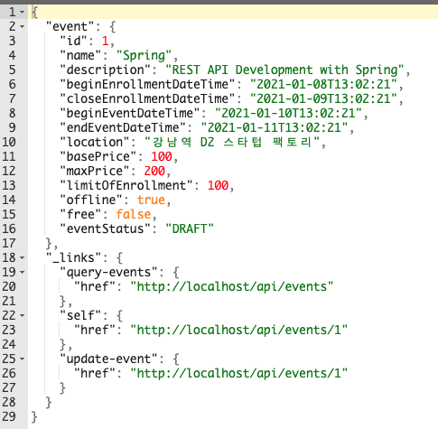
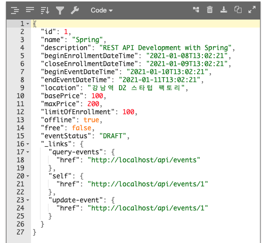

# 스프링 HATEOAS 적용

EvnetResource 만들기

* extends ResourceSupport의 문제
  * @JsonUnwrapped로 해결
  * extends Resource<T>로 해결

테스트 할 것

> * 응답에 HATEOA와 profile 관련 링크가 있는지 확인.
>   * self (view)
>   * update (만든 사람은 수정할 수 있으니까)
>   * events (목록으로 가는 링크)

---

## 테스트 추가

* 응답본문에 3가지 링크 정보가 들어가 있는지 확인

```java
.andExpect(jsonPath("_link.self").exists())
.andExpect(jsonPath("_link.query-events").exists())
.andExpect(jsonPath("_link.update-event").exists())
```

현재 아무런 링크정보가 없기때문에 어떠한 애플리케이션 상태로 전이할 수 없다. ⇒ HATEOAS를 만족하지 않음


## EvnetResource 만들기

* extends `RepresentationModel`의 문제
  * @JsonUnwrapped로 해결
  * extends Resource<T>로 해결

1. 스프링 HATEOAS가 지원하는 기능 중 `RepresentationModel` 를 상속받아서 구현

   getter로 리소스처럼 내보낼 수 있다.

2. Event → EventResource 로 변환해서 링크를 추가한 뒤 응답본문으로 반환

   링크를 추가하는 다양한 방법은 문서 참고

   self링크와 이벤트 수정 link값은 같지만 HTTP 메서드가 다르다. 현재는 어떤 메서드를 사용해야되는지 정보를 담을 수 없고, rel, link 정보만 담을 수 있다.

   ```java
   @PostMapping()
   public ResponseEntity createEvent(@RequestBody @Valid EventDto eventDto, Errors errors) {
     //...
       Event newEvent = this.eventRepository.save(event);
       URI createdUri = linkTo(EventController.class).slash(newEvent.getId()).toUri(); // DB에 저장된 ID 값
       return ResponseEntity.created(createdUri).body(new EventResource(newEvent)); //EventResource로 변환해서 전달
   }
   ```


⇒ 테스트 실패

링크정보가 응답 본문에 담겨있지만 원하는 포맷이 아니다. 지금은 `"event"`로 감싸져서 나옴

* 응답 본문



* 에러

  event로 감싸져 있어서 id값을 바로 찾지 못함.

  ```
  java.lang.AssertionError: No value at JSON path "id"
  ```


> 응답본문이 왜 이런 형태일까?

EventResource를 ObjectMapper가 Serialization할 때, BeanSerializer를 쓴다. BeanSerializer는 기본적으로 필드명을 사용한다. Event는 다른 필드들을 여러개 가지고 있는 Composite객체이기 때문에 이름 아래에 `"event"` 로 감싸준 것이다.

감싸지 않고 출력하고 싶다면?

* 방법 1 : Event 필드를 복사해서 EventSource에 붙여 넣고 일일이 값을 채워 넣는다.

* 방법 2 : `@JsonUnwrapped`를 사용하면 Wrapping을 꺼내준다.

  ```java
  public class EventResource extends RepresentationModel {
  
      @JsonUnwrapped
      private Event event;
    //...
  }
  ```

  

⇒ event로 감싸지 않고 원하는대로 나온다.


* 방법 3

`RepresentationModel` 클래스 하위에 `EntityModel`가 있다. `EntityModel`를 쓰면 `content`로 들어가는데, content 게터에 `@JsonUnwrapped`가 붙어있다.

```java
public class EntityModel<T> extends RepresentationModel<EntityModel<T>> {

   private T content;
  
  //...
  @Nullable
	@JsonUnwrapped //<- 이미 들어가있음
	@JsonSerialize(using = MapSuppressingUnwrappingSerializer.class)
	public T getContent() {
		return content;
	}
}
```

명시적으로 `@JsonUnwrapped`을 붙이지 않아도 UnWrapping 된다.

```java
public class EventResource extends EntityModel<Event> {

    public EventResource(Event content, Link ... links) {
        super(content, links);
    }
}
```

⇒ 빈이 아니므로 빈으로 등록하지 않고, 매번 새로 컨버팅해서 써야하는 객체이다.


응답의 Content-type이 `application/hal+json`이므로 클라이언트들이 응답의 `_links`필드에 링크정보를 들고있을 것이라고 예상할 수 있다. 따라서 링크 정보들을 바탕으로 링크를 파싱할 수 있다.


보통 `self` 링크는 해당 이벤트 리소스 마다 매번 설정해줘야하니깐 self 링크 추가하는 기능을 EventResource에서 하도록 리팩토링


---

##### 참고

 hateoas가 1.0.2 가 되면서 바뀐부분

- `ResourceSupport` is now `RepresentationModel`
- `Resource` is now `EntityModel`
- `Resources` is now `CollectionModel`
- `PagedResources` is now `PagedModel`

위와같이 변경되었고, 12분쯤에 나오는 Resource<Event> 초기화되는 부분이 없어진거 같습니다. 혹시 뒤늦게 보시는 분들 hateos 버전을 맞추던가, 아래 사이트 참고하세요. 

https://docs.spring.io/spring-hateoas/docs/1.0.1.RELEASE/reference/html/

https://github.com/bingbingpa/study-spring-rest-api/commit/d96c4f3ce5f62ace7064f6bc3aea8eae352a5a97