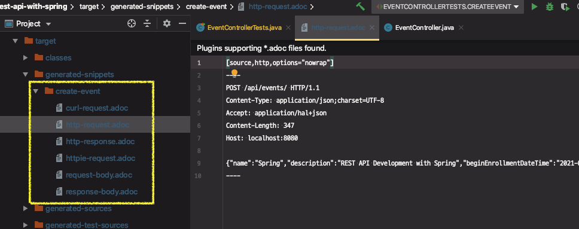
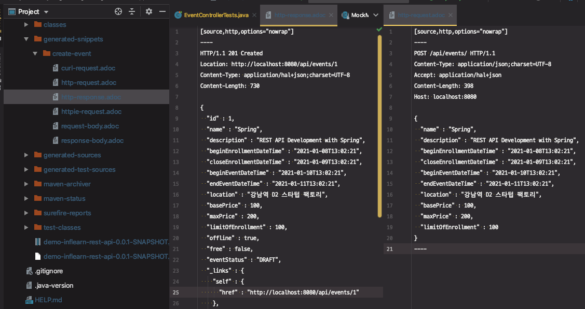

# 스프링 REST Docs 적용

REST Docs 자동 설정

* @AutoConfigureRestDocs

RestDocMockMvc 커스터마이징

* RestDocsMockMvcConfigurationCustomizer 구현한 빈 등록
* @TestConfiguration

테스트 할 것

> * API 문서 만들기
>   * **요청 본문 문서화**
>   * **응답 본문 문서화**
>   * 링크 문서화
>     * profile 링크 추가
>   * 응답 헤더 문서화

---

1. 의존성 추가

```xml
<dependency>
  <groupId>org.springframework.restdocs</groupId>
  <artifactId>spring-restdocs-asciidoctor</artifactId>
  <version>${spring-restdocs.version}</version>
</dependency>
```

2. REST Docs를 만들 테스트에 REST Docs 설정 

```java
public class EventControllerTests {
    @Autowired
    private WebApplicationContext ctx;

    @Rule
    public JUnitRestDocumentation restDocumentation = new JUnitRestDocumentation();

    @Before
    public void setup() {
        this.mockMvc = MockMvcBuilders.webAppContextSetup(ctx)
                .apply(documentationConfiguration(this.restDocumentation))
                .build();
    }
```

→ 애노테이션만 추가해서는 실행이 안돼서 문서([Setting up your JUnit 4 tests](https://docs.spring.io/spring-restdocs/docs/2.0.2.RELEASE/reference/html5/#getting-started-documentation-snippets-setup-junit)) 참고


3. MockMvc에 REST Docs 연동

`.andDo(document("create-event"))`

```java
@Test
@TestDescription("정상적으로 이벤트를 생성하는 테스트")
public void createEvent() throws Exception {
  EventDto event = EventDto.builder().build();

  mockMvc.perform(post("/api/events/")
                  .contentType(MediaType.APPLICATION_JSON)
                  .andDo(print())
                  .andExpect(status().isCreated())
                  .andExpect(jsonPath("_links.update-event").exists())
                  .andDo(document("create-event")) //응답결과로 스니펫 생성
                  ;
}

```


4. 테스트 성공하면 스니펫이 생성된다.



→ 포맷팅이 안돼있어서 보기가 불편하다.


5. 포맷팅하려면 REST Docs를 커스터마이징 해야한다.

※ [REST Docs Pretty printing](https://docs.spring.io/spring-restdocs/docs/2.0.2.RELEASE/reference/html5/#customizing-requests-and-responses-preprocessors-pretty-print)

```java
public class EventControllerTests {
    @Autowired
    private WebApplicationContext ctx;

    @Rule
    public JUnitRestDocumentation restDocumentation = new JUnitRestDocumentation();

    @Before
    public void setup() {
        this.mockMvc = MockMvcBuilders.webAppContextSetup(ctx)
                .addFilters(new CharacterEncodingFilter("UTF-8", true))  // 필터 추가
                .apply(documentationConfiguration(this.restDocumentation).operationPreprocessors()
                        .withRequestDefaults(prettyPrint()) //request 본문을 예쁘게 출력
                        .withResponseDefaults(prettyPrint())) //response 본문을 예쁘게 출력
                .alwaysDo(print())
                .build();
    }
}
```


6. 다시 테스트 실행

⇒ 매번 테스트 실행할 때마다 기존 스니펫은 오버라이딩 된다.

가독성 좋게 포맷팅돼서 보여준다.




---

### REF

[Spring Rest Docs를 이용한 API 문서 만들기](https://jaehun2841.github.io/2019/08/04/2019-08-04-spring-rest-docs/#spring-rest-docs%EB%9E%80)

https://huisam.tistory.com/entry/RESTDocs


