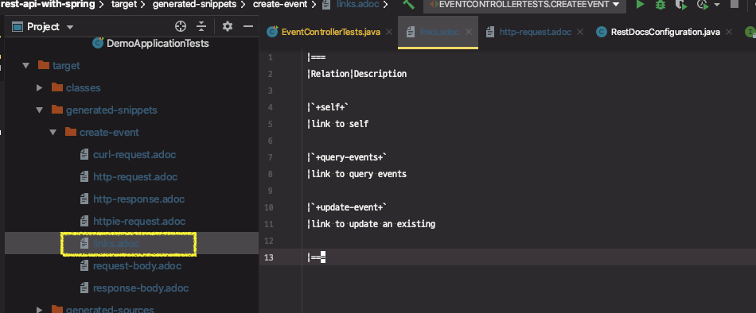

# 스프링 REST Docs: 링크, (Req, Res) 필드와 헤더 문서화

document()에 각각의 스니펫을 추가해주면 된다.

요청 필드 문서화

* requestFields() + fieldWithPath()
* responseFields() + fieldWithPath()
* requestHeaders() + headerWithName()
* responseHedaers() + headerWithName()
* links() + linkWithRel()

테스트 할 것

> * API 문서 만들기
>   * **요청 본문 문서화**
>   * **응답 본문 문서화**
>   * **링크 문서화**
>     * **self**
>     * **query-events**
>     * **update-event**
>     * profile 링크 추가(추후에)
>   * **요청 헤더 문서화**
>   * **요청 필드 문서화**
>   * **응답 헤더 문서화**
>   * **응답 필드 문서화**

Relaxed 접두어

* 장점: 문서 일부분만 테스트 할 수 있다.
* 단점: 정확한 문서를 생성하지 못한다.

---

**테스트할 내용**

이벤트 생성 테스트코드를 가지고 이벤트 생성 요청시 필요한 필드 정보, 헤더 정보, 응답 헤더, 응답 필드(JSON 필드가 어떤 의미를 가지고있는지 문서화), 응답에 보내지는 링크정보 문서화


### 링크 문서화

document()내에 links()추가

```java
.andDo(document("create-event",
        links(
                linkWithRel("self").description("link to self"),
                linkWithRel("query-events").description("link to query events"),
                linkWithRel("update-events").description("link to update an existing")
        )
))
```


→ 링크와 관련된 스니펫(문서조각)도 같이 생성된다.




### 요청 헤더 문서화

```java
.andDo(document("create-event",
                requestHeaders(
                  headerWithName(HttpHeaders.ACCEPT).description("accept header"),
                  headerWithName(HttpHeaders.CONTENT_TYPE).description("content type header")
                )
))
```


### 요청 필드 문서화

* curl-request.adoc 문서 보면서 문서화 작업

```java
requestFields(
  fieldWithPath("name").description("Name of new event"),
  fieldWithPath("description").description("description of new event"),
  fieldWithPath("beginEnrollmentDateTime").description("date time of begin of new event"),
  fieldWithPath("closeEnrollmentDateTime").description("date time of close of new event"),
  fieldWithPath("beginEventDateTime").description("date time of begin of new event"),
  fieldWithPath("endEventDateTime").description("date time of end of new event"),
  fieldWithPath("location").description("location of new event"),
  fieldWithPath("basePrice").description("base price of new event"),
  fieldWithPath("maxPrice").description("max price of new event"),
  fieldWithPath("limitOfEnrollment").description("limit of enrolmment")
)
```


### 응답 헤더 & 필드 문서화 & Relaxed 접두어

요청 문서화와 동일하게 진행. 

> 에러나는 이유?

응답의 일부가 문서화되지 않아 REST 문서가 테스트에 실패

→ Response 본문의 일부라고 인식하는데 links 추가하지 않았기 때문에나는 에러

```
org.springframework.restdocs.snippet.SnippetException: The following parts of the payload were not documented:
{
  "_links" : {
    "self" : {
      "href" : "http://localhost:8080/api/events/1"
    },
    "query-events" : {
      "href" : "http://localhost:8080/api/events"
    },
    "update-event" : {
      "href" : "http://localhost:8080/api/events/1"
    }
  }
}
```


모든 응답을 문서화하지 않고, 일부만 하고싶다면, `relaxed` prefix를 사용하면 된다.

여기서 확인하지 않는 응답의 부가적인 정보가 더 있더라도 테스트는 성공하게 된다.

```java
relaxedResponseFields(
        fieldWithPath("id").description("identifier of new event"),
        fieldWithPath("name").description("Name of new event"),
        fieldWithPath("description").description("description of new event"),
        fieldWithPath("beginEnrollmentDateTime").description("date time of begin of new event"),
        fieldWithPath("closeEnrollmentDateTime").description("date time of close of new event"),
  	//..
)
```


**Relaxed 접두어**

* 장점: 문서 일부분만 테스트 할 수 있다.
* 단점: 정확한 문서를 생성하지 못한다.

→ 쓰지않는 것을 권장. 전부 다 문서화하자. 그래야 API가 변경되었을 때, 해당 변경사항을 테스트가 감지해서 API 바꾼 코드에 맞추어 문서도 바로 업데이트 할 수 있다.


link들은 이미 HAL 스펙에 맞춘 링크 응답을 보고 판단한다. 이미 문서화 및 테스트가 완료된 것이다.

단지 응답을 테스트할때 응답에서 링크정보가 기술되지 않아서 에러가 나는 것은 이해할 수 없다. ⇒ Spring  Docs에 코드리뷰할만한 내용


---

# 스프링 REST Docs: 문서 빌드

스프링 REST Docs

* https://docs.spring.io/spring-restdocs/docs/2.0.2.RELEASE/reference/html5/
* pom.xml에 메이븐 플러그인 설정

```xml
<plugin>
  <groupId>org.asciidoctor</groupId>
  <artifactId>asciidoctor-maven-plugin</artifactId>
  <version>1.5.3</version>
  <executions>
    <execution>
      <id>generate-docs</id>
      <phase>prepare-package</phase>
      <goals>
        <goal>process-asciidoc</goal>
      </goals>
      <configuration>
        <backend>html</backend>
        <doctype>book</doctype>
      </configuration>
    </execution>
  </executions>
  <dependencies>
    <dependency>
      <groupId>org.springframework.restdocs</groupId>
      <artifactId>spring-restdocs-asciidoctor</artifactId>
      <version>2.0.2.RELEASE</version>
    </dependency>
  </dependencies>
</plugin>
<plugin>
  <artifactId>maven-resources-plugin</artifactId>
  <version>2.7</version>
  <executions>
    <execution>
      <id>copy-resources</id>
      <phase>prepare-package</phase>
      <goals>
        <goal>copy-resources</goal>
      </goals>
      <configuration>
        <outputDirectory>
          ${project.build.outputDirectory}/static/docs
        </outputDirectory>
        <resources>
          <resource>
            <directory>
              ${project.build.directory}/generated-docs
            </directory>
          </resource>
        </resources>
      </configuration>
    </execution>
  </executions>
</plugin>
```

* 템플릿 파일 추가
  * src/main/asciidoc/index.adoc

문서 생성하기

* mvn package
  * test
  * prepare-package :: process-asciidoc
  * prepare-package :: copy-resources
* 문서 확인
  * /docs/index.html

테스트 할 것

> * API 문서 만들기
>   * **요청 본문 문서화**
>   * **응답 본문 문서화**
>   * **링크 문서화**
>     * **self**
>     * **query-events**
>     * **update-event**
>     * profile 링크 추가
>   * **요청 헤더 문서화**
>   * **요청 필드 문서화**
>   * **응답 헤더 문서화**
>   * **응답 필드 문서화**

---


