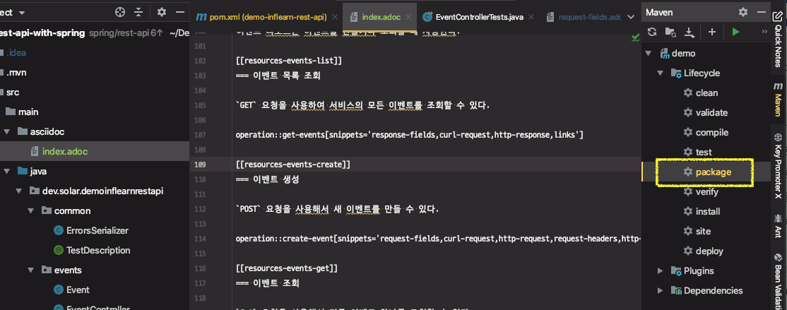

# 스프링 REST Docs: 문서 빌드

스프링 REST Docs

* https://docs.spring.io/spring-restdocs/docs/2.0.2.RELEASE/reference/html5/
* pom.xml에 메이븐 플러그인 설정
  * ★ **문서를 만들고 copy 해야하므로, 플러그인 순서가 중요!!** ★ 

```xml
<plugin>
  <groupId>org.asciidoctor</groupId>
  <artifactId>asciidoctor-maven-plugin</artifactId>
  <version>1.5.3</version>
  <executions>
    <execution>
      <id>generate-docs</id>
      <phase>prepare-package</phase>
      <goals>
        <goal>process-asciidoc</goal>
      </goals>
      <configuration>
        <backend>html</backend>
        <doctype>book</doctype>
      </configuration>
    </execution>
  </executions>
  <dependencies>
    <dependency>
      <groupId>org.springframework.restdocs</groupId>
      <artifactId>spring-restdocs-asciidoctor</artifactId>
      <version>2.0.2.RELEASE</version>
    </dependency>
  </dependencies>
</plugin>
<plugin>
  <artifactId>maven-resources-plugin</artifactId>
  <version>2.7</version>
  <executions>
    <execution>
      <id>copy-resources</id>
      <phase>prepare-package</phase>
      <goals>
        <goal>copy-resources</goal>
      </goals>
      <configuration>
        <outputDirectory>
          ${project.build.outputDirectory}/static/docs
        </outputDirectory>
        <resources>
          <resource>
            <directory>
              ${project.build.directory}/generated-docs
            </directory>
          </resource>
        </resources>
      </configuration>
    </execution>
  </executions>
</plugin>
```

* 템플릿 파일 추가
  * src/main/asciidoc/index.adoc

문서 생성하기

* mvn package
  * test
  * prepare-package :: process-asciidoc
  * prepare-package :: copy-resources
* 문서 확인
  * /docs/index.html

테스트 할 것

> * API 문서 만들기
>   * **요청 본문 문서화**
>   * **응답 본문 문서화**
>   * **링크 문서화**
>     * **self**
>     * **query-events**
>     * **update-event**
>     * profile 링크 추가
>   * **요청 헤더 문서화**
>   * **요청 필드 문서화**
>   * **응답 헤더 문서화**
>   * **응답 필드 문서화**

---

## 문서 빌드

1. pom.xml에 메이븐 플러그인 설정

2. 템플릿 파일 추가

   * src/main/asciidoc/index.adoc

   `snippets` : 요청과 관련된 스니펫을 끼워넣는다고 정의

   ```adoc
   
   [[resources-events-create]]
   === 이벤트 생성
   
   `POST` 요청을 사용해서 새 이벤트를 만들 수 있다.
   
   operation::create-event[snippets='request-fields,curl-request,http-request,request-headers,http-response,response-headers,response-fields,links']
   
   ```

3. 빌드

   * console : `mvn package`
   * IDE : Lifecycle > package

   

   패키징할 때 maven은 Lifecycle에 따라서 컴파일 → 테스트 컴파일 → 테스트 실행 → 패키징 을 진행한다.

   테스트를 실행할 때 우리가 만든 REST Docs 코드로 스니펫(문서조각)들이 생성되고,

   앞서 설정한 2개의 플러그인때문에 최종적으로 문서가 생성되고,

   문서가 스프링부트가 기본적으로 지원하는 static 디렉토리에 생성돼서 웹서버를 띄우면 API 문서 페이지를 뷰에서 확인할 수 있다.

4. 문서확인

   ***target > generated-docs >*** , ***target > classes > static > docs >*** 경로에 index.html 문서가 생성된다.

   **Response fields** : 응답 본문에 들어있는 필드가 각각 무엇을 의미하는지를 정의

   이 문서의 link를 응답에 추가해주면 **self-descrive messages** 을 만족하는 API가 되는 것이다.

   ⇒ 웹서버를 띄우면 ***target > classes > static > docs >*** 경로에 있는 index.html 파일을 브라우저에서 확인가능하다.

   ``` 
   http://localhost:8080/docs/index.html
   http://localhost:8080/docs/index.html#resources-events-create
   ```

   응답에 profile 값으로 앵커(Anchor) 링크를 걸어주면 된다.


## 플러그인 설정 내용

### 1. asciidoctor-maven-plugin

asciidoctor-maven-plugin 플러그인이 제공하는 기능 중, prepare-package 라는 phse에 process-asciidoc : asciidoc을 처리하는 기능을 끼워넣은 것.

패키지라는 메이븐 goal을 실행할 때, asciidoctor-maven-plugin 플러그인이 제공하는 process-asciidoc 기능이 실행이 된것이고, process-asciidoc 기능은 기본적으로 ***src > main > ascciidoc*** 디렉토리에 들어있는 모든 adoc 문서를 ***target > generated-docs >*** 안에 html 문서로 만들어준다.


### 2. maven-resources-plugin

***target > classes > static > docs >*** 경로에 index.html 문서를 옮겨주는 작업은 maven-resources-plugin 플러그인이 가진 기능 중에 copy-resources 기능으로 복사된 것이다.

이 기능을 동일한 prepare-package 라는 동일한 phase에 끼워넣었기 때문에 순서가 중요하다.

★ **문서를 만들고 copy 해야하므로, 플러그인 순서가 중요!!** ★ 

outputDirectory : 붙여넣을 목적지 디렉토리를 설정

resource > directory : 원본데이터 위치. 디렉토리 하위의 모든 문서들을 옮긴다.

```xml
  <configuration>
    <outputDirectory>
      ${project.build.outputDirectory}/static/docs
    </outputDirectory>
    <resources>
      <resource>
        <directory>
          ${project.build.directory}/generated-docs
        </directory>
      </resource>
    </resources>
  </configuration>
```


### 3. 스프링 부트가 정적 리소스를 지원하는 기능

* static 디렉토리에 있는 모든 파일은 별도의 설정이 없어도 웹서버가 떴을 때, 해당 디렉토리 경로의 리소스를 요청할 수 있다.


---

# profile 링크 추가

테스트 추가

응답 본문을 확인할 수 있지만 문서를 만들면서도 확인하므로 굳이 추가하지 않음

```java
.andExpect(jsonPath("_links.profile").exists())
```

문서에서 확인

```java
.andDo(document("create-event",
        links(
                linkWithRel("self").description("link to self"),
                linkWithRel("query-events").description("link to query events"),
                linkWithRel("update-event").description("link to update an existing"),
                linkWithRel("profile").description("link to update an existing event") // 추가
        ),
```


