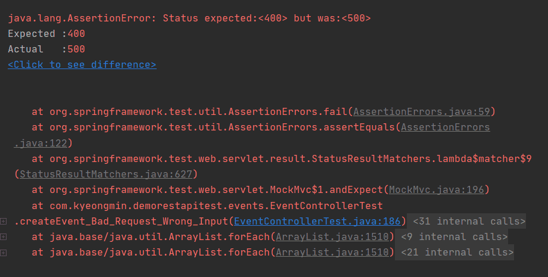

# 인덱스 핸들러 만들기

인덱스 핸들러

* 다른 리소스에 대한 링크 제공
* 문서화

```java
@GetMapping("/api")
    public ResourceSupport root() {
        ResourceSupport index = new ResourceSupport();
        index.add(linkTo(EventController.class).withRel("events"));
        return index;
    }

```

테스트 컨트롤러 리팩토링

* 중복 코드 제거

에러 리소스

* 인덱스로 가는 링크 제공

---

## 인덱스 핸들러

URL로 홈페이지에 접근한 후에는 그 다음 모든 행위들은 클릭(또는 값입력)으로 이루어진다.

ex) 유튜브 접속 후, 다음 영상을 보기위해 url을 입력하는 것이 아니라 터치로 화면이 전이 된다.

우리의 API에도 **진입점**이 필요하다. 진입점을 통해서 이벤트를 조회, 생성, 수정하는 일이 이뤄져야하기 때문에 진입점에 해당하는 index를 만들어야 한다.


### 테스트 코드 작성

확인사항

* index로 들어가면 각각의 리소스의 루트 링크를 제공

  현재 Event 리소스만 가지고 있으므로 Event에 해당하는 리소스의 루트를 제공

```java
@RunWith(SpringRunner.class)
@SpringBootTest
@AutoConfigureMockMvc
@AutoConfigureRestDocs
@Import(RestDocsConfiguration.class)
@ActiveProfiles("test")
public class IndexControllerTest {

    @Autowired
    MockMvc mockMvc;

    @Test
    public void index() throws Exception {
        this.mockMvc.perform(get("/api/"))
                .andExpect(status().isOk())
                .andExpect(jsonPath("_links.events").exists());
    }
}
```


### IndexController 구현

* 첫 페이지에 메뉴를 추가하는 것과 비슷한 구성이라고 생각하면 된다.

```java
@RestController
public class IndexController {

    @GetMapping("/api")
    public RepresentationModel index() {
        var index = new RepresentationModel();
        index.add(linkTo(EventController.class).withRel("events"));
        return index;
    }
}
```

※ var 자료구조 - JAVA 10

​	자바 10에 추가되었고 지역 변수에 한해서 타입을 지정하지 않고 var로 쓸 수 있다.


**※ Spring HATEOAS 변경사항**

* [Docs](https://docs.spring.io/spring-hateoas/docs/current/reference/html/#reference)

- `ResourceSupport` is now `RepresentationModel`
- `Resource` is now `EntityModel`
- `Resources` is now `CollectionModel`
- `PagedResources` is now `PagedModel`


### Error 페이지에서 활용

에러를 받은 후, 애플리케이션 상태를 전이할 수 있는 유일한 곳은 index이다. 따라서 에러 리소스에 인덱스로 가는 링크를 제공해주자


#### 테스트코드

* 에러 발생 시 index 링크가 본문에 있는지 확인
* JSON arrays에는 unwrap이 적용되지 않는다.
  * 테스트코드를 $[0]이 아니라 errors[0]으로 조회하도록 수정

```java
this.mockMvc.perform(post("/api/events")
                     .contentType(MediaType.APPLICATION_JSON)
                     .content(this.objectMapper.writeValueAsString(eventDto)))
  .andExpect(status().isBadRequest())
  .andDo(print())
  .andExpect(jsonPath("errors[0].objectName").exists())
  .andExpect(jsonPath("errors[0].defaultMessage").exists())
  .andExpect(jsonPath("errors[0].code").exists())
  .andExpect(jsonPath("_links.index").exists()) // 추가
  ;
```


#### 에러 리소스 구현

현재 에러 데이터만 보내고, 에러 리소스를 반환하고 있지 않다.

에러를 리소스로 만들어서 링크정보를 추가


IndexController에 있는 index()메소드로 가는 링크를 "index"라는 릴레이션으로 추가해주는 에러 리소스

```java
public class ErrorsResource extends EntityModel<Errors> {

    public static EntityModel<Errors> modelOf(Errors errors) {
        EntityModel<Errors> errorsModel = EntityModel.of(errors);
        errorsModel.add(linkTo(methodOn(IndexController.class).index()).withRel("index"));
        return errorsModel;
    }
}
```


ErrorSerializer에 `gen.writeFieldName("errors");` 코드 추가

 스프링 부트 2.3으로 올라가면서 Jackson 라이브러리가 더이상 Array부터 만드는걸 허용하지 않음

```java
@JsonComponent
public class ErrorsSerializer  extends JsonSerializer<Errors> {
    @Override
    public void serialize(Errors errors, JsonGenerator gen, SerializerProvider serializers) throws IOException {
        gen.writeFieldName("errors"); // 추가
        gen.writeStartArray();
```


컨트롤러에서 Error를 바로 반환하지않고 ErrorResource로 바꿔서 응답의 body로 반환한다.

```java
@PostMapping()
public ResponseEntity createEvent(@RequestBody @Valid EventDto eventDto, Errors errors) {
  if (errors.hasErrors()) {
    return ResponseEntity.badRequest().body(ErrorsResource.modelOf(errors));
  }

  eventValidator.validate(eventDto, errors);
  if (errors.hasErrors()) {
    return ResponseEntity.badRequest().body(ErrorsResource.modelOf(errors));
  }
  //...
}
```


---

#### 질문

> Test class에서 SpringRunner와 JunitParamsRunner는 RunWith로 동시에 사용 못합니다. 그래서 어떻게하면 bean으로 등록된 클래스를 사용하면서 JunitParameter도 사용할 수 있을지 질문드립니다.
>
> (추가로 기선님 코드에서는 SpringRunner와 JunitParameter를 아에 다른 클래스에서 각각 사용하던데, 이런 방식으로 해결해야 할까요?)

JUnit 4에서 Runner를 두개 못쓰게 되있어서 그런데 찾아보니까 이런게 있긴 하네요. 이걸 시도해 보시거나 JUnit 5로 올려서 Extension을 써보시기 바랍니다. Extension은 여러개를 허용하거든요.

https://github.com/Pragmatists/junitparams-spring-integration-example


> 현재 Spring boot 2.3.4 버전 사용중입니다.
>
> 
>
> ErrorsResource를 만들고, EventController.java파일에서
>
> ```java
> if(errors.hasErrors()){
>             return ResponseEntity.badRequest().body(new ErrorsResource(errors));
>         }
>         eventValidator.validate(eventDTO, errors);
>         if(errors.hasErrors()){
>             return ResponseEntity.badRequest().body(new ErrorsResource(errors));
>         }
> ```
>
> 
>
> 여기서 return body에 new ErrorsResource(errors)를 추가하니까 500에러가 발생했습니다.
>
> 제가 어떤 부분을 놓치고있는 건지 찾아봐도 도저히 모르겠습니다..
>
> \## error 내용
>
> ```html
> 2020-10-02 22:09:06.151  WARN 14548 --- [           main] .w.s.m.s.DefaultHandlerExceptionResolver : Resolved [org.springframework.http.converter.HttpMessageNotWritableException: Could not write JSON: Can not start an array, expecting field name (context: Object); nested exception is com.fasterxml.jackson.core.JsonGenerationException: Can not start an array, expecting field name (context: Object)]
> 
> MockHttpServletRequest:
>       HTTP Method = POST
>       Request URI = /api/events/
>        Parameters = {}
>           Headers = [Content-Type:"application/json;charset=UTF-8", Content-Length:"343"]
>              Body = {"name":"spring","description":"rest api dev with spring","beginEnrollmentDateTime":"2020-10-02T23:28:00","closeEnrollmentDateTime":"2020-10-01T23:28:00","beginEventDateTime":"2020-10-02T23:28:00","endEventDateTime":"2020-10-03T23:28:00","location":"kangNam Station D2 startUP factory","basePrice":10000,"maxPrice":200,"limitOfEnrollment":100}
>     Session Attrs = {}
> 
> Handler:
>              Type = com.kyeongmin.demorestapitest.events.EventController
>            Method = com.kyeongmin.demorestapitest.events.EventController#createEvent(EventDTO, Errors)
> 
> Async:
>     Async started = false
>      Async result = null
> 
> Resolved Exception:
>              Type = org.springframework.http.converter.HttpMessageNotWritableException
> 
> ModelAndView:
>         View name = null
>              View = null
>             Model = null
> 
> FlashMap:
>        Attributes = null
> 
> MockHttpServletResponse:
>            Status = 500
>     Error message = null
>           Headers = [Content-Type:"application/hal+json"]
>      Content type = application/hal+json
>              Body = 
>     Forwarded URL = null
>    Redirected URL = null
>           Cookies = []
> ```
>
> 
>
> 아래는 ErrorsResource.java 코드 부분입니다.
>
> 

[답변](https://www.inflearn.com/questions/72123)

[해당 이슈 커밋](https://github.com/whiteship/study/commit/91d373f84c16b89f69329717b60927a3099cf40d)

 스프링 부트 2.3으로 올라가면서 Jackson 라이브러리가 더이상 Array부터 만드는걸 허용하지 않습니다.

```
2020-10-02 22:09:06.151 WARN 14548 --- [      main] .w.s.m.s.DefaultHandlerExceptionResolver : Resolved [org.springframework.http.converter.HttpMessageNotWritableException: Could not write JSON: Can not start an array, expecting field name (context: Object); nested exception is com.fasterxml.jackson.core.JsonGenerationException: Can not start an array, expecting field name (context: Object)]ErrorSerializer 
```

코드에 한줄만 추가해주시면 됩니다.

```java
jsonGenerator.writeFieldName("errors");
jsonGenerator.writeStartArray();
```

그런 다음 테스트코드를 content[0]이 아니라 errors[0]으로 조회하도록 고치면 되구요.

```java
this.mockMvc.perform(post("/api/events/")
        .contentType(MediaType.APPLICATION_JSON)
        .content(this.objectMapper.writeValueAsString(eventDTO)))
        .andExpect(status().isBadRequest())
        .andExpect(jsonPath("errors[0].objectName").exists())
        .andExpect(jsonPath("errors[0].field").exists())
        .andExpect(jsonPath("errors[0].code").exists())
        .andExpect(jsonPath("_links.index").exists())
```

