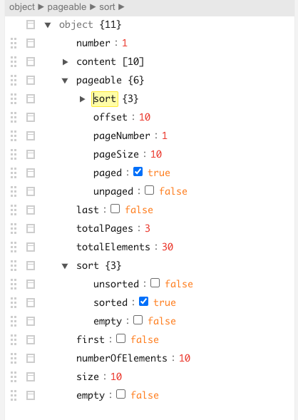
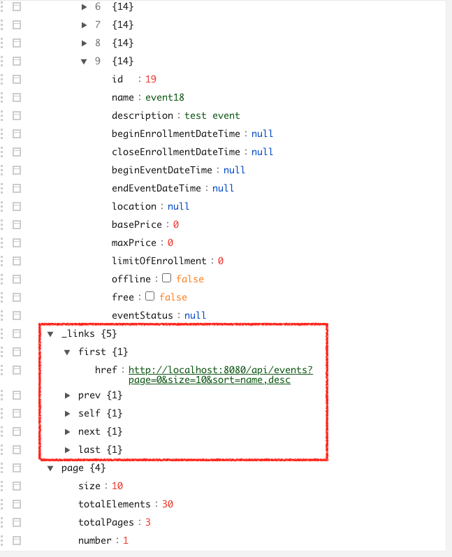
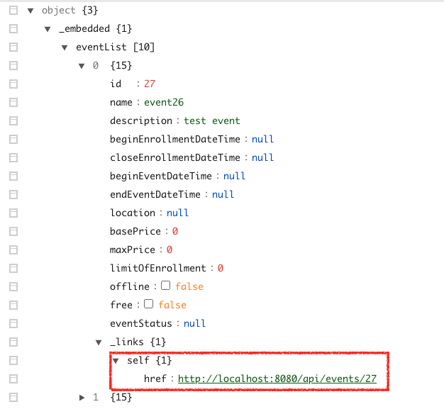

# Event 목록 조회 API

페이징, 정렬 어떻게 하지?

* 스프링 데이터 JPA가 제공하는 Pageable

Page<Event>에 안에 들어있는 Event 들은 리소스로 어떻게 변경할까?

* 하나씩 순회하면서 직접 EventResource로 맵핑을 시킬까..
* PagedResourceAssembler<T> 사용하기

[테스트 할 때 Pageable 파라미터 제공하는 방법](https://docs.spring.io/spring-data/jpa/docs/current/reference/html/#core.web)

* page: 0부터 시작
* size: 기본값 20
* sort: property,property(,ASC|DESC)

테스트 할 것

> * Event 목록 Page 정보와 함께 받기
>   * content[0].id 확인
>   * pageable 경로 확인
> * Sort과 Paging 확인
>   * 30개를 만들고, 10개 사이즈로 두번째 페이지 조회하면 이전, 다음 페이지로 가는 링크가 있어야 한다.
>   * 이벤트 이름순으로 정렬하기
>   * page 관련 링크
> * Event를 EventResource로 변환해서 받기
>   * 각 이벤트 마다 self
> * 링크 확인
>   * self
>   * profile
>   * (create)
> * 문서화

---

## Sort, Paging 기능 구현

* 이벤트 조회시 Sort과 Paging 이 되어야 한다.

> 페이징, 정렬 어떻게 하지?

* 스프링 데이터 JPA가 제공하는 **Pageable**

파라미터로 Pageable 인터페이스를 받아온다. Pageable 인터페이스를 사용하면 페이징과 관련된 파라미터들을 받아올 수 있다.



### 테스트 코드

```java
@Test
@TestDescription("30개의 이벤트를 10개의 두번쨰 페이지 조회하기")
public void queryEvents() throws Exception {
    // Given
    IntStream.range(0, 30).forEach(i -> {
        this.generateEvent(i);
    });

    // When
    this.mockMvc.perform(get("/api/events")
                .param("page", "1") //조회시 pagine과 sorting이 가능해야 한다.
                .param("size", "10")
                .param("sort", "name,DESC")
                )
            .andDo(print())
            .andExpect(status().isOk())
            .andExpect(jsonPath("page").exists())
    ;
}

private void generateEvent(int index) {
    Event event = Event.builder()
            .name("event" + index)
            .description("test event")
            .build();

    this.eventRepository.save(event);
}
```


### 구현

```java
@GetMapping
public ResponseEntity queryEvents(Pageable pageable) {
    return ResponseEntity.ok(this.eventRepository.findAll(pageable));
}
```


## 링크 정보 추가

### 테스트 코드

```java
.andExpect(jsonPath("_embedded.eventList[0]._links.self").exists()) //각 이벤트가 self 링크를 가지고 있는지 확인
.andExpect(jsonPath("_links.self").exists())
.andExpect(jsonPath("_links.profile").exists())
.andDo(document("query-events"))
```


### Page 관련 링크 추가

* page 관련 링크 - 현재 페이지, 이전/다음 페이지, 첫/마지막 페이지 etc..

this.eventRepository.findAll(pageable)이 **Page<Event>** 타입으로 나온다. 이를 리소스로 변환해서 링크정보를 담아줘야함

> 어떻게 페이지 관련 링크 정보를 담아줄까?

**PagedResourceAssembler<T> 사용하기** (Spring Data JPA가 제공)

```java
@GetMapping
public ResponseEntity queryEvents(Pageable pageable, PagedResourcesAssembler<Event> assembler) {
  Page<Event> page = this.eventRepository.findAll(pageable);
  var pagedModel = assembler.toModel(page);
  return ResponseEntity.ok(pagedModel);
}
```



⇒ 여기 까지 ,

* Event 목록 Page 정보와 함께 받기
* Sort과 Paging 확인

를 구현하였지만, 완벽한 HATEOAS라고 할 수 없다.

목록정보를 보여주지만 각각의 이벤트로 가는 링크 정보가 없다.


### 각 이벤트 관련 링크 정보 추가

Event를 EventResource로 변환해서 받기

* 각 이벤트 마다 self

> Page<Event>에 안에 들어있는 Event 들은 리소스로 어떻게 변경할까?

* 하나씩 순회하면서 직접 EventResource로 맵핑을 시킬까..
* **PagedResourceAssembler<T> 사용하기**

```java
@GetMapping
public ResponseEntity queryEvents(Pageable pageable, PagedResourcesAssembler<Event> assembler) {
    Page<Event> page = this.eventRepository.findAll(pageable);
    var pagedModel = assembler.toModel(page, e -> new EventResource(e)); // EventResourcce로 변환
    return ResponseEntity.ok(pagedModel);
}
```




### Profile 링크 추가

리소스로 변환되고 나면 링크를 추가할 수 있는 메서드들을 사용할 수 있다.

 ```java
@GetMapping
public ResponseEntity queryEvents(Pageable pageable, PagedResourcesAssembler<Event> assembler) {
  Page<Event> page = this.eventRepository.findAll(pageable);
  var pagedModel = assembler.toModel(page, e -> new EventResource(e));
  pagedModel.add(Link.of("/docs/index.html#resources-events-list").withRel("profile")); // profile 링크 추가
  return ResponseEntity.ok(pagedModel);
}
 ```


## 문서화

```java
.andDo(document("query-events"))
```

* TODO
  * page 에 들어있는 필드 내용 설명
  * _links 필드 내용

⇒ 테스트 통과 후, `query-events` 스니펫 생성 확인


---

#### 질문

> 스프링 프로젝트들을보면 패키지명을 controller, dto, repository 이런단위로 만들고
>
> 관련클래스 파일을 모아놓는식으로 사용하는걸 많이 봤는데요,
>
> 강좌에서는 events, accounts 도메인(?) 단위로 만드셨잖아요.
>
> 현업에서도 이렇게 사용을 많이 할까요?
>
> 이렇게 구성시는 이유? 좋은점은 뭘까요?

물어보신 질문에 대해 정해진 답은 없습니다. 회사마다 팀마다 패키지 정책이 다를 수 있거든요. 다만 최근 마이크로서비스의 영향으로 패키지를 도메인으로 구분하는 경우가 더 많아진거 같습니다. 스프링 공식 예제 프로젝트인 petclinic을 봐도 그렇구요. 그렇게 나누는게 일리가 있는 이유도 나중에 여러 조각으로 쪼갤 걸 생각하면 미리 도메인 별로 패키징을 해두는게 분리할 때도 도움이 될테니까요. 예전에야 그런 고민이 없었고, 계층형 아키텍쳐를 고려하다보니 service는 dao만 써야하고 controller에서는 service만 써야 하는 구역을 나누느라 그런식으로 패키징을 했었고 그것도 일리 있는 설계라 생각합니다.

> Pageable은 @RequestBody 혹은 @PathVariable없이 어떻게 바인딩이 되나요?
>
> Post방식이 아니여서 @RequestBody는 안될것 같긴하고, 
>
> 저는 종종 Get방식은 @Pathvariable 어노테이션 써서 사용하곤 했는데요. 
>
> 해당 부분은 어떠한 어노테이션도 없이 바인딩 되는게 궁금합니다.

@PathVariable은 URI 경로에 있는걸 바인딩 받을 때 쓰구요. Query parameter나 요청 본문에 들어오는 키/값 쌍의 데이터를 스프링 MVC 내부에서 Request attribute라는 걸로 추상화해서 @RequestParam이나 @ModelAttribute로 받을 수 있습니다. 근데 그 두 애노테이션 모두 생략이 가능해요. Pageable같은 경우, Query parameter로 넘어온 데이터를 @ModelAttribute를 생략하고 받았다고 생각하시면 됩니다.

자세한건 스프링 웹 MVC 강좌를 들으시면 도움이 될 거 같습니다.

