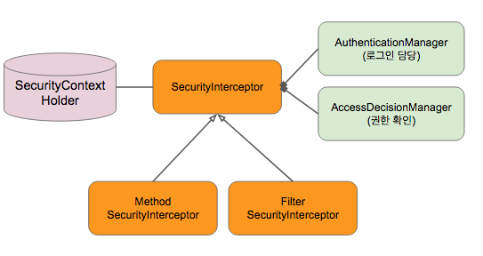

# 스프링 시큐리티

스프링 시큐리티

* 웹 시큐리티 (Filter 기반 시큐리티)
* 메소드 시큐리티 이 둘 다 Security Interceptor를 사용합니다.
* 리소스에 접근을 허용할 것이냐 말것이냐를 결정하는 로직이 들어있음.
  

의존성 추가

```xml
<dependency>
  <groupId>org.springframework.security.oauth.boot</groupId>
  <artifactId>spring-security-oauth2-autoconfigure</artifactId>
  <version>2.1.0.RELEASE</version>
</dependency>
```

테스트 다 깨짐 (401 Unauthorized)

* 깨지는 이유는 스프링 부트가 제공하는 스프링 시큐리티 기본 설정 때문.

---

## 스프링 시큐리티가 제공하는 2가지 기능

* 웹 시큐리티

  * 웹 요청에 보안 인증

  * 웹 요청의 경우 시큐리티 필터체인 - 서블릿 필터와 연관되어있다.

    (현재 스프링 5부터 웹이 2가지(WebFlux와 서블릿 기반의 웹)존재하는데 설명은 서블릿 기반으로 가정하고 설명)

* 메소드 시큐리티

  * 웹과 상관없이 어떤 메소드가 호출되었을 때, 인증&권한을 확인
  * AOP를 생각하면 된다.
  * 프록시를 만들어서 접근과 보안을 강제하는 interceptor가 기능을 수행

* 둘 다 Security Interceptor를 통해서 기능을 제공

  인터셉터 구현체 - Method Security Interceptor, Filter Security Interceptor

(※ 강의에서는 웹 시큐리트를 적용)


## 시큐리티 인터셉터의 동작 흐름

(웹시큐리티) 요청이 왔을 때, 이 요청을 서블릿 필터가 가로채서 스프링 빈에 등록되어있는 Web Filter Security Interceptor 쪽으로 요청을 보낸다.

인터셉터가 요청을 보고, 이 요청에 인증을 해야하는지 (Security Filter를 적용해야하는지) 여부를 확인

요청에 Security Filter를 적용해야한다면 **Filter Security Interceptor에 들어오게 된다.**

1. **인증정보 확인**

   `SecurityContext Holder`[^1] 에서 인증정보를 꺼내려고 시도

   * 인증정보를 꺼냈다면 ? ⇒ 인증된 사용자가 이미 있는 것

   * 인증정보가 없다면 ? ⇒  인증을 한 적이 없는 것. 현재 사용자가 없는 것.

     

2.  (인증정보가 없는 경우) **`AuthenticationManager`를 사용해서 로그인을 한다.**

   * AuthenticationManager가 로그인할 때 사용하는 주요한 인터페이스 2가지
     1. `UserDetailsService` 
     2. `PasswordEncoder`

   AuthenticationManager가 여러가지 방법으로 인증을 할 수 있다. 

   그 중 대표적으로 Basic Authentication 인증 예) 

   인증 요청 헤더에 Authentication, Basic, username, password를 합쳐서 인코딩한 문자열을 입력받아서 UserDetailsService 인터페이스를 사용해서 입력받은 username에 해당하는 password를 (DB에서든 어디선가) 읽어온다. 

   읽어온 password와 사용자가 입력한 password가 매칭하는지는 PasswordEncoder로 확인한다.

   **매칭되면 로그인 성공! Authentication 객체를 만들어서 인증정보를 `SecurityContext Holder`에 저장해둔다.**


3. **요청한 리소스에 접근할 권한이 있는지 확인**

   여러가지 권한 확인 방법이 있음. 그 중 `Role`을 확인

   인증된 Account의 role을 확인. ex) "~한 요청은 Admin만, 나머지 모든 요청은 User도 사용할 수 있다."


4. 예외처리 등등 더 많은 일들이 이루어짐


[^1]: SecurityContext Holder : ThreadLocal[^2]의 구현체(default로 스레드 로컬 구현체를 쓰지만 바꿔끼울 수 있음). 
[^2]: Java ThreadLocal : 한 스레드 내에서 공유하는 자원 저장소. 애플리케이션에서 데이터를 넘겨줄 때 메서드 파라미터에 넘겨주지 않아도 된다. 한 스레드에서 실행되는 메소드라면 ThreadLocal에 데이터를 넣어두면 다른 메서드에서 꺼내서 사용할 수 있다. DB와 비슷


## 스프링 시큐리티 적용

1. 의존성 추가

   * Spring Security OAuth2 AutoConfigure

   ```xml
   <dependency>
       <groupId>org.springframework.security.oauth.boot</groupId>
       <artifactId>spring-security-oauth2-autoconfigure</artifactId>
       <version>2.3.6.RELEASE</version>
   </dependency>
   ```

2. UserDetailsService 구현체 - "AccountService" 구현

   userName에 해당하는 실제 User를 읽어주는 역할

   ```java
   @Service
   public class AccountService implements UserDetailsService {
       @Override
       public UserDetails loadUserByUsername(String username) throws UsernameNotFoundException {
           return null;
       }
   }
   ```

   

3. Account를 저장할 AccountRepository 구현

   ```java
   public interface AccountRepository extends JpaRepository<Account, Integer> {
   }
   ```

   


### AccountService 테스트 코드

MockMVC 사용하지 않음. 서비스 테스트이므로 굳이 BaseController테스트를 상속받을 필요가 없다.

 AccountService는 UserDetailsService 타입이어야 한다.

* username으로 User정보를 잘 가져오는지 확인
* Given으로 생성한 Account를 AccountRepository에 저장해두고, **loadUserByUsername()**할 때 꺼내옴

```java
@RunWith(SpringRunner.class)
@SpringBootTest
@ActiveProfiles("test")
public class AccountServiceTest {

    @Autowired
    AccountService accountService;

    @Autowired
    AccountRepository accountRepository;

    @Test
    @Description("username으로 user를 찾아온다.")
    public void findByUsername() {
        // Given
        String username = "solar@email.com";
        String password = "1234";
        Account account = Account.builder()
                .email(username)
                .password(password)
                .roles(Set.of(AccountRole.ADMIN, AccountRole.USER))
                .build();
        this.accountRepository.save(account); //DB에 생성한 Account 저장

        // When
        UserDetailsService userDetailsService = accountService;
        UserDetails userDetails = userDetailsService.loadUserByUsername("solar"); // username으로 User정보를 가져온다.

        // Then
        assertThat(userDetails.getPassword()).isEqualTo(password);

    }
}
```

