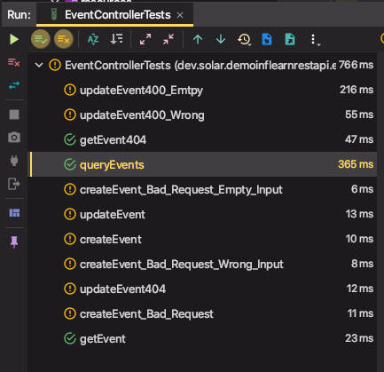

# 스프링 시큐리티 OAuth 2 설정: 리소스 서버 설정

테스트 수정

* GET을 제외하고 모두 엑세스 토큰을 가지고 요청 하도록 테스트 수정

ResourceServer 설정

* @EnableResourceServerextends 
* ResourceServerConfigurerAdapter
* configure(ResourceServerSecurityConfigurer resources)
  * 리소스 ID
* configure(HttpSecurity http)
  * anonymous
  * GET /api/** : permit all
  * POST /api/**: authenticated**
  * PUT /api/**: authenticated
  * 에러 처리
    * accessDeniedHandler(OAuth2AccessDeniedHandler())

---

# 리소스 서버 설정

- 설정한 **OAuth2** 서버와 연동이 되어서 사용이 됨

- 어떤 외부 요청이 리소스에 접근할 때

  클라이언트가 인증이 필요하다면 **OAuth2** 서버에서 제공하는 토큰 서비스에 요청을 보내서 토큰을 발급받고, (클라이언트가 할 일)

  (리소스 서버는) 토큰 기반으로 인증정보가 있는지 없는지 확인하고 리소스 서버에 접근을 제한함

- 리소스 서버는 이벤트 리소스를 제공하는 서버와 같이 있는게 맞고 인증서버는 따로 분리하는게 맞음

- 작은 서비스에서는 같이 사용해도 상관은 없음

### 설정 내용

- `@EnableResourceServer`
- `extends ResourceServerConfigurerAdapter`
- `configure(ResourceServerSecurityConfigurer resources)`
  - resourceId() : 리소스 ID설정
  - accessDeniedHandler : 엑세스 거부되었을 때, (접근 권한이 없는 경우) 어떻게 처리할 지
- `configure(HttpSecurity http)`
  - **anonymous** : anonymous만 사용할 수 있고, 인증된 사용자는 사용할 수 없다.
  - `GET /api/**` : **permit all** : 모두 허용
  - `POST /api/**`: **authenticated**
  - `PUT /api/**`: **authenticated**
  - 에러 처리
    - `accessDeniedHandler(OAuth2AccessDeniedHandler())`

```java
@Configuration
@EnableResourceServer
public class ResourceServerConfig extends ResourceServerConfigurerAdapter {

    @Override
    public void configure(ResourceServerSecurityConfigurer resources) throws Exception {
        resources.resourceId("event"); // 최소한 리소스ID 정도는 설정 필요
    }

    @Override
    public void configure(HttpSecurity http) throws Exception {
        http
                .anonymous() // 익명 허용
                .and()
                .authorizeRequests()
                .mvcMatchers(HttpMethod.GET, "/api/**") // 이 요청은
                .permitAll() // 전부 허용
                .anyRequest() // 그 밖의 다른 요청
                .authenticated() // 인증 필요
                .and()
                .exceptionHandling() // 인증이 잘못됐다던가 권한이 없는 경우 발생하는 예외중에
                .accessDeniedHandler(new OAuth2AccessDeniedHandler()); //  접근권한이 없는 것은 OAuth2AccessDeniedHandler를 사용함. 이 핸들러는 403으로 status 응답을 내보내줌
    }
}
```


### 위 설정으로 테스트를 실행

GET 요청은 테스트에 성공한다. 익명의 요청을 허용해줬기 때문에, 

GET 이외의 요청은 거부되어서 테스트 실패




## EventControllerTests 테스트 수정

인증이 필요한 요청들에 인증정보를 넣어서 테스트를 실행하도록 수정해야한다.

`GET`을 제외하고 모두 엑세스 토큰을 가지고 요청 하도록 테스트 수정


#### (인증이 필요한 요청 테스트에) 토큰 정보를 Request 헤더에 추가

AUTHORIZATION 헤더에 `Bearer`로 엑세스 토큰을 발급받아서 넣어준다.

```java
mockMvc.perform(post("/api/events/") // 요청
        .header(HttpHeaders.AUTHORIZATION, "Bearer " + getBearerToken()) //인증 정보 헤더에 추가
```


#### 인증 토큰 발급 메서드 추가

```java
private String getBearerToken() throws Exception {
  // Given
  String username = "tester@email.com";
  String password = "1234";
  Account keesun = Account.builder()
    .email(username)
    .password(password)
    .roles(Set.of(AccountRole.ADMIN, AccountRole.USER))
    .build();
  this.accountService.saveAccount(keesun);

  String clientId = "myApp";
  String clientSecret = "pass";

  ResultActions perform = this.mockMvc.perform(post("/oauth/token")
                                               .with(httpBasic(clientId, clientSecret))
                                               .param("username", username)
                                               .param("password", password)
                                               .param("grant_type", "password"));

  var responseBody = perform.andReturn().getResponse().getContentAsString();
  Jackson2JsonParser parser = new Jackson2JsonParser();
  return parser.parseMap(responseBody).get("access_token").toString();
}
```

## `javax.persistence.NonUniqueResultException` 에러발생

#### 문제원인

* **uniq** 해야되는데 테스트마다 계속 동일한 유저를 저장하니까 에러가남

#### 해결방법

- 아이디를 랜덤으로 생성하거나 매번 테스트 하기전에 데이터를 비워줌

- **InMemoryDB** 이지만 테스트 진행 중에는 **DB**를 공유하므로 데이터가 공유된다.

  데이터가 독립적이지 않으므로 **setUp**이나 **after**에서 데이터를 다 지움

- **테스트시 한 건씩은 괜찮지만 여러건을 한번에 테스트시에는 주의해야함**

### 테스트 시 DB를 비우면서 테스트

```java
@Autowired
AccountRepository accountRepository;

@Before
public void setUp() {
    this.eventRepository.deleteAll();
    this.accountRepository.deleteAll();
}
```

