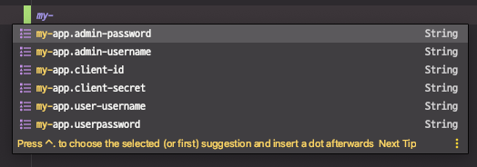

# 문자열을 외부 설정으로 빼내기

기본 유저 만들기

* ApplicationRunner
  * Admin
  * User

외부 설정으로 기본 유저와 클라이언트 정보 빼내기

* @ConfigurationProperties

---

이전 코드 문제점

* 필요할 때마다 유저를 생성하는 코드를 넣었다.

* 동일한 이메일로 유저가 DB에 쌓여있으면 안된다.


## 유저 Email unique 설정

유저 저장시 겹치지 않도록 설정

### Account email unique 설정

```java
@Column(unique = true)
private String email;
```


## Properties 자동완성 의존성 추가

빌드할 때, 우리가 만든 Properties를 자동완성할 수 있게끔 정보를 생성 해준다.

```xml
<dependency>
    <groupId>org.springframework.boot</groupId>
    <artifactId>spring-boot-configuration-processor</artifactId>
    <optional>true</optional>
</dependency>
```




## 외부 설정으로 기본 유저와 클라이언트 정보 빼내기

### AppProperties 클래스 생성

외부 설정으로 기본 유저와 클라이언트 정보를 빼내기 위한 프로퍼티 설정

스프링부트를 사용하면 application.properties에 설정한 값을 이 클래스의 값으로 자동으로 바인딩받아준다.

애플리케이션에서는 이 AppProperties를 주입받아서 사용하면 된다.


> ※  참고 `Prefix must be in canonical form` : 네이밍 표준 형식을 사용해야 한다.
>
> ex) myApp (X) → my-app (O), myCommonProperties (X) → my-common-properties (O)

```java
@Component //빈으로 등록
@ConfigurationProperties(prefix = "my-app") // prefix 설정
@Getter @Setter
public class AppProperties {

    @NotEmpty
    private String adminUsername;

    @NotEmpty
    private String adminPassword;

    @NotEmpty
    private String userUsername;

    @NotEmpty
    private String userPassword;

    @NotEmpty
    private String clientId;

    @NotEmpty
    private String clientSecret;

}
```

### `application.properties` 에 프로퍼티 값 추가

```properties
my-app.admin-username=admin@email.com
my-app.admin-password=admin
my-app.user-username=user@email.com
my-app.user-password=user
my-app.client-id=myApp
my-app.client-secret=pass
```


## 기본 유저 만들기

- **admin**
- **user**

### AppConfig 에 기본유저 admin, user 생성되도록 수정하고 프로퍼티 설정추가

애플리케이션이 뜰 때 기본적으로 생성되는 유저

```java
//임의의 유저정보 생성
@Bean
public ApplicationRunner applicationRunner() {
    return new ApplicationRunner() {
        @Autowired
        AccountService accountService;

        @Autowired
        AppProperties appProperties; // 외부 설정 사용

        @Override
        public void run(ApplicationArguments args) throws Exception {
            Account admin = Account.builder()
                    .email(appProperties.getAdminUsername()) // 외부 설정값
                    .password(appProperties.getAdminPassword())
                    .roles(Set.of(AccountRole.ADMIN, AccountRole.USER))
                    .build();
            accountService.saveAccount(admin);

            Account user = Account.builder()
                    .email(appProperties.getUserUsername())
                    .password(appProperties.getUserPassword())
                    .roles(Set.of(AccountRole.USER))
                    .build();
            accountService.saveAccount(user);
        }
    };
}
```

→ 기본 생성 계정 정보는 application.properties에서만 확인하면 된다.


### AuthServerConfig에 프로퍼티 설정 추가

**OAuth2** 서버 설정 부분에 프로퍼티 설정 추가

```java
@Autowired
AppProperties appProperties;

@Override
public void configure(ClientDetailsServiceConfigurer clients) throws Exception {
    clients.inMemory() // inMemory 용으로 생성 원래는 jdbc로 DB로 생성해야됨
            .withClient(appProperties.getClientId()) // myApp에 대한 클라이언트를 하나 생성 //외부 설정 값
            .authorizedGrantTypes("password", "refresh_token") // 지원하는 grant_Type
            .scopes("read", "write")
            .secret(this.passwordEncoder.encode(appProperties.getClientSecret())) // 외부설정값
            .accessTokenValiditySeconds(10 * 60) // 엑세스 토큰의 유효시간 10분
            .refreshTokenValiditySeconds(6 * 10 * 60); // refresh_token의 유효시간
}
```


## 테스트 코드에 프로퍼티 설정 추가

* AuthServerConfigTest 에 프로퍼티 설정 추가

* EventControllerTests 에 프로퍼티 설정 추가

  > ※ 주의
  >
  > EventControllerTests에서는 DB와의 의존성을 끊어주기 위해서 setUp()에 모든 DB 정보를 지우는 코드를 추가했기 때문에, 기본 생성되는 유저가 없다. 
  >
  > 따라서 여기서는 유저를 만들어주도록(save) 한다.

