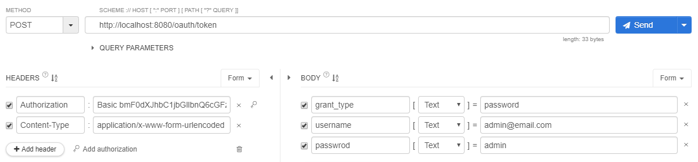
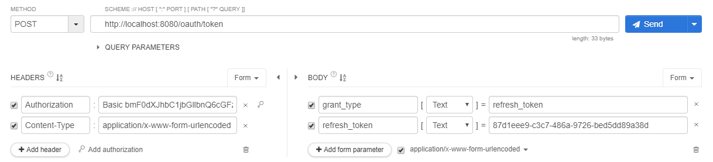

# 이벤트 API 점검

토큰 발급 받기

* POST /oauth/token
* BASIC authentication 헤더
  * client Id(myApp) + client secret(pass)
* 요청 본문 폼
  * username: admin@email.com
  * password: admin
  * grant_type: password

 

토큰 갱신하기

* POST /oauth/token
* BASIC authentication 헤더
  * client Id(myApp) + client secret(pass)
* 요청 본문 폼
  * token: 처음에 발급받았던 refersh 토큰
  * grant_type: refresh_token

이벤트 목록 조회 API

* 로그인 했을 때
  * 이벤트 생성 링크 제공

이벤트 조회

* 로그인 했을 때
  * 이벤트 Manager인 경우에는 이벤트 수정 링크 제공

---

