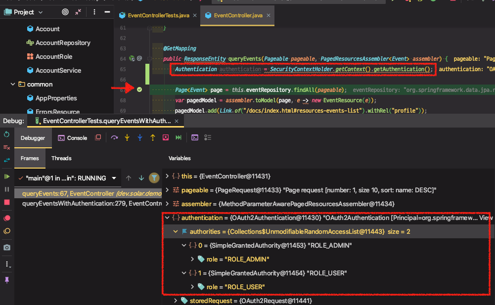
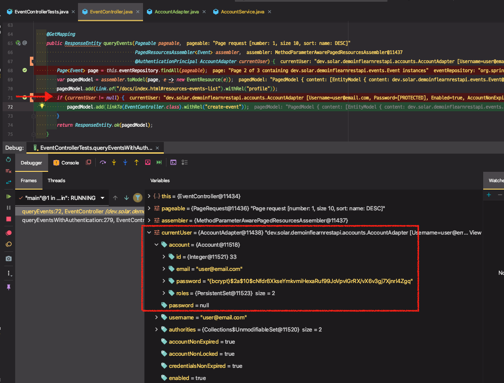

# 스프링 시큐리티 현재 사용자

SecurityContext

* 자바 ThreadLocal 기반 구현으로 인증 정보를 담고 있다.

* 인증 정보 꺼내는 방법

  Authentication authentication = SecurityContextHolder.getContext().getAuthentication();

@AuthenticationPrincipal spring.security.User user

* 인증 안한 경우에 null
* 인증 한 경우에는 username과 authorities 참조 가능

spring.security.User를 상속받는 클래스를 구현하면

* 도메인 User를 받을 수 있다.
* @AuthenticationPrincipa **me.whiteship.user.UserAdapter** 
* Adatepr.getUser().getId()

SpEL을 사용하면

* @AuthenticationPrincipa(expression=”account”) **me.whiteship.user.Account** 

```java
@Target(ElementType.PARAMETER)
@Retention(RetentionPolicy.RUNTIME)
@AuthenticationPrincipal(expression = "account")
public @interface CurrentUser {
}
```

커스텀 애노테이션을 만들면

* @CurrentUser Account account
* 엇? 근데 인증 안하고 접근하면..?

```java
expression = "#this == 'anonymousUser' ? null : account"
```

* 현재 인증 정보가 anonymousUse 인 경우에는 null을 보내고 아니면 “account”를 꺼내준다.

조회 API 개선

* 현재 조회하는 사용자가 owner인 경우에 update 링크 추가 (HATEOAS)

수정 API 개선

* 현재 사용자가 이벤트 owner가 아닌 경우에 403 에러 발생

---

> 이번 수업 목적 : 현재 사용자를 **Account**로 받아오고 아니면 `null`

# 테스트 코드

인증정보(토큰)을 가지고 이벤트 목록을 조회하는 경우, Response에 이벤트 생성관련 링크가 존재해야 한다.

```java
@Test
@TestDescription("30개의 이벤트를 10개씩 두번째 페이지 조회하기 - 인증정보 있는 경우")
public void queryEventsWithAuthentication() throws Exception {
    // Given
    IntStream.range(0, 30).forEach(this::generateEvent);

    // When & Then
    this.mockMvc.perform(get("/api/events")
            .header(HttpHeaders.AUTHORIZATION, getBearerToken()) // 토큰을 가지고 요청
            .param("page", "1")
            .param("size", "10")
            .param("sort", "name,DESC"))
            .andDo(print())
            .andExpect(status().isOk())
            .andExpect(jsonPath("page").exists())
            .andExpect(jsonPath("_embedded.eventList[0]._links.self").exists())
            .andExpect(jsonPath("_links.self").exists())
            .andExpect(jsonPath("_links.profile").exists())
            .andExpect(jsonPath("_links.create-event").exists()) // 인증 정보가 있다면 create 링크가 존재
            .andDo(document("query-events"))
    ;
}
```

## 코드로 인증정보 확인하는 방법

## SecurityContext

자바 **ThreadLocal** 기반 구현으로 인증 정보를 담고 있다.

### 인증 정보 꺼내는 방법

```java
Authentication authentication = SecurityContextHolder.getContext().getAuthentication();
```

BP를 잡아서 디버깅 → 인증 정보 확인




### AccountService에서 반환하는 UserDetails의 구현체(스프링 시큐리티 유저)를 받아 올 수 있음

받아온 User 정보(**username**등)으로 해당하는 유저를 **DB**에서 조회해올 수 있음

```java
User principal = (User) authentication.getPrincipal();
```


---

# 애노테이션으로 인증정보 받아오기

## @AuthenticationPrincipal spring.security.User user

스프링 시큐리티가 제공해주는 기능 중에 하나로 스프링 **MVC** 핸들러 파라메터에 `@AuthenticationPrincipal`를 사용하면 `getPrincipal()` 로 리턴 받을 수 있는 객체를 바로 주입받을 수가 있음

User 정보가 있는지 없는지만 확인하는 용도로 사용

- 인증 안한 경우에 `null`
- 인증 한 경우에는 **username**과 **authorities** 참조 가능

## 1. queryEvents를 호출할 때 user가 있는 경우 create-event 링크 추가

<u>User 정보가 있는지 없는지만 확인</u>하면 되기 때문에 @AuthenticationPrincipal 로 User 정보를 자동으로 주입받아오면 된다.

```java
@GetMapping
public ResponseEntity queryEvents(Pageable pageable,
                                  PagedResourcesAssembler<Event> assembler,
                                  @AuthenticationPrincipal User user) {
  Page<Event> page = this.eventRepository.findAll(pageable);
  var pagedModel = assembler.toModel(page, e -> new EventResource(e));
  pagedModel.add(Link.of("/docs/index.html#resources-events-list").withRel("profile"));
  if (user != null) {
    // 유저가 있으면 EventController에 create-event 링크를 추가
    pagedModel.add(linkTo(EventController.class).withRel("create-event"));
  }
  return ResponseEntity.ok(pagedModel);
}
```

## 2. 이벤트를 생성할 때는 Account 유저가 필요

이벤트를 생성할때 <u>현재 사용자 정보를</u> 이벤트에 주입을 해줘야 한다.

**Event**에 있는 **manager**를 셋팅해주려면 현재 **user**가 **Springsecurity User**가 아니라 **Account** 여야한다.


## `spring.security.User`를 상속받는 클래스를 구현하면

**AccountService**의 **UserDetails**의 구현체가 리턴해주는 스프링 시큐리티 유저를 **Account**객체를 알고있는 객체로 바꿔야함

- 도메인 **User**를 받을 수 있다
- `@AuthenticationPrincipa` `me.freelife.user.UserAdapter`
- `Adatepr.getUser().getId()`

## AccountAdapter 구현

스프링 시큐리티 유저를 **Account**객체를 알고있는 객체로 바꿔주는 클래스

```java
public class AccountAdapter extends User {

    private Account account;

    public AccountAdapter(Account account) {
        super(account.getEmail(), account.getPassword(), authorities(account.getRoles()));
        this.account = account;
    }

    private static Collection<? extends GrantedAuthority> authorities(Set<AccountRole> roles) {
        return roles.stream()
                .map(r -> new SimpleGrantedAuthority("ROLE_" + r.name()))
                .collect(Collectors.toSet());
    }

    public Account getAccount() {
        return account;
    }
}
```

## AccountAdapter로 리턴 하도록 수정

**AccountService**의 **UserDetails**를 (User가 아닌)`AccountAdapter`로 리턴하도록 수정

이렇게 수정하면 이제 **Controller**에서 `AccountAdapter`를 받을 수 있음

```java
@Override
public UserDetails loadUserByUsername(String username) throws UsernameNotFoundException {
  Account account = accountRepository.findByEmail(username)
    .orElseThrow(() -> new UsernameNotFoundException(username));
  return new AccountAdapter(account); //AccountAdapter를 리턴
}
```


## AccountAdapter 에서 유저정보 꺼내오기

AccountAdapter의 Getter를 사용해서 우리의 도메인인 Account를 꺼낼 수 있게 된다.

**DB**에 접근하지 않고도 현재 사용자의 정보에 접근할 수 있으므로 이벤트를 생성할 때 현재 매니저를 셋팅할 수 있게 됨

### `@AuthenticationPrincipal` 로 AccountAdapter 에서 현재 유저 꺼내오기

```java
@AuthenticationPrincipal AccountAdapter currentUser
@GetMapping
public ResponseEntity queryEvents(Pageable pageable, PagedResourcesAssembler<Event> assembler, @AuthenticationPrincipal AccountAdapter currentUser) { //AccountAdapter를 주입받음
    //현재 사용자 인증정보 가져오기
    Authentication  authentication = SecurityContextHolder.getContext().getAuthentication();

    Page<Event> page = this.eventRepository.findAll(pageable);
    var pagedResources = assembler.toResource(page, e -> new EventResource(e));
    pagedResources.add(new Link("/docs/index.html#resources-events-list").withRel("profile"));
    if(currentUser != null) {
        // 유저가 있으면 EventController에 create-event 링크를 추가
        pagedResources.add(linkTo(EventController.class).withRel("create-event"));
    }
    return ResponseEntity.ok(pagedResources);
}
```



⇒ 이제 AccountAdapter가 아닌 Account로 주입받도록 수정해야한다.

## SpEL을 사용해서 Account 정보만 꺼내옴

**AccountAdapter**에서 `account`라는 필드 값을 꺼내서 주입 해줌

```java
@AuthenticationPrincipal(expression=”account”) Account account
```


### Annotation 커스텀 : CurrentUser Annotation을 만들어서 Annotation 간추리기

@AuthenticationPrincipal이 메타애노테이션을 지원하므로 `@AuthenticationPrincipal(expression = "account")` 이 내용을 간추린 커스텀한 애노테이션을 만들어서 사용할 수 있다.

```java
@Target(ElementType.PARAMETER)
@Retention(RetentionPolicy.RUNTIME)
@AuthenticationPrincipal(expression = "account")
public @interface CurrentUser {
}
```

## 커스텀 애노테이션을 만들면

**anonymousUser**인 경우에는 **Authentication** 객체가 들고 있던 **Principal**이 문자열 '**anonymousUser**' 임

**Account** 객체를 가지고 있는 **AccountAdapter** 객체가 아니라 에러가 발생함

### getEvent 컨트롤러로 확인

```java
Authentication authentication = SecurityContextHolder.getContext().getAuthentication();
```

### `@CurrentUser` 애노테이션 표현식 수정

현재 인증 정보가 **anonymousUse** 인 경우에는 `null`을 보내고 아니면 “**account**”를 꺼내준다

### `@CurrentUser` Account account

```java
package me.freelife.rest.accounts;

import org.springframework.security.core.annotation.AuthenticationPrincipal;

import java.lang.annotation.ElementType;
import java.lang.annotation.Retention;
import java.lang.annotation.RetentionPolicy;
import java.lang.annotation.Target;

@Target(ElementType.PARAMETER)
@Retention(RetentionPolicy.RUNTIME)
@AuthenticationPrincipal(expression = "#this == 'anonymousUser' ? null : account")
public @interface CurrentUser {
}
```

## manager 정보를 생성

**EventController**에서 **Event**를 생성할 때 **manager** 정보를 생성

## 조회 API 개선

현재 조회하는 사용자가 **owner**인 경우에 **update** 링크 추가 (**HATEOAS**)

### Event 한건 조회 API에 update 링크 추가

`@CurrentUser` **Account currentUser** 를 받아와서 현재의 **event manager**와 동일하면 업데이트 링크 추가

```java
if(event.getManager().equals(currentUser)) {
    eventResource.add(linkTo(EventController.class).slash(event.getId()).withRel("update-event"));
}
```

## 수정 API 개선

현재 사용자가 이벤트 **owner**가 아닌 경우에 403 에러 발생

### Event 수정 API에 예외처리

**manager** 와 현재 유저정보가 다를 경우 인가되지 않았으므로 `HttpStatus.UNAUTHORIZED` 리턴 처리

```java
if(!existingEvent.getManager().equals(currentUser)){
    return new ResponseEntity(HttpStatus.UNAUTHORIZED);
}
```


