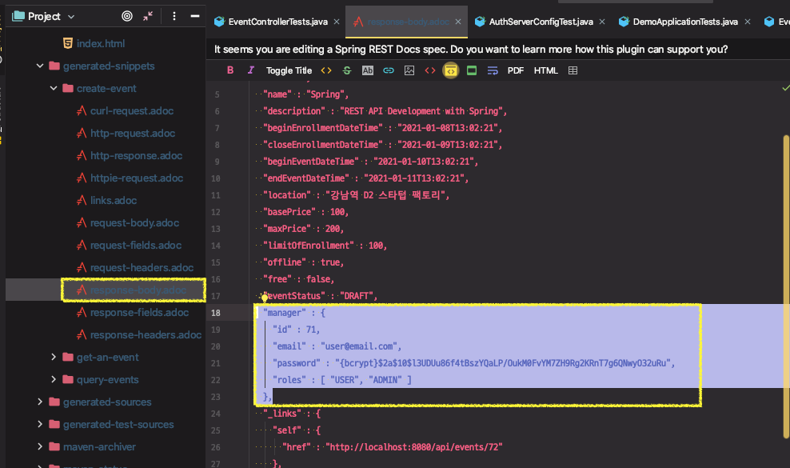
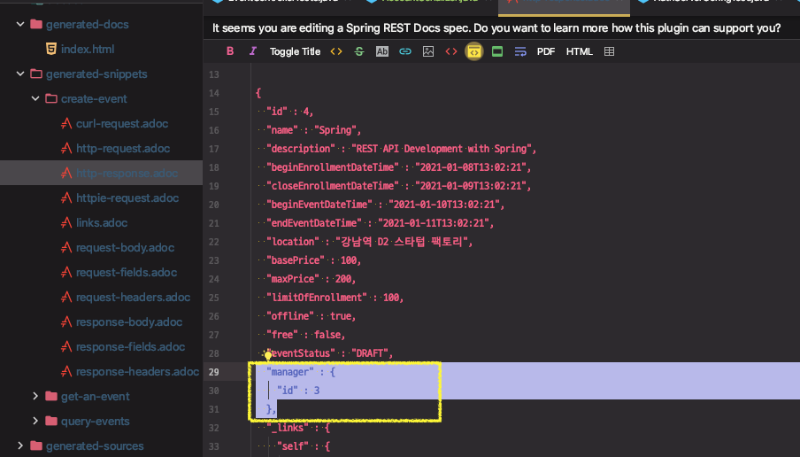

# Events API 개선: 출력값 제한하기

생성 API 개선

* Event owner 설정
* 응답에서 owner의 id만 보내 줄 것.

```json
{
  "id" : 4,
  "name" : "test 3PISM1Ju",
  "description" : "test event",
...
  "free" : false,
  "eventStatus" : "DRAFT",
  "owner" : {
    "id" : 3,
    "email" : "keesun@email.com",
    "password" : "{bcrypt}$2a$10$3z/rHmeYsKpoOQR3aUq38OmZjZNsrGfRZxSnmpLfL3lpLxjD5/JZ6",
    "roles" : [ "USER", "ADMIN" ]
  },
```

* JsonSerializer<User> 구현

* @JsonSerialize(using) 설정

---

# Events API 문제점

- 이전에 작업한 `@CurrentUser` 애노테이션을 이용해 **manager** 정보를 생성해주는데
- **email** 이외에 패스워드와 권한 까지 모두 노출되는 문제가 있음




**해결방법 2가지**

1. User를 내보낼 때 사용할 DTO를 새로 정의하고, DTO에 데이터를 맵핑하는 방법(ModelMapper를 사용)

2. JsonSerializer를 사용

   이전에는 **ErrorSerializer**에서 `@JsonComponent`를 사용해서 **ObjectMapper**에 등록이 되도록 했었음

   이번에는 `@JsonCommponent` 를 사용하지 않고 **Serializer** 처리


⇒ JsonSerializer를 사용하는 방법을 선택

이전에는 **ErrorSerializer**에서 `@JsonComponent`를 사용해서 **ObjectMapper**에 등록이 되도록 했었음

이번에는 `@JsonCommponent` 를 사용하지 않고 **Serializer** 처리

**※ `@JsonComponent`를 사용하지 않는 이유**

Account를 리소스로 정보를 내보낼 때마다 모든 Account는 (내가 설정한 규칙에 따라) `id` 정보만 나가게 되어있다. 하지만 어떠한 경우(Account의 정보를 수정하고 싶다던지)에는 Account의 정보를 추가적으로 더 받아야 되는 상황이 있을 수 있다. 따라서 한정적으로 커스텀한 Serializer를 사용할 곳에서만 사용하도록 만들어주는 것.

**Event**를 **Serialization** 할때는 manager의 구체적인 정보를 알필요가 없기 때문에 커스텀한 이 Serializer를 쓰도록 설정하는 것이다.


## 생성 API 개선

- **Event owner** 설정
- 응답에서 **owner**의 **id**만 보내준다.

### `JsonSerializer<User>` 구현

**JsonSerializer** 를 상속 받아 **account**의 **id**만 보내주도록 **AccountSerializer** 구현

```java
import com.fasterxml.jackson.core.JsonGenerator;
import com.fasterxml.jackson.databind.JsonSerializer; // fasterxml 패키지
import com.fasterxml.jackson.databind.SerializerProvider;

import java.io.IOException;

public class AccountSerializer extends JsonSerializer<Account> {
    
    @Override
    public void serialize(Account account, JsonGenerator jsonGenerator, SerializerProvider serializerProvider) throws IOException {
        jsonGenerator.writeStartObject();
        jsonGenerator.writeNumberField("id", account.getId());
        jsonGenerator.writeEndObject();
    }
}
```


### Event 객체에 `@JsonSerialize(using)` 설정

**Event**를 **Serialization** 할때는 **manager**를 **AccountSerializer**로 **Serialization** 하도록 설정

```java
import com.fasterxml.jackson.databind.annotation.JsonSerialize;
import dev.solar.demoinflearnrestapi.accounts.AccountSerializer;

public class Event {
	//...
  @ManyToOne
  @JsonSerialize(using = AccountSerializer.class)
	private Account manager;
  //...
}
```


⇒ 응답 본문에 Manager의 ID 정보만 노출된다.

