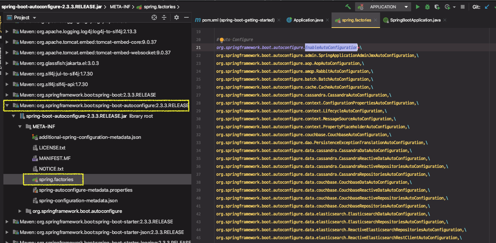

# 자동설정 이해

@EnableAutoConfiguration (@SpringBootApplication 안에 숨어 있음)
● 빈은 사실 두 단계로 나눠서 읽힘
	○ 1단계: @ComponentScan
	○ 2단계: @EnableAutoConfiguration
● @ComponentScan
	○ @Component
	○ @Configuration @Repository @Service @Controller @RestController
● @EnableAutoConfiguration
	○ spring.factories
			■ org.springframework.boot.autoconfigure.EnableAutoConfiguration
	○ @Configuration
	○ @ConditionalOnXxxYyyZzz


---

### 스프링 부트의 자동설정

스프링부트 프로젝트를 초기에 생성 하고, main을 실행하면 여러가지 설정들이 읽히면서 톰캣이 떠있는 상태가 된다.

How? `@SpringBootApplication` 어노테이션 안에 있는 `@EnableAutoConfiguration`에 있는 설정들 때문이다.

```java
@SpringBootApplication
public class Application {

    public static void main(String[] args) {
        SpringApplication.run(Application.class, args); //SpringApplication.run() static 메서드를 이용한 애플리케이션 실행
    }
}
```


 `@SpringBootApplication` 어노테이션은 다음 3가지 어노테이션으로 대체할 수 있다.

* @SpringBootConfiguration
  * 그냥 @Configuration 과 같다. 이름만 다름
* @ComponentScan
* @EnableAutoConfiguration


### 스프링부트 어플리케이션은 빈을 2단계로 등록한다.

우선, @ComponentScan으로 빈을 등록 후에, 추가적으로 @EnableAutoConfiguration로 읽어온 빈을 등록한다.

따라서 @EnableAutoConfiguration을 쓰지 않고, 2가지 어노테이션 @Configuration, @ComponentScan으로 어플리케이션을 실행할 수 있다.


```java
@Configuration
@Component
//@EnableAutoConfiguration
public class Application {

    public static void main(String[] args) {
        SpringApplication.run(Application.class, args);
    }
}
// => 실행하면 에러
```


`ServletWebServerFactory` 타입의 빈을 찾지 못해서 발생한 에러

(`ServletWebServerFactory` 은 @EnableAutoConfiguration 에서 자동으로 만들어주는 빈이기 때문에 에러 발생.)

지금은 Web 어플리케이션으로 별도의 설정이 들어가 있기 때문에, Web 어필리케이션으로 실행하지 않고 두가지 어노테이션을 가지고 실행하려면 추가적인 작업이 필요하다.


**`SpringApplication` 을 static 메서드를 사용하지 않고, 인스턴스를 만들어서 사용하면 SpringApplication을 커스터마이징해서 사용할 수 있다.**

`WebApplicationType.NONE` 으로 설정하면 web 어플리케이션으로 만들지 않기 때문에, `@EnableAutoConfiguration` 없이도 어플리케이션(웹 서버용 X)을 실행된다.

```java
@Configuration
@ComponentScan
public class Application {

    public static void main(String[] args) {
        SpringApplication application = new SpringApplication(Application.class);
        application.setWebApplicationType(WebApplicationType.NONE);  //WebApplicationType 으로 실행하지 않음
        application.run(args);
    }
}
```


### 1. @ComponentScan 빈 등록

* @Component
* @Configuration @Repository @Service @Controller @RestController

위 어노테이션을 가진 클래스들을 스캔해서 빈으로 등록한다. 


@ComponentScan 어노테이션 설정을 보자

excludeFilters에 해당하는 값들은 빈으로 읽어들이지 않고 제외한다.

```java
@ComponentScan(excludeFilters = { @Filter(type = FilterType.CUSTOM, classes = TypeExcludeFilter.class),
		@Filter(type = FilterType.CUSTOM, classes = AutoConfigurationExcludeFilter.class) })
public @interface SpringBootApplication {
```


다음과 같이 `@ComponentScan` 이 붙어있으면 해당 클래스 파일이 위치한 패키지와 하위 패키지 내의 어노테이션들을 스캔해서 빈으로 등록한다. (상위 패키지는 스캔하지 않음!!)

```java
@ComponentScan
public class Application {

    public static void main(String[] args) { ... }
}
```


### 2. @EnableAutoConfiguration 빈 등록

 java>resources 의 메타 디렉토리 안에 `spring.factories` 라는 파일이 있다.




하위에 여러가지 Configuration이 정의되어있다. 이 목록들이 기본 설정된 AutoConfiguration 이다. 스프링부트 컨벤션들

`WebMvcAutoConfiguration` 을 보면 여러가지 설정들이 많지만 핵심은 `@Configuration`이다. 즉, 자바에서 빈을 등록하는 설정파일이다. 

```java
@Configuration(proxyBeanMethods = false)
@ConditionalOnWebApplication(type = Type.SERVLET)
@ConditionalOnClass({ Servlet.class, DispatcherServlet.class, WebMvcConfigurer.class })
@ConditionalOnMissingBean(WebMvcConfigurationSupport.class)
@AutoConfigureOrder(Ordered.HIGHEST_PRECEDENCE + 10)
@AutoConfigureAfter({ DispatcherServletAutoConfiguration.class, TaskExecutionAutoConfiguration.class,
		ValidationAutoConfiguration.class })
public class WebMvcAutoConfiguration { ... }
```


따라서 스프링부트가 이 자바 설정 파일들을 읽어들인다. `EnableAutoConfiguration` 라는 Key값 하위에 설정되어있는 클래스들을 읽어들인다. AutoConfiguration의 대상이 되어 모든 설정들이 적용이 된다.

정확히는 조건에 따라서 적용이 된다. 하위 Configuration에는 모두 `@Configuration`  어노테이션이이 달려있기 때문에 전부 자바 설정 파일이다. 그런데, `@Conditional..XXX` 라는 어노테이션들이 부가적으로 함께 사용이 된다.

즉, 조건에 따라 어떠한 빈을 등록하기도 하고, 하지 않기도 한다. 또는 이 설정파일 자체를 쓸 것인지 아닌지를 결정하기도 한다.


위의 WebMvcAutoConfiguration 어노테이션 중,`@ConditionalOnWebApplication(type = Type.SERVLET)` 은 `WebApplicationType`이 `Type.SERVLET`인 경우에만 이 설정을 사용한다는 의미이다.

위의 실습에서는 다음과 같이 Type을 None으로 설정하였기 때문에 위 설정은 적용되지 않는다.

```java
application.setWebApplicationType(WebApplicationType.NONE);
```


* `@ConditionalOnClass` 는 다음 항목들이 Class Path에 있는 경우에만 이 빈 설정 사용한다는 의미

```java
@ConditionalOnClass({ Servlet.class, DispatcherServlet.class, WebMvcConfigurer.class })
```


* `OrderedHiddenHttpMethodFilter` 빈이 없는 경우 `hiddenHttpMethodFilter` 을 등록한다.

```java
@ConditionalOnMissingBean(WebMvcConfigurationSupport.class)
...
@Bean
    @ConditionalOnMissingBean(HiddenHttpMethodFilter.class)
    @ConditionalOnProperty(prefix = "spring.mvc.hiddenmethod.filter", name = "enabled", matchIfMissing = false)
    public OrderedHiddenHttpMethodFilter hiddenHttpMethodFilter() {
    	return new OrderedHiddenHttpMethodFilter();
  }
```


### 전체 과정 

"모든 jar 파일에서 `spring.factories`  파일을 찾아서 키값(ex, `EnableAutoConfiguration` )해당하는 모든 클래스들을 보고 컨디션에 맞으면 빈을 등록한다."

`@SpringBootApplication` 어노테이션을 통해서 `spring.factories`  에 정의된 수많은 자동 설정들이 조건에 따라 적용이 되어서 수많은 빈들이 생성이 되고, 내장 톰캣을 사용해서 Web 어플리케이션이 구동되는 것이다.


