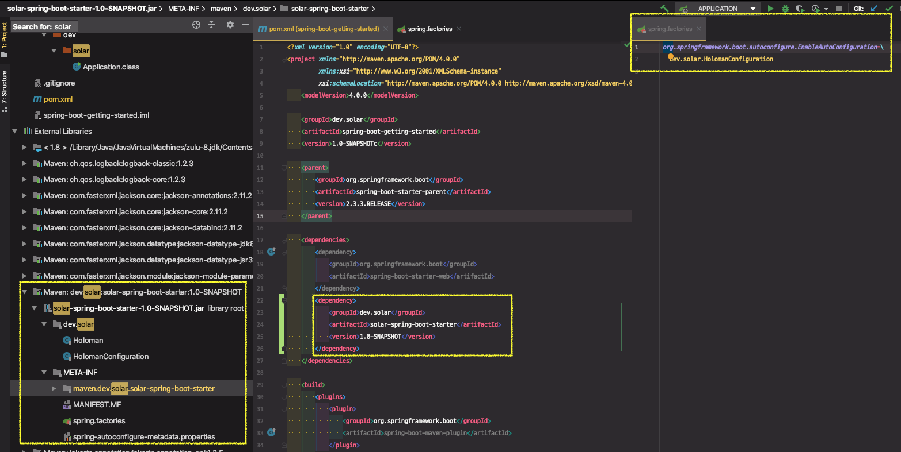
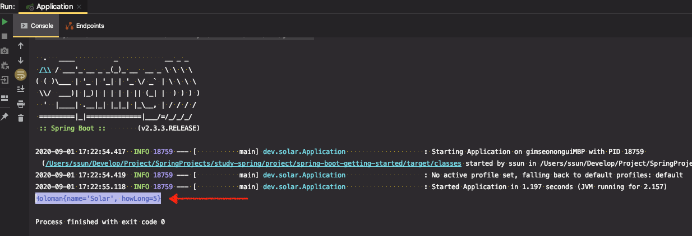

# 자동 설정 만들기 1부 : Starter와 AutoConfigure

* https://docs.spring.io/spring-boot/docs/current/reference/htmlsingle/#boot-features-developing-auto-configuration

● Xxx-Spring-Boot-Autoconfigure 모듈: 자동 설정

● Xxx-Spring-Boot-Starter 모듈: 필요한 의존성 정의

● 그냥 하나로 만들고 싶을 때는?

​	 ○ Xxx-Spring-Boot-Starter

● 구현 방법

1. 의존성 추가

  ```xml
  <dependencies>
  	<dependency>
  		<groupId>org.springframework.boot</groupId>
  		<artifactId>spring-boot-autoconfigure</artifactId>
  	</dependency>
  	<dependency>
  		<groupId>org.springframework.boot</groupId>
  		<artifactId>spring-boot-autoconfigure-processor</artifactId>
  		<optional>true</optional>
  	</dependency>
  </dependencies>
  
  <dependencyManagement>
  	<dependencies>
  		<dependency>
  			<groupId>org.springframework.boot</groupId>
  			<artifactId>spring-boot-dependencies</artifactId>
         <version>2.0.3.RELEASE</version>
         <type>pom</type>
  			<scope>import</scope>
  		</dependency>
  	</dependencies>
  </dependencyManagement>
  ```

  

2. @Configuration 파일 작성

3. src/main/resource/META-INF에 spring.factories 파일 만들기

4. spring.factories 안에 자동 설정 파일 추가

   ```java
   org.springframework.boot.autoconfigure.EnableAutoConfiguration=\
     dev.solar.HolomanConfiguration //내가 만든 설정 파일
   ```

5. mvn install

---

## 프로젝트 생성

* maven 프로젝트생성 (solar-spring-boot-starter)
* 위 구현 방법에 따라 진행

#### 1. 의존성 추가

* 2개의 의존성의 버전 관리를 위해 `spring-boot-dependencies` 라는 `dependencyManagement`도 추가해줌.
* 현재 2.0.3.RELEASE 버전으로 관리한다.


#### 2. `Holoman.java` 클래스 파일생성

```java
package dev.solar;

public class Holoman {

    String name;

    int howLong;

    public String getName() {
        return name;
    }

    public void setName(String name) {
        this.name = name;
    }

    public int getHowLong() {
        return howLong;
    }

    public void setHowLong(int howLong) {
        this.howLong = howLong;
    }

    @Override
    public String toString() {
        return "Holoman{" +
                "name='" + name + '\'' +
                ", howLong=" + howLong +
                '}';
    }
}
```


#### 3. Holoman을 자동 설정해주는 @Configuration 설정 파일을 생성

뭔가를 설정하는 대상이 되는 클래스같은 경우는 다른 프로젝트에 있는 경우가 흔하다. 다른 프로젝트 라이브러리에 대한 자동 설정 파일을 또 다른 프로젝트에서 만들어서 사용한다.

지금은 실습을 위해 편의상 같은 프로젝트 내에서 설정 파일을 생성해보자

```java
package dev.solar;

import org.springframework.context.annotation.Bean;
import org.springframework.context.annotation.Configuration;

@Configuration
public class HolomanConfiguration {

    @Bean
    public Holoman holoman() {
        Holoman holoman = new Holoman();
        holoman.setHowLong(5);
        holoman.setName("Solar");
        return holoman;
    }
}
```


#### 4. src/main/resource/META-INF에 spring.factories 파일 만들기

`META-INF` 디렉토리 생성 후, `spring.factories` 파일 생성

( ※ `spring.factories` 는 스프링 부트에 국한된 것이 아니다. 스프링 프레임워크 라이프 사이클에서도 활용되고 여러가지 용도로 쓰인다. `서비스 프로바이더` 와 같은 패턴이다.)

```java
org.springframework.boot.autoconfigure.EnableAutoConfiguration=\
  dev.solar.HolomanConfiguration //내가 만든 설정 파일
```

`EnableAutoConfiguration` 설정이 켜져 있으면, key에 해당하는 `dev.solar.HolomanConfiguration` 설정 파일을 읽게 된다. `HolomanConfiguration` 파일의 Bean 설정을 보고 사용할 수 있게 된다.


#### 5. mvn install

다른 프로젝트에서 사용할 수 있도록 이 프로젝트를 `빌드`하고 `install`해야 한다.

※ 방법 2가지

1. (우측) [Maven] > [Lifecycle] > [install] 더블 클릭
2. CLI에서 `mvn install`  명령 입력


프로젝트를 빌드해서 생성된 `jar` 파일을 다른 메이븐 프로젝트에서 가져다가 쓸 수 있도록 **로컬 메이븐 저장소에 설치한다.**


#### 6. 다른 외부 프로젝트에서 방금 만든 의존성을 추가해보자

[solar-spring-boot-starter] 의 pom.xml 파일에서 다음 내용을 복사

```xml
<groupId>dev.solar</groupId>
<artifactId>solar-spring-boot-starter</artifactId>
<version>1.0-SNAPSHOT</version>
```


[spring-boot-getting-started] 프로젝트의 pom.xml 파일에 위 복사한 내용으로 의존성 추가

```xml
<dependency>
  <groupId>dev.solar</groupId>
  <artifactId>solar-spring-boot-starter</artifactId>
  <version>1.0-SNAPSHOT</version>
</dependency>
```


다음과 같이 의존성이 추가된 것을 확인할 수 있다.

[META-INF] > [spring.factories]에 설정한 내용도 잘 들어온다.




#### 7. Holoman 빈이 정상적으로 생성되었는지 확인

`HolomanRunner` 파일 생성

스프링부트 애플리케이션이 생성되고 띄워질 때 자동으로 실행되는 빈을  만들고 싶은 경우 `ApplicationRunner` 인터페이스를 구현하면 된다.   

[spring-boot-getting-started] 프로젝트에서는 어디에서도 `Holoman`을 빈으로 등록하지 않았다.

@Autowired로 Holoman을 주입받아서 내용을 출력하도록 해보자

```java
@Component
public class HolomanRunner implements ApplicationRunner {
    
    @Autowired
    Holoman holoman;

    @Override
    public void run(ApplicationArguments args) throws Exception {
        System.out.println(holoman);
    }
}
```

내용이 출력된다면 Holoman 빈이 존재한다는 의미이다.

만약 Holoman 빈이 존재하지 않는다면, 빈을 주입받지 못하기 때문에 어플리케이션이 띄워지지도 않는다.




##### ※ 결론

 [spring-boot-getting-started] 프로젝트에서 Holoman에 대한 빈을 별도로 등록하지 않았지만, pom.xml에 [solar-spring-boot-starter] 프로젝트에 대한 의존성을 추가하였기 때문에 자동으로 Holoman 빈이 생성되어 사용할 수 있다.


### ※ 여기서 존재하는 문제

명시적으로 Holoman 빈을 등록하는 코드를 작성

```java
@SpringBootApplication
public class Application {

    public static void main(String[] args) {
        SpringApplication application = new SpringApplication(Application.class);
        application.setWebApplicationType(WebApplicationType.NONE); //좀 더 빨리 실행되도록 타입 변경
        application.run(args);
    }

    @Bean
    public Holoman holoman() {
        Holoman holoman = new Holoman();
        holoman.setName("Solariri");
        holoman.setHowLong(60);
        return holoman;
    }
}
```


프로젝트를 실행하면 기대하는 값은, "Solari" , 60 이라는 값인데, ~~이 빈 등록이 무시된다.~~ 어플리케이션이 실행되지 않는다.


##### Why??

이전 강의에서 **"스프링부트 어플리케이션은 빈을 2단계로 등록한다."** 라고 하였다. 먼저 `@ComponentScan`으로 우리가 작성한 빈등록 코드로 Holoman이 빈으로 등록된다. 그리고나서 `@EnableAutoConfiguration`로 읽어온 빈을 등록하기 때문에 ~~덮어쓰게 된다.~~ 오버라이딩이 막혀있어 어플리케이션이 실행되지 않는다.

(강의에서는 어플리케이션을 실행하면 명시적으로 등록한 빈이 무시되고 AutoConfiguration 으로 설정한 빈 값으로 출력이 된다. 현재 실습을 진행하면 에러메시지가 뜨면서 실행 조차 안 됨.)

```
***************************
APPLICATION FAILED TO START
***************************

Description:

The bean 'holoman', defined in class path resource [dev/solar/HolomanConfiguration.class], could not be registered. A bean with that name has already been defined in dev.solar.Application and overriding is disabled.

Action:

Consider renaming one of the beans or enabling overriding by setting spring.main.allow-bean-definition-overriding=true
```


에러메시지 : 클래스 경로 자원 [dev/solar/HolomanConfiguration.class]에 정의 된 'holoman'Bean을 등록 할 수 없습니다. 해당 이름의 Bean이 이미 dev.solar.Application에 정의되어 있으며 재정의가 비활성화되어 있습니다.

빈 이름을 재정의하거나 spring.main.allow-bean-definition-overriding 속성값을 true로 하여 재정의가 가능하게 설정해야 함


