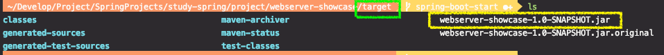
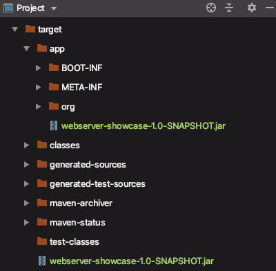
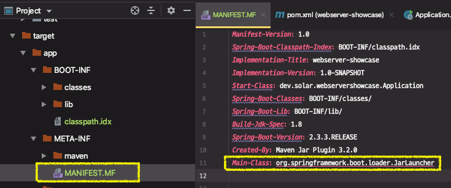

# 독립적으로 실행가능한 JAR

* [Spring Docs - executable jar](https://docs.spring.io/spring-boot/docs/current/reference/html/executable-jar.html)

* `spring-boot-maven-plugin`에 대한 내용

“그러고 보니 JAR 파일 하나로 실행할 수 있네?”

- mvn package를 하면 실행 가능한 **JAR** 파일 **“**하나가**"** 생성 됨.
- spring-maven-plugin이 해주는 일 (패키징)
- 과거 “uber” jar 를 사용
  - 모든 클래스 (의존성 및 애플리케이션)를 하나로 압축하는 방법
  - 뭐가 어디에서 온건지 알 수가 없음
    - 무슨 라이브러리를 쓰는건지..
  - 내용은 다르지만 이름이 같은 파일은 또 어떻게?

* 스프링 부트의 전략
  * 내장 JAR : 기본적으로 자바에는 내장 JAR를 로딩하는 표준적인 방법이 없음. 
  * 애플리케이션 클래스와 라이브러리 위치 구분
  * org.springframework.boot.loader.jar.JarFile을 사용해서 내장 JAR를 읽는다. 
  * org.springframework.boot.loader.Launcher를 사용해서 실행한다.

---

* (프로젝트 세팅) JAVA 8, SSL 적용 X, GET "/" 요청에 대한 응답 컨트롤러 생성


개발 중에는 IDE를 통해서 어플리케이션을 실행하지만, 어딘가에 배포하거나 도커 이미지로 만들 때에는 `JAR` 파일로 패키징한 다음에, 그 JAR 파일을 실행하는 방법이 유용하다.

이 부분도 스프링부트의 중요한 특징 중의 하나이다.


1. IDE에서 실행

2. Console에서 실행

   (1) 패키지 파일 생성

   * `mvn clean` : target 하위에 있는 모든 파일 삭제 (명령 실행 위치는 **프로젝트 Root** ★)
   * `mvn package` : 컴파일된 결과물을 패키지 파일로 생성
     * `-DskipTests` : 테스트 스킵하여 패키지 생성
     * `target` 디렉토리에 패키지 파일 생성

   ```sh
   mvn clean package
   ```

   

   (2) 패키지 파일 실행

   ```sh
   java -jar webserver-showcase-1.0-SNAPSHOT.jar 
   ```

   ⇒ 웹 어플리케이션이 잘 실행되고, 브라우저에서 접근 잘 됨

   

> JAR 파일 하나로 잘 실행된다. 패키징할 때 수많은 의존성은 어떻게 했을까?

mvn package를 하면 실행 가능한 **JAR** 파일 **“**하나가**"** 생성 됨.

그 JAR 파일 하나에 모든 의존성 JAR 파일이 다 들어가 있다. 


생성된 JAR 파일을 압축 해제하여 어떠한 파일이 들어가 있는지 확인해보자

```sh
.../target> mkdir app
.../target> cd app
.../target/app> cp ../webserver-showcase-1.0-SNAPSHOT.jar ./
.../target/app> unzip -q webserver-showcase-1.0-SNAPSHOT.jar
```

* META-INF : 메타 파일이 들어있다.

* org/springframework/boot/loader : 로더 관련 파일들 ...
* BOOT-INF/classes : 내가 만든 클래스
* BOOT-INF/lib : 애플리케이션에 필요한 라이브러리 jar 파일들

 


자바에는 JAR 안에 들어있는 JAR 파일을 읽을 수 있는 표준적인 방법이 없다. 

그래서 옛날에는 **"uber jar"**를 사용해서 jar안에 들어있는 모든  클래스를 합쳐서 하나의 JAR 파일로 만들었다. 

**※ uber jar 문제점**

*  뭐가 어디에서 온건지 알 수가 없다. 무슨 라이브러리를 쓰는건지..

* 서로 다른 JAR 안의 동일한 파일 이름을 가진 경우에 구분할 수 없다. 

스프링 부트는 이러한 문제를 보완해서 `내장 JAR`로 만들어서 JAR 파일 안에 JAR 파일 그대로를 묶어서 가지고 있고, 이 파일들을 읽을 수 있는 파일을 만들었다.

* org/springframework/boot/loader/jar/**JarFile.clss** : 의존성 JAR 파일들을 읽어주는 역할을 한다.

* org/springframework/boot/loader/**JarLauncher.class** : main 메서드를 가지고 있는 클래스를 실행시켜주는 파일 (Launcher)
  * 그 외, **WarLauncher.class** 도 있다.

* **MANIFEST.MF** 파일에 어떤 Launcher로 실행할지 적혀있다.
  * Main-Class : main 클래스를 가지고있는 클래스를 알려준다.




내장 톰캣 또한 독립적으로 실행가능한 어플리케이션을 만들기 위한 일부분이다.

`spring-maven-plugin`이 이러한 패키징을 해주고, `MANIFEST.MF` 파일 정보를 활용해서 실행할 수 있게 된다.

 모든 JAR파일의 실행 시작은 `MANIFEST.MF`에서 시작한다. 스프링부트에서 `Main-Class`를 main을 가진 클래스가 아니라 스프링부트가 가지고있는 `JarLauncher`를 먼저 실행하도록 패키징을 한 것이다. 

그리고 `Start-Class`에 내가 만든 main 클래스가 어떤 것인지 알려주고, JarLauncher가 이 앱을 실행하는데 필요한 내장된 모든 라이브러리 파일을 `JarFile`을 사용해서 로딩해서 실행한다.


 