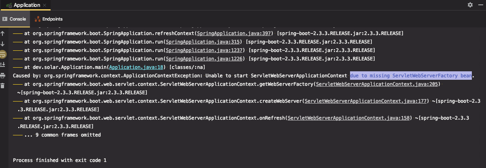

# 자동설정 이해

@EnableAutoConfiguration (@SpringBootApplication 안에 숨어 있음)
● 빈은 사실 두 단계로 나눠서 읽힘
	○ 1단계: @ComponentScan
	○ 2단계: @EnableAutoConfiguration
● @ComponentScan
	○ @Component
	○ @Configuration @Repository @Service @Controller @RestController
● @EnableAutoConfiguration
	○ spring.factories
■ org.springframework.boot.autoconfigure.EnableAutoConfiguration
	○ @Configuration
	○ @ConditionalOnXxxYyyZzz


---

스프링부트 프로젝트를 초기에 생성 하고, main을 실행하면 여러가지 설정들이 읽히면서 톰캣이 떠있는 상태가 된다.

How? `@SpringBootApplication` 어노테이션 안에 있는 `@EnableAutoConfiguration`에 있는 설정들 때문이다.

```java
@SpringBootApplication
public class Application {

    public static void main(String[] args) {
        SpringApplication.run(Application.class, args);
    }
}
```


 `@SpringBootApplication` 어노테이션은 다음 3가지 어노테이션으로 대체할 수 있다.

* @SpringBootConfiguration
  * 그냥 @Configuration 과 같다. 이름만 다름
* @ComponentScan
* @EnableAutoConfiguration


#### 스프링부트 어플리케이션은 빈을 2단계로 등록한다.

우선, @ComponentScan으로 빈을 등록 후에, 추가적으로 @EnableAutoConfiguration로 읽어온 빈을 등록한다.

따라서 @EnableAutoConfiguration을 쓰지 않고, 2가지 어노테이션 @Configuration, @ComponentScan으로 어플리케이션을 실행할 수 있다.


```java
@Configuration
@Component
//@EnableAutoConfiguration
public class Application {

    public static void main(String[] args) {
        SpringApplication.run(Application.class, args);
    }
}
// => 실행하면 에러
```


`ServletWebServerFactory` 타입의 빈을 찾지 못해서 발생한 에러

(`ServletWebServerFactory` 은 @EnableAutoConfiguration 에서 자동으로 만들어주는 빈이기 때문에 에러 발생.)

지금은 Web 어플리케이션으로 별도의 설정이 들어가 있기 때문에, Web 어필리케이션으로 실행하지 않고 두가지 어노테이션을 가지고 실행하려면 추가적인 작업이 필요하다.




`SpringApplication` 을 static 메서드를 사용하지 않고, 인스턴스를 만들어서 사용하면 SpringApplication을 커스터마이징해서 사용할 수 있다.

`WebApplicationType.NONE` 으로 설정하면 web 어플리케이션으로 만들지 않기 때문에, `@EnableAutoConfiguration` 없이도 어플리케이션(웹 서버용 X)을 실행된다.

```java
@Configuration
@ComponentScan
public class Application {

    public static void main(String[] args) {
        SpringApplication application = new SpringApplication(Application.class);
        application.setWebApplicationType(WebApplicationType.NONE);  //WebApplicationType 으로 실행하지 않음
        application.run(args);
    }
}
```


#### 1. @ComponentScan 빈 등록

* @Component
* @Configuration @Repository @Service @Controller @RestController

위 어노테이션을 가진 클래스들을 스캔해서 빈으로 등록한다. 


@ComponentScan 어노테이션 설정을 보자

excludeFilters에 해당하는 값들은 빈으로 읽어들이지 않고 제외한다.

```java
@ComponentScan(excludeFilters = { @Filter(type = FilterType.CUSTOM, classes = TypeExcludeFilter.class),
		@Filter(type = FilterType.CUSTOM, classes = AutoConfigurationExcludeFilter.class) })
public @interface SpringBootApplication {
```


다음과 같이 `@ComponentScan` 이 붙어있으면 해당 클래스 파일이 위치한 패키지와 하위 패키지 내의 어노테이션들을 스캔해서 빈으로 등록한다. (상위 패키지는 스캔하지 않음!!)

```java
@ComponentScan
public class Application {

    public static void main(String[] args) { ... }
}
```


 