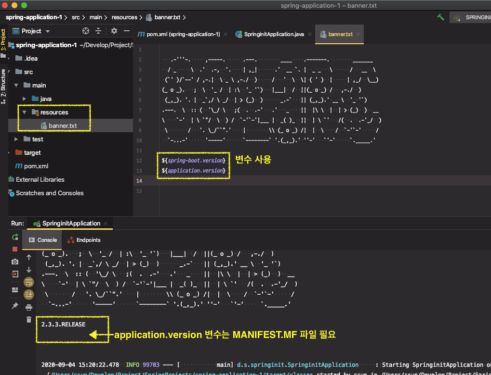
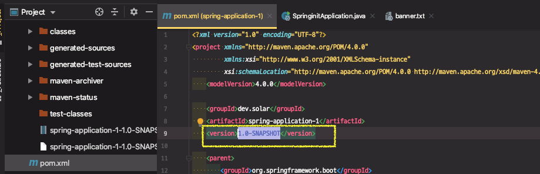

# 4부: 스프링 부트 활용

3부에서는 스프링 부트가 제공하는 여러 기능을 사용하며 원하는대로 커스터마이징 하는 방법을 학습

기능을 두 파트로 나누어서 학습 진행

* 어떠한 스프링 기술을 사용하던지 스프링부트가 기본적으로 제공해주는 핵심 기능들 (기반이 되는 기술)

* 가상 널리 사용되는 웹 MVC, 데이터, 시큐리티 기술 등을 다룸

| 스프링 부트 핵심 기능                                        | 각종 기술 연동                                               |
| ------------------------------------------------------------ | ------------------------------------------------------------ |
| ● SpringApplication <br />● 외부설정<br />● 프로파일  <br />● 로깅<br />● 테스트  <br />● Spring-Dev-Tools | ●  스프링 웹 MVC <br />●  스프링 데이터<br />●  스프링 시큐리티 <br />●  REST API 클라이언트<br />●  다루지 않은 내용들 |


---

# SpringApplication 1부

* [Spring Docs - boot-features-spring-application](https://docs.spring.io/spring-boot/docs/current/reference/html/boot-features-spring-application.html#boot-features-spring-application)

* 기본 로그 레벨 INFO (뒤에 로깅 수업 때 자세히 살펴볼 예정)

* FailureAnalyzer

* 배너
  * banner.txt | gif | jpg | png
  * classpath 또는 spring.banner.location
  * ${spring-boot.version} 등의 변수를 사용할 수 있음.
  * Banner 클래스 구현하고 SpringApplication.setBanner()로 설정 가능.
  * 배너끄는방법
* SpringApplicationBuilder로 빌더 패턴 사용 가능

---

### SpringApplication 실행 방법

원래 SpringApplication을 실행할 때, 다음과 같이 Static Method를 이용했었다.

```java
@SpringBootApplication
public class SpringinitApplication {
  public static void main(String[] args) {
    SpringApplication.run(Application.class, args);
  }
}
```

하지만 이렇게 하면, SpringApplication이 제공하는 많은 다양한 커스터마이징 기능을 사용하기 어렵다. 

따라서 SpringApplication 인스턴스를 만들어서 run()을 하는 방식으로 쓰면 코드 실행 결과는 동일하면서 스프링부트 기능을 커스터마이징할 수 있다.

```java
@SpringBootApplication
public class SpringinitApplication {
    public static void main(String[] args) {
        SpringApplication app = new SpringApplication(SpringinitApplication.class);
        app.run(args);
    }
}
```


## 기본 로그 레벨 - INFO

별도의 옵션을 설정하지않으면 기본적으로 어플리케이션의 로그 레벨이 `INFO`이다. (로그 설정 방법은 이후 강의에서..)


[어플리케이션 실행 tab] > [Edit Configurations...] > [VM options] : `-Ddebug` 또는 [Program Argument] : `--debug` 를 입력해서 debug level을 설정할 수 있다. 


debug 모드로 실행하면 콘솔 창에 추가적으로 많은 내용이 출력된다. "어떠한 자동설정이 (왜 안) 적용되었는지"에 대한 로그를 볼 수 있다.


## FailureAnalyzer

어플리케이션 에러가 났을 때, 에러 메시지를 좀 더 예쁘게 출력해주는 기능

스프링 부트 어플리케이션에는 기본적으로 여러가지 FailureAnalyzer 가 등록이 되어있다. 

(직접 등록해서 사용할 수 있지만 거의 그럴일 없음)

* 참고 : [Spring Docs - failure](https://docs.spring.io/spring-boot/docs/current/reference/html/spring-boot-features.html#boot-features-startup-failure)

## 배너

* 배너


### 배너 변경

* 배너파일 위치
  *  `classpath` [src > main > resources] 에 `banner.txt | gif | jpg | png` 파일을 생성
  * application.properties 파일에서`spring.banner.location` 속성 설정
    * classpath 기준으로 설정
    * spring.banner.location=classpath:/dir/of/file/banner.txt
    * image 배너를 사용하는 경우, `spring.banner.image.xxx` 여러 속성을 사용할 수 있음
* 배너 기본 인코딩은 `UTF-8`이다. 시스템 콘솔의 인코딩이 `UTF-8`이 아니면 깨짐
* online에서 ascii generator 로 자신의 배너 만들기 가능

※ [배너 만들어주는 사이트](http://patorjk.com/software/taag/#p=display&f=Flower%20Power&t=solarc)


### 배너에 변수를 사용할 수 있다.

* `${spring-boot.version} ` 으로 스프링부트 버전 정보를 출력



* 일부는 `MANIFEST.MF `파일이 있어야 사용가능한 변수들이 있다.

`${application.version}` 변수의 경우 위와 같이 실행하면 출력이 안된다.

콘솔에서 프로젝트를 JAR 파일로 패키징해서 실행시켜보자

```sh
mvn clean package // target 디렉토리에 jar 파일 생성 됨
java -jar target/spring-application-1-1.0-SNAPSHOT.jar
```

`mvn package` 로 스프링 부트를 패키징하면 모든 의존성을 다 포함해서 하나의 JAR 파일을 만들어준다. 그 JAR 파일만 가지고 프로그램을 실행할 수 있다.

생성된 jar 파일을 실행하면 `${application.version}` 정보가 출력된다.


※ WHY? 패키징한 JAR 파일을 실행하면 왜 나올까

JAR 패키징을 할 때, MANIFEST.MF 파일도 만들어 주는데, 그 때 `pom.xml` 파일의 `version` 정보를 사용하기 때문에 이 버전 정보가 출력되는 것이다. 




### 배너 끄는 방법

* `app.setBannerMode(Banner.Mode.OFF);` 코드 추가

```java
public static void main(String[] args) {
  SpringApplication app = new SpringApplication(SpringinitApplication.class);
  app.setBannerMode(Banner.Mode.OFF); // 배너 끄기
  app.run(args);
}
```


### 배너를 코딩으로 구현

* Banner 클래스 구현하고 `SpringApplication.setBanner()`로 배너를 커스텀하게 생성해서 사용

```java
@SpringBootApplication
public class SpringinitApplication {

  public static void main(String[] args) {
    SpringApplication app = new SpringApplication(SpringinitApplication.class);
    app.setBanner(new Banner() {
      @Override
      public void printBanner(Environment environment, Class<?> sourceClass, PrintStream out) {
        out.println("======================================");
        out.println("  SOLAR'S SPRING PROJECT !!!!!!!!! ");
        out.println("======================================");
      }
    });
    //        app.setBannerMode(Banner.Mode.OFF);
    app.run(args);
  }
}
```


> `app.setBanner() 로 생성한 배너` vs `resources의 배너 파일` 우선순위는 ??

⇒ resources의 배너 파일의 우선순위가 높다.


### SpringApplicationBuilder로 빌더 패턴 사용 가능

