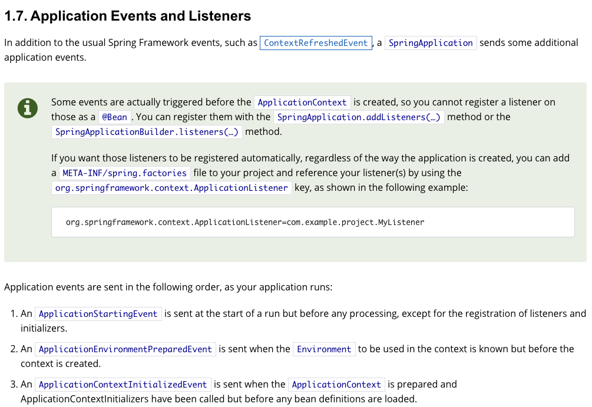
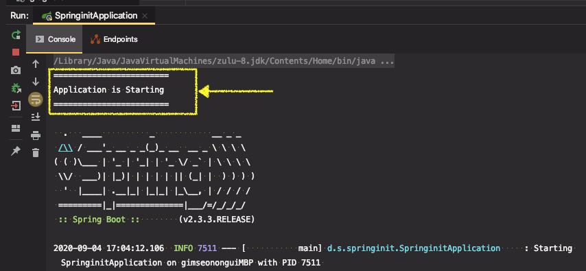
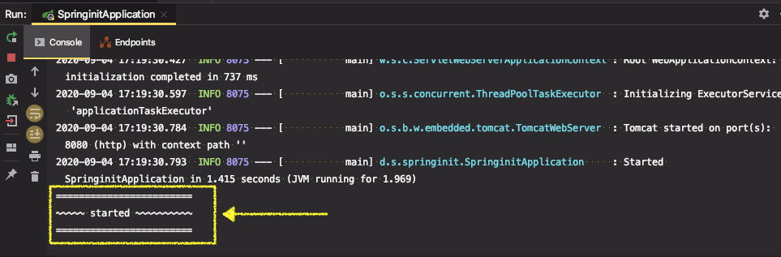

# SpringApplication 2부

* [Spring Docs - 1.7. Application Events and Listeners](https://docs.spring.io/spring-boot/docs/current/reference/html/spring-boot-features.html#boot-features-spring-application)

* ApplicationEvent 등록
  * ApplicationContext를 만들기 전에 사용하는 리스너는 @Bean으로 등록할 수 없다.
    * SpringApplication.addListners()

* WebApplicationType 설정 
* 애플리케이션 아규먼트 사용하기
  * ApplicationArguments를 빈으로 등록해 주니까 가져다 쓰면 됨. 
* 애플리케이션 실행한 뒤 뭔가 실행하고 싶을 때
  * ApplicationRunner (추천) 또는 CommandLineRunner
  * 순서 지정 가능 @Order

---

## ApplicationEvent 등록

※ 문서 참고




스프링부트가 기본적으로 제공해주는 ApplicationEvent들이 있고, 이벤트가 실행되는 시점이 다양하게 있다. 어플리케이션이 실행될 때, ApplicationContext를 만들었을 때, ApplicationContext가 refresh 됐을 때, Application이 잘 구동되었을 때, 실패했을 때 등등...

그 중에 주의해야할 것이 있다.


#### 1 - (1). ApplicationListener 를 생성 - ApplicationContext가 만들어지기 전 이벤트

* `ApplicationListener<이벤트타입>` : 어떤 이벤트의 리스너를 만드는 것인지 타입을 지정해줘야 한다.
* `applicationStartingEvent`는 어플리케이션 가장 처음에 발생하는 이벤트로  `ApplicationContext`가 만들어지기 이전 시점이다.

```java
@Component //빈으로 등록하기위해 어노테이션을 추가했지만, 빈으로 등록 안되는 시점이다.
public class SampleListener implements ApplicationListener<ApplicationStartingEvent> {

  @Override
  public void onApplicationEvent(ApplicationStartingEvent applicationStartingEvent) {
    System.out.println("========================");
    System.out.println("Application is Starting");
    System.out.println("========================");
  }
}
```

`applicationStartingEvent` 이벤트가 발생하면 우리가 구현한 `SampleListener` 라는 이벤트 리스너가 실행된다. 리스너를 빈으로 등록하면 등록되어있는 빈 중에 해당하는 이벤트에 대한 리스너를 알아서 실행해준다.


> ★ "이 이벤트가 언제 발생하는 것이냐"가 중요한 기점이 된다. ★ 
>
> **"`ApplicationContext`가 만들어 졌는가? 아닌가?"** 를 기준으로 한다.

`ApplicationContext`가 만들어진 다음에 발생하는 이벤트들은 그 이벤트들에 대한 리스너가 빈이라면 해당 빈을 실행(알아서 호출)할 수 있는데, `ApplicationContext`가 만들어지기 이전에 발생한 이벤트는 빈으로 등록한다 하더라도 리스너가 동작하지 않는다.


⇒ 어플리케이션을 실행해보면 아무런 출력도 되지 않고 있다.

이런 경우에 리스너를 직접 등록해줘야 한다.


#### 1 - (2). ApplicationListener 등록

* `SpringApplication.addListners()`

```java
@SpringBootApplication
public class SpringinitApplication {

  public static void main(String[] args) {
    SpringApplication app = new SpringApplication(SpringinitApplication.class);
    app.addListeners(new SampleListener()); //<-- 리스너 직접 추가
    app.run(args);
  }
}
```

* 리스너를 빈으로 등록하는 것이 의미없으므로 앞서 빈으로 등록하기 위해 썼던 `@Component` 어노테이션 삭제


⇒ 어플리케이션을 실행해보면, 리스너가 잘 동작하여 메시지가 출력되는 것 확인




#### 2. ApplicationListener 를 생성 - ApplicationContext가 만들어진 후 이벤트

* 리스너 생성 후, 빈으로만 등록해주면 됨
* `ApplicationStartedEvent`는 `ApplicationContext`가 만들어진 다음에 발생하는 이벤트이다.

(1) 리스너 생성

* `@Component` 어노테이션을 이용해서 빈으로 등록

```java
import org.springframework.boot.context.event.ApplicationStartedEvent;
import org.springframework.context.ApplicationListener;
import org.springframework.stereotype.Component;

@Component
public class SampleListener implements ApplicationListener<ApplicationStartedEvent> {

    @Override
    public void onApplicationEvent(ApplicationStartedEvent applicationStartedEvent) {
        System.out.println("========================");
        System.out.println("~~~~~ started ~~~~~~~~~~");
        System.out.println("========================");
    }
}
```

main 코드

```java
@SpringBootApplication
public class SpringinitApplication {

    public static void main(String[] args) {
        SpringApplication app = new SpringApplication(SpringinitApplication.class);
        app.run(args);
    }
}
```


⇒ 실행하면 리스너가 잘 동작해서 어플리케이션이 실행 후 메시지가 출력됨



