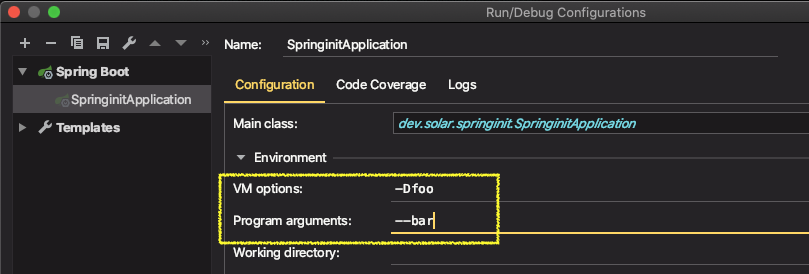
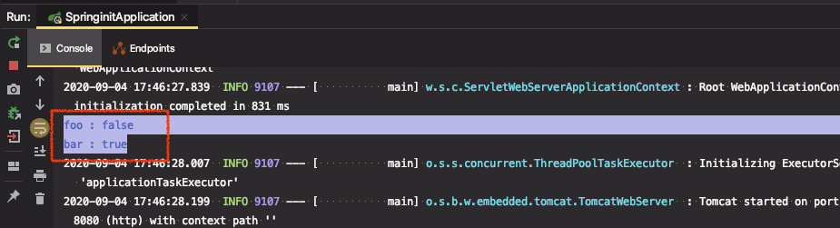
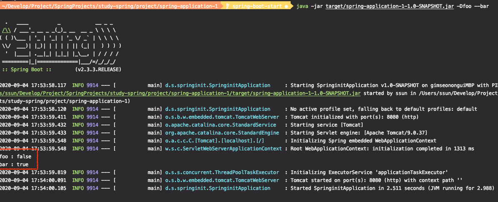
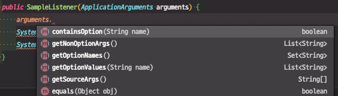
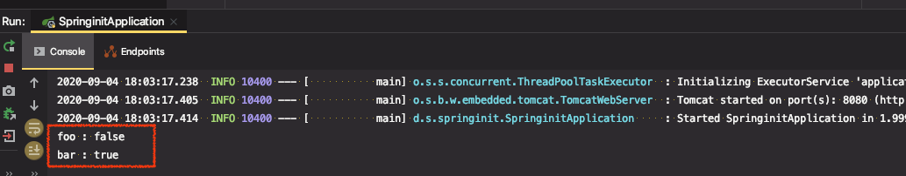
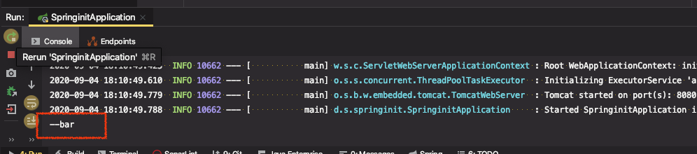

# SpringApplication 2부

* [Spring Docs - 1.7. Application Events and Listeners](https://docs.spring.io/spring-boot/docs/current/reference/html/spring-boot-features.html#boot-features-spring-application)

* ApplicationEvent 등록
  * ApplicationContext를 만들기 전에 사용하는 리스너는 @Bean으로 등록할 수 없다.
    * SpringApplication.addListners()

* WebApplicationType 설정 
* 애플리케이션 아규먼트 사용하기
  * ApplicationArguments를 빈으로 등록해 주니까 가져다 쓰면 됨. 
* 애플리케이션 실행한 뒤 뭔가 실행하고 싶을 때
  * ApplicationRunner (추천) 또는 CommandLineRunner
  * 순서 지정 가능 @Order

---

## ApplicationEvent 등록

※ 문서 참고


스프링부트가 기본적으로 제공해주는 ApplicationEvent들이 있고, 이벤트가 실행되는 시점이 다양하게 있다. 어플리케이션이 실행될 때, ApplicationContext를 만들었을 때, ApplicationContext가 refresh 됐을 때, Application이 잘 구동되었을 때, 실패했을 때 등등...

그 중에 주의해야할 것이 있다.


#### 1 - (1). ApplicationListener 를 생성 - ApplicationContext가 만들어지기 전 이벤트

* `ApplicationListener<이벤트타입>` : 어떤 이벤트의 리스너를 만드는 것인지 타입을 지정해줘야 한다.
* `applicationStartingEvent`는 어플리케이션 가장 처음에 발생하는 이벤트로  `ApplicationContext`가 만들어지기 이전 시점이다.

```java
@Component //빈으로 등록하기위해 어노테이션을 추가했지만, 빈으로 등록 안되는 시점이다.
public class SampleListener implements ApplicationListener<ApplicationStartingEvent> {

  @Override
  public void onApplicationEvent(ApplicationStartingEvent applicationStartingEvent) {
    System.out.println("========================");
    System.out.println("Application is Starting");
    System.out.println("========================");
  }
}
```

`applicationStartingEvent` 이벤트가 발생하면 우리가 구현한 `SampleListener` 라는 이벤트 리스너가 실행된다. 리스너를 빈으로 등록하면 등록되어있는 빈 중에 해당하는 이벤트에 대한 리스너를 알아서 실행해준다.


> ★ "이 이벤트가 언제 발생하는 것이냐"가 중요한 기점이 된다. ★ 
>
> **"`ApplicationContext`가 만들어 졌는가? 아닌가?"** 를 기준으로 한다.

`ApplicationContext`가 만들어진 다음에 발생하는 이벤트들은 그 이벤트들에 대한 리스너가 빈이라면 해당 빈을 실행(알아서 호출)할 수 있는데, `ApplicationContext`가 만들어지기 이전에 발생한 이벤트는 빈으로 등록한다 하더라도 리스너가 동작하지 않는다.


⇒ 어플리케이션을 실행해보면 아무런 출력도 되지 않고 있다.

이런 경우에 리스너를 직접 등록해줘야 한다.


#### 1 - (2). ApplicationListener 등록

* `SpringApplication.addListners()`

```java
@SpringBootApplication
public class SpringinitApplication {

  public static void main(String[] args) {
    SpringApplication app = new SpringApplication(SpringinitApplication.class);
    app.addListeners(new SampleListener()); //<-- 리스너 직접 추가
    app.run(args);
  }
}
```

* 리스너를 빈으로 등록하는 것이 의미없으므로 앞서 빈으로 등록하기 위해 썼던 `@Component` 어노테이션 삭제


⇒ 어플리케이션을 실행해보면, 리스너가 잘 동작하여 메시지가 출력되는 것 확인


#### 2. ApplicationListener 를 생성 - ApplicationContext가 만들어진 후 이벤트

* 리스너 생성 후, 빈으로만 등록해주면 됨
* `ApplicationStartedEvent`는 `ApplicationContext`가 만들어진 다음에 발생하는 이벤트이다.

(1) 리스너 생성

* `@Component` 어노테이션을 이용해서 빈으로 등록

```java
import org.springframework.boot.context.event.ApplicationStartedEvent;
import org.springframework.context.ApplicationListener;
import org.springframework.stereotype.Component;

@Component
public class SampleListener implements ApplicationListener<ApplicationStartedEvent> {

    @Override
    public void onApplicationEvent(ApplicationStartedEvent applicationStartedEvent) {
        System.out.println("========================");
        System.out.println("~~~~~ started ~~~~~~~~~~");
        System.out.println("========================");
    }
}
```

main 코드

```java
@SpringBootApplication
public class SpringinitApplication {

    public static void main(String[] args) {
        SpringApplication app = new SpringApplication(SpringinitApplication.class);
        app.run(args);
    }
}
```


⇒ 실행하면 리스너가 잘 동작해서 어플리케이션이 실행 후 메시지가 출력됨


## WebApplicationType 설정

※ **WebApplicationType 3종류**

* `NONE` : (우선순위 3)
* `REACTIVE` : Spring Web flux[^1] 가 들어있다면, `REACTIVE` 타입으로 동작, (우선순위 2)
* `SERVLET` : Spring MVC가 들어있다면, 기본적으로 `SERVLET`타입으로 동작, (우선순위 1)

[^1]: Spring  Framwork5에서 새롭게 추가된 모듈이다. **web**-**flux**는 client, server에서 reactive 스타일의 어플리케이션 개발을 도와주는 모듈


Spring MVC와 Spring Web flux 둘 다 들어있으면, `SERVLET`으로 동작한다. classPath에 둘 다 있는 상황에서 Spring Web flux로 동작하게 하려면 명시적으로 설정해줘야 한다.

* `app.setWebApplicationType(WebApplicationType 종류);`

```java
@SpringBootApplication
public class SpringinitApplication {

    public static void main(String[] args) {
        SpringApplication app = new SpringApplication(SpringinitApplication.class);
        app.setWebApplicationType(WebApplicationType.REACTIVE); //WebApplicationType 지정
        app.run(args);
    }
}
```


## 애플리케이션 아규먼트 사용하기

※ [실습] Argument를 찍어내는 컴포넌트 생성


두 가지 값 중 어떤 것이 애플리케이션 아규먼트인지 확인해보기 위해 각각의 값을 입력하고 출력해보자

[어플리케이션 실행 tab] > [Edit Configurations...] >

* [VM options] : `-D`로 들어오는 값
* [Program Argument] : `--` 로 들어오는 값




※ 어떠한 빈에 생성자가 한 개이고, 그 생성자에 파라미터가 빈을 경우에는 해당 빈을 스프링이 자동으로 주입해준다.

빈을 생성할 때, 넘겨받은 argument에 값이 들어있는지 출력해보자

```java
import org.springframework.boot.ApplicationArguments;
import org.springframework.stereotype.Component;

@Component
public class SampleListener {

  public SampleListener(ApplicationArguments arguments) {
    System.out.println("foo : " + arguments.containsOption("foo"));
    System.out.println("bar : " + arguments.containsOption("bar"));
  }
}
```



⇒ foo는 없고, bar는 있다.

즉, `VM options`는 `Program Argument`가 아니다.

둘 다 콘솔로 들어오는 것인데, `-D`로 들어오는 것은 `VM options`으로 쓰고, `--`로 들어오는 값은  `[Program Argument]` 값으로 쓴다.


※ [실습] 콘솔로 Argument를 넣어보자

```sh
mvn clean package //mvn을 실행하는 위치는 항상 프로젝트의 루트여야 한다.
java -jar target/spring-application-1-1.0-SNAPSHOT.jar -Dfoo --bar
```




* argument에는 유용한 메서드들이 있으므로 필요한 경우에 잘 사용하자
* 우리가 low level로 코딩하지 않아도 된다. `ApplicationArguments`에 대한 추상화된 API를 사용해서 코딩을 할 수 있다.




## 애플리케이션 실행한 뒤 뭔가 추가적으로 실행하고 싶을 때

* ApplicationRunner (추천) 또는 CommandLineRunner
* 순서 지정 가능 @Order


#### ApplicationRunner 이용

* `ApplicationArguments` 타입으로 메서드를 만들어 준다.
* argument가 제공하는 유용한 메서드들이 있기때문에 우리가 low level로 코딩하지 않아도 된다. 
  `ApplicationArguments`에 대한 추상화된 API를 사용해서 코딩을 할 수 있다.

```java
import org.springframework.boot.ApplicationArguments;
import org.springframework.boot.ApplicationRunner;
import org.springframework.stereotype.Component;

@Component
public class SampleRunner implements ApplicationRunner {

    @Override
    public void run(ApplicationArguments args) throws Exception {
        System.out.println("foo : " + args.containsOption("foo"));
        System.out.println("bar : " + args.containsOption("bar"));
    }
}
```




#### CommandLineRunner 이용

`ApplicationArguments` 타입으로 받을 수 없다. `ApplicationArguments` 가 제공하는 API를 사용하지 못해서 for문으로 값을 다 찍어보자

```java
import org.springframework.boot.CommandLineRunner;
import org.springframework.stereotype.Component;

import java.util.Arrays;

@Component
@Order(1) //Runner 우선 순위 지정. 낮을수록 높은 우선순위
public class SampleRunner implements CommandLineRunner {

    @Override
    public void run(String... args) throws Exception {
        Arrays.stream(args).forEach(System.out::println);
    }
}
```



⇒ `[Program Argument]` 값만 받는다.


※ Program Argument를 쓰기위해 ApplicationRunner는 고급진 API를 이용할 수 있지만, CommandLineRunner는 조금 무식한 방법을 써야하므로 ApplicationRunner 방법을 추천


* ApplicationRunner 가 여러개인 경우 `@Order(n)`으로 먼저 실행될 순서를 지정할 수 있다.
* 값이 낮을수록 높은 우선순위를 가진다.

