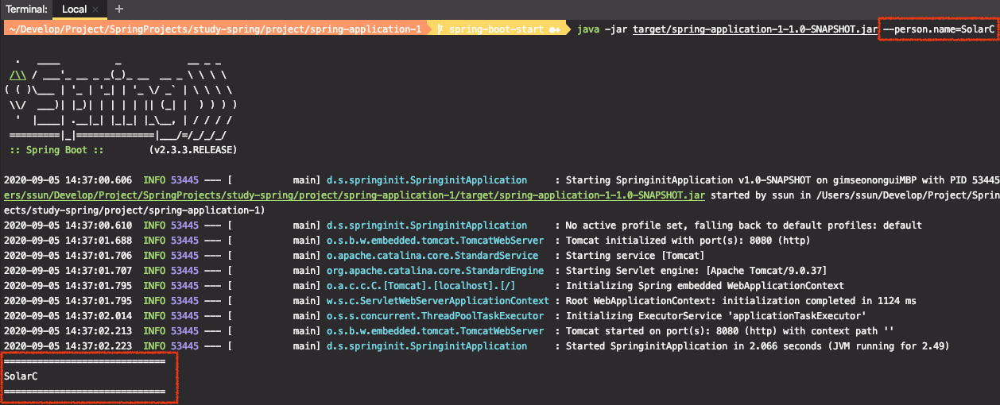
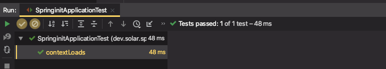
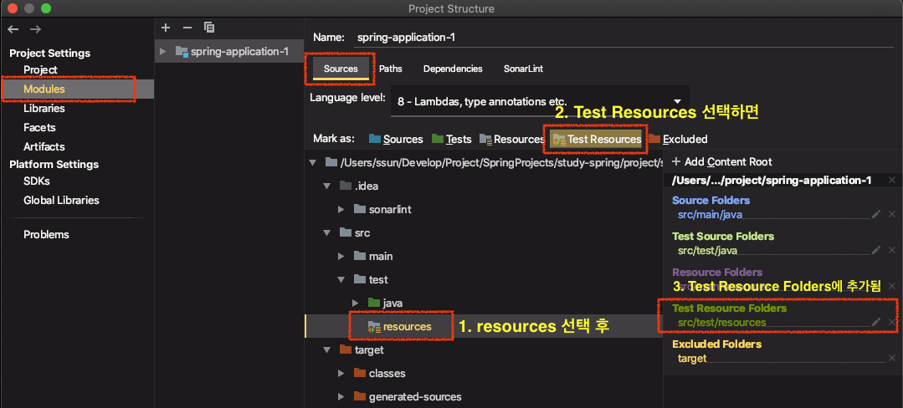
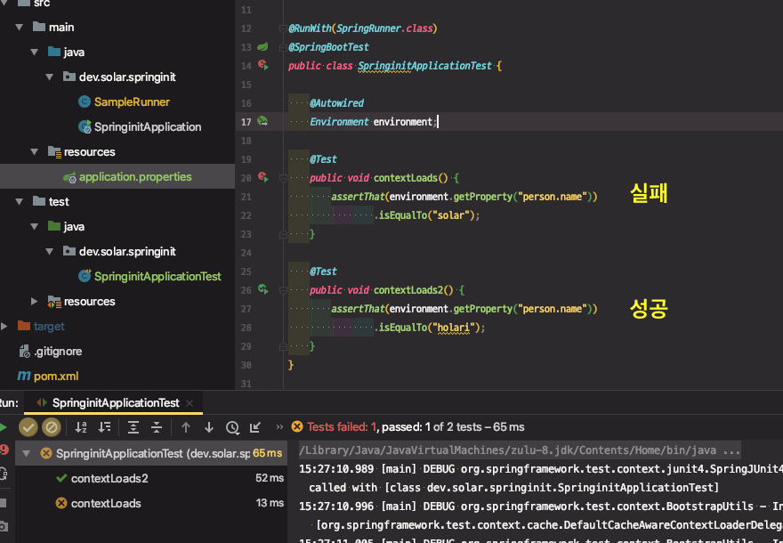
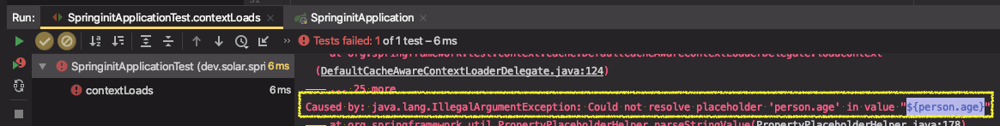

# 외부 설정 1부

* [Spring docs - external config](https://docs.spring.io/spring-boot/docs/current/reference/htmlsingle/#boot-features-external-config)

**사용할 수 있는 외부 설정**

* properties
* YAML
* 환경변수
* 커맨드 라인 아규먼트

**프로퍼티 우선 순위**

1. 유저 홈 디렉토리에 있는 spring-boot-dev-tools.properties

2. 테스트에 있는 @TestPropertySource

3. @SpringBootTest 애노테이션의 properties 애트리뷰트

4. 커맨드 라인 아규먼트

5. SPRING_APPLICATION_JSON (환경 변수 또는 시스템 프로티) 에 들어있는

   프로퍼티

6. ServletConfig 파라미터

7. ServletContext 파라미터

8. java:comp/env JNDI 애트리뷰트

9. System.getProperties() 자바 시스템 프로퍼티

10. OS 환경 변수

11. RandomValuePropertySource

12. JAR 밖에 있는 특정 프로파일용 application properties

13. JAR 안에 있는 특정 프로파일용 application properties

14. JAR 밖에 있는 application properties

15. JAR 안에 있는 application properties

16. @PropertySource

17. 기본 프로퍼티 (SpringApplication.setDefaultProperties)


**application.properties 우선 순위**

1. file:./config/
2. file:./
3. classpath:/config/

4. classpath:/

* (높은게 낮은걸 덮어 쓴다.) 

**랜덤값 설정하기**

​	● ${random.*}

**플레이스 홀더**

* name = keesun 
* fullName = ${name} baik

---

* 외부설정

  : 어플리케이션에서 사용하는 여러가지 설정값들을 어플리케이션 내/외부에 정의할 수 있는 기능

* **application.properties**
  * 가장 중요한 설정 파일
  * 스프링부트가 어플리케이션을 구동할 때 자동으로 로딩하는 파일 이름 규약(컨벤션)이다.


key = value 형태로 값을 정의하면 어플리케이션에서 참조해서 사용할 수 있다.

```properties
#application.properties
person.name = solar
```

`@Value("{key값}")` 으로 값을 가져와 사용할 수 있다.

```java
@Component
public class SampleRunner implements ApplicationRunner {

    @Value("${person.name}")
    private String name;

    @Override
    public void run(ApplicationArguments args) throws Exception {
        System.out.println("=============================");
        System.out.println(name);
        System.out.println("=============================");
    }
}
```

```
2020-09-05 14:31:14.863  INFO 52625 --- [           main] d.s.springinit.SpringinitApplication     : Started SpringinitApplication in 1.752 seconds (JVM running for 2.276)
=============================
solar
=============================
```


**랜덤값 설정하기**

* ${random.*}

  ```properties
  person.age = ${random.int}
  ```

* 서버 랜덤 포트를 `random`변수로 정하지 말 것. (가용한 범위를 고려하지 않음)

  0번으로 주면 가용한 port 범위 내에서 찾아서 랜덤으로 포트를 지정해준다.

  ```properties
  server.port = 0
  ```


## 프로퍼티 우선 순위

* 프로퍼티 값이 여러곳에서 중복되어있다면 높은 우선순위를 가진 설정으로 오버라이딩 된다.

다음 두 설정이 되어있는 상태에서 실습

* 4위 - 커맨드 라인 아규먼트

* 15위 - JAR 안에 있는 application properties


jar 를 실행하면서 아규먼트를 넘겨준다.

```sh
mvn clean packages -DskipTests
java -jar arget/spring-application-1-1.0-SNAPSHOT.jar --person.name=SolarC
```

커맨드 라인의 아규먼트 값으로 출력된다.




#### 테스트용 properties 정의

##### 1. 환경변수를 체크하는 테스트코드를 작성해보자

모든 프로퍼티들은 기본적으로 Environment를 통해서 확인할 수 있다.

※ 주의 : `import org.springframework.core.env.Environment` 
				springframework의 Environment를 import 해야함

```java
import org.junit.Test;
import org.junit.runner.RunWith;
import org.springframework.beans.factory.annotation.Autowired;
import org.springframework.boot.test.context.SpringBootTest;
import org.springframework.core.env.Environment;
import org.springframework.test.context.junit4.SpringRunner;

import static org.assertj.core.api.Assertions.assertThat;

@RunWith(SpringRunner.class)
@SpringBootTest
public class SpringinitApplicationTest {

    @Autowired
    Environment environment;

    @Test
    public void contextLoads() {
        assertThat(environment.getProperty("person.name"))
                .isEqualTo("solar");
    }
}
```




※ 테스트 코드 작성을 위해 의존성 추가

* Junit4, AsserJ 사용

```xml
<dependency>
  <groupId>org.springframework</groupId>
  <artifactId>spring-test</artifactId>
  <version>5.2.8.RELEASE</version>
  <scope>test</scope>
</dependency>
<!-- https://mvnrepository.com/artifact/org.assertj/assertj-core -->
<dependency>
  <groupId>org.assertj</groupId>
  <artifactId>assertj-core</artifactId>
  <version>3.15.0</version>
  <scope>test</scope>
</dependency>
<dependency>
  <groupId>junit</groupId>
  <artifactId>junit</artifactId>
  <version>4.13</version>
  <scope>test</scope>
</dependency>
```


##### 2. 테스트를 위해서 테스트용 properties를 정의

[test] > [resources] > application.properties 파일 생성

```properties
person.name = holari
```


테스트용 properties 파일을 모듈에 등록

[Project Structure] (`cmd + i`) > [Modules] > [프로젝트] > [Source] > [test > resources] 디렉토리 선택 후, > [Test Resources] 탭 클릭 ⇒ 모듈에 추가 됨



그래야 해당 파일에 스프링 아이콘이 생기면서 자동완성이 제공된다.


테스트용 resource를 읽어오는 것 확인




**※ 테스트 코드 빌드를 할 때 진행 순서**

먼저 src 하위의 파일을 빌드하는 시점에 main 하위의 모든 파일(application.properties 포함)이 ClassPath에 들어간다.  

그 후, 테스트코드 파일을 컴파일해서 test 하위의 모든 파일이(application.properties 포함) ClassPath에 들어간다. 

그 때, application.properties 파일이 test 디렉토리에 있던 application.properties 파일로 바뀌는 것이다. 그래서 테스트로 돌리면 test용 application.properties 파일이 읽혀서 이 값으로 찍히게 되는 것이다.


이런식으로 사용해도 좋지만 귀찮은 문제가 발생할 수 있다.


src > main > resources > application.properties 에 속성을 하나 추가해보자

```properties
person.name = solar
person.age = ${random.int}
```

```java
@Component
public class SampleRunner implements ApplicationRunner {

    @Value("${person.name}")
    private String name;

    @Value("${person.age}")
    private int age;

    @Override
    public void run(ApplicationArguments args) throws Exception {
        System.out.println("=============================");
        System.out.println(name);
        System.out.println(age);
        System.out.println("=============================");
    }
}
```

```
=============================
solar
571999630
=============================
```

⇒ 오류 없이 잘 실행된다.


> 이렇게 추가한 뒤, 테스트를 다시 돌리면 ???

`person.age` 를 찾을 수 없다는 에러가 난다. 테스트로 실행시키면 빌드할 때 테스트용 application.properties 파일로 덮어씌워지기 때문에 해당 파일에는 ${person.age} 라는 설정을 추가하지 않아서 찾을 수 없다는 에러가 나는 것이다.



⇒ ★ 버그가 발생할 수 있는 중요한 포인트 ★

⇒ 해결. 테스트용 properties에도 해당 속성값을 추가해주면 된다.


