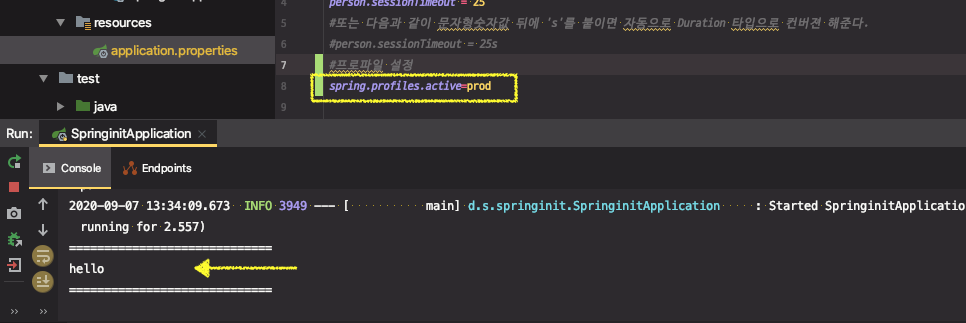
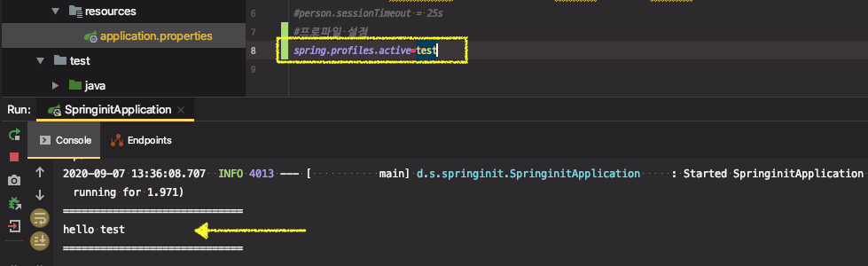
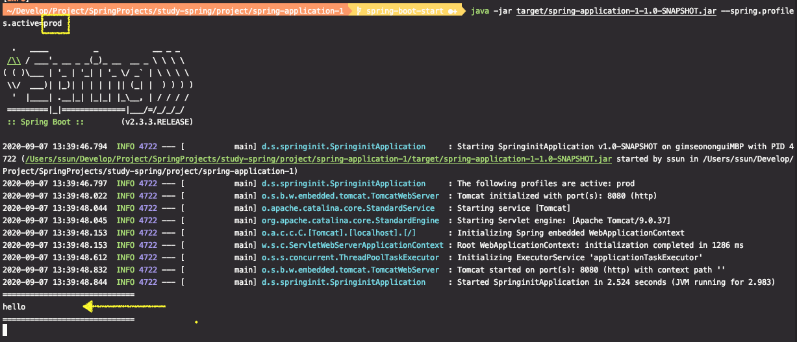

# 프로파일

@Profile 애노테이션은 어디에? 

* @Configuration
* @Component

어떤 프로파일을 활성화 할 것인가?

* spring.profiles.active

어떤 프로파일을 추가할 것인가?

* spring.profiles.include

프로파일용 프로퍼티

* application-{profile}.properties

---

## 프로파일

특정 프로파일에서만 특정한 빈을 등록하고 싶다.

애플리케이션 동작을 특정 프로파일에서 다르게 하고 싶은 경우에 사용


#### @Profile 어노테이션은 어디에?

※ [실습]

패키지하위에 config 디렉토리 생성 후, 2가지 종류의 빈을 생성

`prod` 프로파일인 경우와 `test` 프로파일인 경우에 사용할 hello 빈의 설정이 다르다.

```java
@Profile("prod") //prod 프로파일인 경우에만 hello 빈 사용 가능
@Configuration
public class BaseConfiguration {

    @Bean
    public String hello() {
        return "hello";
    }
}
```

```java
@Profile("test") //test 프로파일인 경우에만 hello 빈 사용 가능
@Configuration
public class TestConfiguration {

    @Bean
    public String hello() {
        return "hello test";
    }
}
```


ApplicationRunner로 빈을 사용해보자

```java
@Component
public class SampleRunner implements ApplicationRunner {

    @Autowired
    private String hello;

    @Override
    public void run(ApplicationArguments args) {
        System.out.println("=============================");
        System.out.println(hello);
        System.out.println("=============================");
    }
}
```

⇒ 지금 상태로 실행하면 에러 발생

why?

hello 빈을 찾을 수 없어서, hello 빈을 생성하고있는 `prod`나 `test` 프로파일 설정을 해줘야한다.


#### 프로파일 활성화

* application.properties 파일에서 활성화하려는 빈의 프로파일을 설정할 수 있다.

* `spring.profiles.active` 

이 설정 또한 property이다. 이전에 학습한 프로퍼티 우선순위에 모두 적용된다. 


프로파일 설정에 따라 사용되는 빈이 달라지는 것 확인






> 프로파일 설정을 `test`라고 개발했지만, 프로그램을 외부에서 실행하면서 `커맨드 라인 아규먼트`로 다른 프로파일 설정값을 넘겨주면 ?

```sh
mvn clean package -DskipTests
java -jar target/spring-application-1-1.0-SNAPSHOT.jar --spring.profiles.active=prod
```


커맨드라인 아규먼트가 application.properties 보다 우선순위가 높기 때문에 `prod` 프로파일이 적용된다.




#### 프로파일용 프로퍼티

* `application-{profile}.properties`

application-prod.properties, application-test.properties 두 개 파일 생성

* application-prod.properties

```properties
person.name= Solari Prod
```

* application-test.properties 

```properties
person.name= Solari Test
```


PersonProperties의 name값을 출력해보자

```java
System.out.println(personProperties.getName());
```


새로 만든 파일을 JAR 파일 내에 없으므로 새로 패키징 후, 커맨드 라인 아규먼트로 프로파일을 지정해서 실행해보자

```sh
mvn clean package -DskipTests
java -jar target/spring-application-1-1.0-SNAPSHOT.jar --spring.profiles.active=test
```

```
=============================
hello test
Solari Test 							<------
=============================
```


**※ 프로파일에 관련된 `properties`파일의 우선순위가 기본 `application.properties`보다 높다.**

application.properties의 내용이 application-test.properties의 내용으로 오버라이딩되므로 application.name이 "Solar Test"로 출력된다.


#### 어떤 프로파일을 추가할 것인가?


