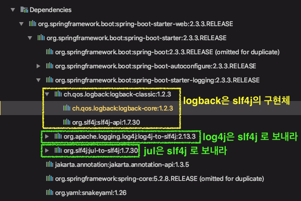
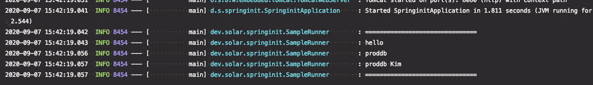

# 로깅 1부 : 스프링 부트 기본 로거 설정

로깅 퍼사드 VS 로거

* 로깅 퍼사드 : **Commons Logging**, SLF4j

* 로거 : JUL, Log4J2, **Logback**

스프링 5에 로거 관련 변경 사항

* [Spring Docs - overview logging](https://docs.spring.io/spring/docs/5.0.0.RC3/spring-framework-reference/overview.html#overview-logging)
* Spring-JCL
  * Commons Logging -> SLF4j or Log4j2
  * pom.xml에 exclusion 안해도 됨.

스프링 부트 로깅

* 기본포맷
* --debug (일부 핵심 라이브러리만 디버깅 모드로)
* --trace (전부 다 디버깅 모드로)
* 컬러 출력: spring.output.ansi.enabled
* 파일 출력: logging.file 또는 logging.path
* 로그 레벨 조정: logging.level.패지키 = 로그 레벨

---

스프링부트는 기본적으로 **Commons Logging**를 사용

결국 SLF4j 를 사용하게 되므로 이걸 쓰면 됨.

<details>
<summary>
이유.. 안 읽어도 됨
</summary>
   Commons Logging 가 초기에 문제가 많았다가 점차 좋아짐. 스프링이 이걸 사용하는 이유는 스프링 프레임워크의 core 모듈이 만들어질 때, 개발자들이 이미 Commons Logging을 쓰고 있었기 때문이다.
  스프링 ver 1 에서는 Commons Logging에 대한 의존성을 exclusion 시키고, (pom.xml 서블릿 컨테이너 변경하는 법) SLF4j 로 변경. 런타임시 classpath 관련 이슈는 없으니 좋지만 관련 의존성들을 잘 처리해줘야한다. 어떤 로거를 쓸 지 결정이 된 후에 어플리케이션이 동작하기 때문에... 런타임시에 찾는 것이 아님
  따라서 pom.xml에 여러가지 의존성 설정이 필요하다. 내가 쓰려는 로거를 지정
  Commons Logging 은 런타임시에 classpath 로거를 찾는다.
</details>


#### 로깅 퍼사드 VS 로거 구분

`Commons Logging`과 `SLF4j`는 실제 로깅을 하는 것이 아니라 로깅 API를 추상화해놓은 인터페이스들이다.

주로 프레임워크들은 `로깅 퍼사드`를 이용해서 코딩한다.

애플리케이션 개발시에도 로깅 퍼사드를 통해서 로거를 써도 문제없다.

**※ 로깅 퍼사드 장점**

* 로깅 퍼사드들의 로거를 교체하기 쉽다.
* 프레임워크에서 로깅 퍼사드 기반으로 코딩하는 이유
  - 프레임워클를 사용하는 애플리케이션들이 원하는 로거를 사용할 수 있도록 해주기 위해서이다.


#### 스프링 5에 로거 관련 변경 사항

Spring-JCL

* Commons Logging -> SLF4j or Log4j2
* pom.xml에 exclusion 안해도 됨.

스프링 1버전에서 Commons Logging을 exclusion 시키고, SLF4j 로 변경하는 작업을 하지 않고도, 안정하게 사용할 수 있도록 자체적으로 `Spring-JCL` 모듈 을 만들었다.

스프링에 있는 JCL(jakarta commons logging) 코드를 컴파일 시점에 `SLF4j` 나 `Log4j2`로 변경할 수 있는 기능을 가진 모듈


⇒ 정리

```
Commons Logging ⇒ SLF4j ⇒ Logback
```

스프링부트는 Commons Logging을 쓰고 있고, 우리는 Commons Logging이나 SLF4j 둘 다 쓸 수 있지만 최종적으로는  `SLF4j`로 가서 최종 로거를 선택해서 사용하게 된다. 최종 로거는 `Logback` 을 쓰는 것이다. (Logback이 SLF4j의 구현체)

즉, 처음 스프링 어플리케이션을 만들고 실행하면서 찍어주는 로그는 `Logback`이 찍어주는 것이 맞다.


의존성을 확인해보면 알 수 있다.



* logback은 slf4j의 구현체

* `log4j-to-slf4j` : log4j를 사용하는 코드도 (가로채서) slf4j API로 보냄

* `jul-to-slf4j` : jul(java util logging)을 쓰는 것은 (가로채서) slf4j API로 보내라

⇒ slf4j는 받아서 최종적으로 `logback`으로 로그를 남긴다.


#### 스프링 부트 로깅

* 기본포맷

* --debug (일부 핵심 라이브러리만 디버깅 모드로)

* --trace (전부 다 디버깅 모드로)

* 컬러 출력: spring.output.ansi.enabled

* 파일 출력: logging.file 또는 logging.path

  ```properties
  #log를 파일로 저장 - spring.log 파일명으로 저장됨
  logging.file.path=logs
  ```

  어느정도 후에 아카이빙된다. 조절 가능

  `logging.file.max-history`

* 로그 레벨 조정: logging.level.패지키 = 로그 레벨


```properties
logging.level.dev.solar.springinit=DEBUG
```

로거를 만들어서 출력하도록 수정

```java
@Component
public class SampleRunner implements ApplicationRunner {

  	//로거 생성
    private Logger logger = LoggerFactory.getLogger(SampleRunner.class);

    @Autowired
    private PersonProperties personProperties;

    @Autowired
    private String hello;

    @Override
    public void run(ApplicationArguments args) {
        logger.info("==============================="); //info 레벨로 출력
        logger.info(hello);
        logger.info(personProperties.getName());
        logger.info(personProperties.getFullName());
        logger.info("===============================");
    }
}
```




---

# 로깅 2부 : 커스터 마이징


