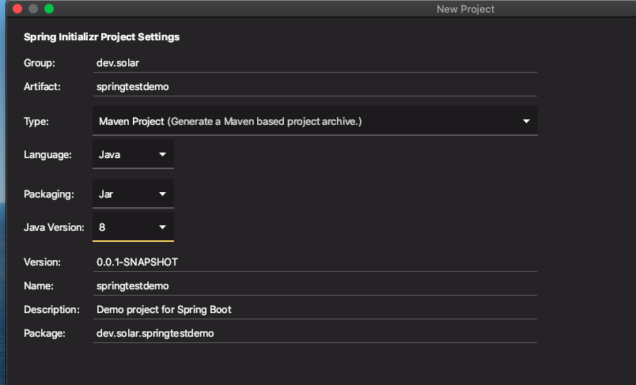
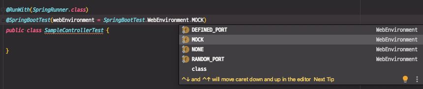

# 테스트

시작은 일단 spring-boot-starter-test를 추가하는 것 부터

* test 스콥으로 추가.

@SpringBootTest

- @RunWith(SpringRunner.class)랑 같이 써야 함.
- 빈 설정 파일은 설정을 안해주나? 알아서 찾습니다. (@SpringBootApplication)
- webEnvironment
  - MOCK: mock servlet environment. 내장 톰캣 구동 안 함.
  - RANDON_PORT, DEFINED_PORT: 내장 톰캣 사용 함.
  - NONE:서블릿환경제공안함.

@MockBean

- ApplicationContext에 들어있는 빈을 Mock으로 만든 객체로 교체 함.
- 모든 @Test 마다 자동으로 리셋.

슬라이스 테스트

* 레이어 별로 잘라서 테스트하고 싶을 때
* @JsonTest
* @WebMvcTes
* @WebFluxTest
* @DataJpaTest
* ...

---

## 테스트 환경 구성

##### spring-boot-starter-test를 test 스콥으로 추가

* New Project - [springtestdemo]
  * 의존성 `Web`만 추가



* Test code 작성을 위한 의존성이 추가돼있는지 확인

```xml
<dependency>
  <groupId>org.springframework.boot</groupId>
  <artifactId>spring-boot-starter-test</artifactId>
  <scope>test</scope>
</dependency>
```

※ 참고... `@RunWith`가 안나와서 확인해보니 다음과 같이 `junit-vintage-engine` 의존성이 exclution되어있어서 exclusions 코드를 주석처리했음. 

```xml
<dependency>
  <groupId>org.springframework.boot</groupId>
  <artifactId>spring-boot-starter-test</artifactId>
  <scope>test</scope>
  <!--            <exclusions>-->
  <!--                <exclusion>-->
  <!--                    <groupId>org.junit.vintage</groupId>-->
  <!--                    <artifactId>junit-vintage-engine</artifactId>-->
  <!--                </exclusion>-->
  <!--            </exclusions>-->
</dependency>
```


※ [실습] 테스트를 위한 기본 프로젝트 구성

* SampleController.java

```java
@RestController
public class SampleController {

    @Autowired
    private SampleService sampleService;

    @GetMapping("/hello")
    public String hello() {
        return "hello " + sampleService.getName();
    }
}
```

* SampleService.java

```java
@Service
public class SampleService {

    public String getName() {
        return "Solar";
    }
}
```

* SampleControllerTest.java

```java
import org.junit.runner.RunWith;
import org.springframework.boot.test.context.SpringBootTest;
import org.springframework.test.context.junit4.SpringRunner;

@RunWith(SpringRunner.class)
@SpringBootTest(webEnvironment = SpringBootTest.WebEnvironment.MOCK)
public class SampleControllerTest {

}
```


## @SpringBootTest

- @RunWith(SpringRunner.class)랑 같이 써야 함.
- 빈 설정 파일은 설정을 안해주나? 알아서 찾습니다. (@SpringBootApplication)
- webEnvironment
  - `MOCK` : mock servlet environment. 내장 톰캣 구동 안 함.
  - `RANDON_PORT`, `DEFINED_PORT`: 내장 톰캣 사용 함.
  - `NONE` : 서블릿환경제공안함.


### WebEnvironment - Mock 환경

#### 1. MockMvc 생성

기본적으로 SpringBootTest의 WebEnvironment 값이 `MOCK`으로 되어있다.



 

(스프링 프레임워크의 테스팅 흐름을 알아야한다.)

서블릿 컨테이너를 테스트용으로 띄우지않고, 서블릿을 mocking한 것이 뜬다. 그래서 DispatcherServlet이 만들어지긴 하는데, 목업에서 DispatcherServlet에 요청을 보낸 것과 비슷하게 실험은 할 수 있다. 그 때 mockup이 된 서블릿에 interaction하기 위해서는 `MockMVC`라는 클라이언트를 사용해야 한다.


* 스프링부트에서 MockMvc를 만드는 방법 (1) - 가장 쉬운 방법

`@AutoConfigureMockMvc` 어노테이션을 추가하여 `MockMvc`를 주입받는다.

```java
import org.springframework.boot.test.autoconfigure.web.servlet.AutoConfigureMockMvc;
import org.springframework.test.web.servlet.MockMvc;

@RunWith(SpringRunner.class)
@SpringBootTest(webEnvironment = SpringBootTest.WebEnvironment.MOCK)
@AutoConfigureMockMvc
public class SampleControllerTest {

    @Autowired
    MockMvc mockMvc;
}
```


#### 2. 테스트코드 작성

* MockMvc로 hello controller를 테스트
  * 어떤 컨트롤러, 어떤 메서드를 썼는지도 테스트할 수 있음

```java
@RunWith(SpringRunner.class)
@SpringBootTest(webEnvironment = SpringBootTest.WebEnvironment.MOCK)
@AutoConfigureMockMvc
public class SampleControllerTest {

    @Autowired
    MockMvc mockMvc;

    @Test
    public void hello() throws Exception {
        mockMvc.perform(get("/hello")) // <-- /hello url에 get 요청에 대한 테스트
                .andExpect(status().isOk()) // <-- response status 값 200 체크
                .andExpect(content().string("hello Solar")) // <-- response body 값 string으로 체크
                .andDo(print()); // <-- 요청 정보 출력
    }
}
```


#### 3. import static method

* `status`, `content`, `print` : result 패키지로 가져와야함

* get 메서드 static import 자동으로 안돼서 직접 쳐줌....

```java
import static org.springframework.test.web.servlet.request.MockMvcRequestBuilders.get;
import static org.springframework.test.web.servlet.result.MockMvcResultHandlers.print; //<-- result 패키지
import static org.springframework.test.web.servlet.result.MockMvcResultMatchers.content;
import static org.springframework.test.web.servlet.result.MockMvcResultMatchers.status;
```


#### 4. 테스트 결과

* `print`로 찍히는 대부분의 정보를 테스트해볼 수 있다.

```MockHttpServletRequest:
      HTTP Method = GET
      Request URI = /hello
       Parameters = {}
          Headers = []
             Body = null
    Session Attrs = {}

Handler:
             Type = dev.solar.springtestdemo.sample.SampleController
           Method = dev.solar.springtestdemo.sample.SampleController#hello()

Async:
    Async started = false
     Async result = null

Resolved Exception:
             Type = null

ModelAndView:
        View name = null
             View = null
            Model = null

FlashMap:
       Attributes = null

MockHttpServletResponse:
           Status = 200
    Error message = null
          Headers = [Content-Type:"text/plain;charset=UTF-8", Content-Length:"11"]
     Content type = text/plain;charset=UTF-8
             Body = hello Solar
    Forwarded URL = null
   Redirected URL = null
          Cookies = []
```


#### WebEnvironment - RANDON_PORT 환경


