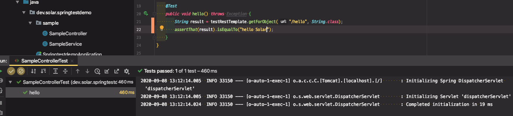
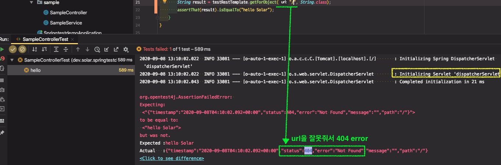
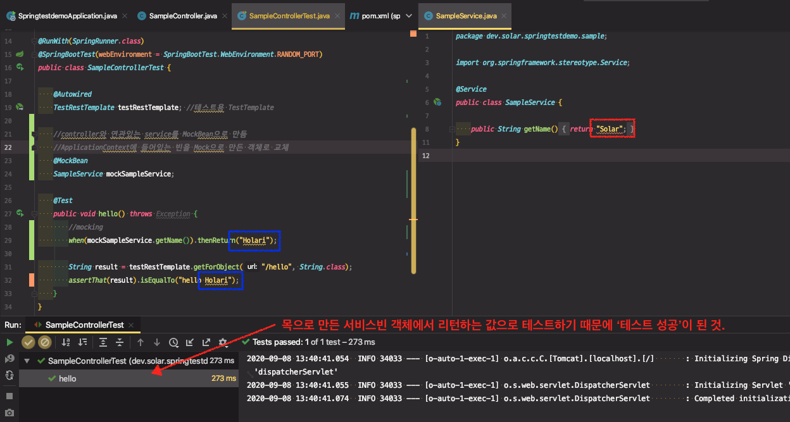

# 테스트

시작은 일단 spring-boot-starter-test를 추가하는 것 부터

* test 스콥으로 추가.

@SpringBootTest

- @RunWith(SpringRunner.class)랑 같이 써야 함.
- 빈 설정 파일은 설정을 안해주나? 알아서 찾습니다. (@SpringBootApplication)
- webEnvironment
  - MOCK: mock servlet environment. 내장 톰캣 구동 안 함.
  - RANDOM_PORT, DEFINED_PORT: 내장 톰캣 사용 함.
  - NONE : 서블릿환경 제공 안 함.

@MockBean

- ApplicationContext에 들어있는 빈을 Mock으로 만든 객체로 교체 함.
- 모든 @Test 마다 자동으로 리셋.

슬라이스 테스트

* 레이어 별로 잘라서 테스트하고 싶을 때
* @JsonTest
* @WebMvcTes
* @WebFluxTest
* @DataJpaTest
* ...

---

## 테스트 환경 구성

##### spring-boot-starter-test를 test 스콥으로 추가

* New Project - [springtestdemo]
  * 의존성 `Web`만 추가


* Test code 작성을 위한 의존성이 추가돼있는지 확인

```xml
<dependency>
  <groupId>org.springframework.boot</groupId>
  <artifactId>spring-boot-starter-test</artifactId>
  <scope>test</scope>
</dependency>
```

※ 참고... `@RunWith`가 안나와서 확인해보니 다음과 같이 `junit-vintage-engine` 의존성이 exclution되어있어서 exclusions 코드를 주석처리했음. 

```xml
<dependency>
  <groupId>org.springframework.boot</groupId>
  <artifactId>spring-boot-starter-test</artifactId>
  <scope>test</scope>
  <!--            <exclusions>-->
  <!--                <exclusion>-->
  <!--                    <groupId>org.junit.vintage</groupId>-->
  <!--                    <artifactId>junit-vintage-engine</artifactId>-->
  <!--                </exclusion>-->
  <!--            </exclusions>-->
</dependency>
```


※ [실습] 테스트를 위한 기본 프로젝트 구성

* SampleController.java

```java
@RestController
public class SampleController {

    @Autowired
    private SampleService sampleService;

    @GetMapping("/hello")
    public String hello() {
        return "hello " + sampleService.getName();
    }
}
```

* SampleService.java

```java
@Service
public class SampleService {

    public String getName() {
        return "Solar";
    }
}
```

* SampleControllerTest.java

```java
import org.junit.runner.RunWith;
import org.springframework.boot.test.context.SpringBootTest;
import org.springframework.test.context.junit4.SpringRunner;

@RunWith(SpringRunner.class)
@SpringBootTest(webEnvironment = SpringBootTest.WebEnvironment.MOCK)
public class SampleControllerTest {

}
```


## @SpringBootTest

* 통합 테스트

- @RunWith(SpringRunner.class)랑 같이 써야 함.
- 빈 설정 파일은 설정을 안해주나? 알아서 찾습니다. (@SpringBootApplication)
- webEnvironment
  - `MOCK` : mock servlet environment. 내장 톰캣 구동 안 함.
  - `RANDOM_PORT`(추천), `DEFINED_PORT`(지정한 포트 사용): 내장 톰캣 사용 함.
  - `NONE` : 서블릿 환경 제공 안 함.


## ※ WebEnvironment - Mock 환경

* mock servlet environment. 내장 톰캣 구동 안 함.
* `MockMvc`를 사용해야 한다.


## 1. MockMvc 사용

#### 1. MockMvc 생성

기본적으로 SpringBootTest의 WebEnvironment 값이 `MOCK`으로 되어있다.


 

(스프링 프레임워크의 테스팅 흐름을 알아야한다.)

서블릿 컨테이너를 테스트용으로 띄우지않고, 서블릿을 mocking한 것이 뜬다. 그래서 DispatcherServlet이 만들어지긴 하는데, 목업에서 DispatcherServlet에 요청을 보낸 것과 비슷하게 실험은 할 수 있다. 그 때 mockup이 된 서블릿에 interaction하기 위해서는 **`MockMVC`라는 클라이언트를 사용해야 한다.**


* 스프링부트에서 MockMvc를 만드는 방법 (1) - 가장 쉬운 방법

`@AutoConfigureMockMvc` 어노테이션을 추가하여 `MockMvc`를 주입받는다.

```java
import org.springframework.boot.test.autoconfigure.web.servlet.AutoConfigureMockMvc;
import org.springframework.test.web.servlet.MockMvc;

@RunWith(SpringRunner.class)
@SpringBootTest(webEnvironment = SpringBootTest.WebEnvironment.MOCK)
@AutoConfigureMockMvc
public class SampleControllerTest {

    @Autowired
    MockMvc mockMvc;
}
```


#### 2. 테스트코드 작성

* MockMvc로 hello controller를 테스트
  * 어떤 컨트롤러, 어떤 메서드를 썼는지도 테스트할 수 있음

```java
@RunWith(SpringRunner.class)
@SpringBootTest(webEnvironment = SpringBootTest.WebEnvironment.MOCK)
@AutoConfigureMockMvc
public class SampleControllerTest {

    @Autowired
    MockMvc mockMvc;

    @Test
    public void hello() throws Exception {
        mockMvc.perform(get("/hello")) // <-- /hello url에 get 요청에 대한 테스트
                .andExpect(status().isOk()) // <-- response status 값 200 체크
                .andExpect(content().string("hello Solar")) // <-- response body 값 string으로 체크
                .andDo(print()); // <-- 요청 정보 출력
    }
}
```


#### 3. import static method

* `status`, `content`, `print` : result 패키지로 가져와야함

* get 메서드 static import 자동으로 안돼서 직접 쳐줌....

```java
import static org.springframework.test.web.servlet.request.MockMvcRequestBuilders.get;
import static org.springframework.test.web.servlet.result.MockMvcResultHandlers.print; //<-- result 패키지
import static org.springframework.test.web.servlet.result.MockMvcResultMatchers.content;
import static org.springframework.test.web.servlet.result.MockMvcResultMatchers.status;
```


#### 4. 테스트 결과

* `print`로 찍히는 대부분의 정보를 테스트해볼 수 있다.

```MockHttpServletRequest:
      HTTP Method = GET
      Request URI = /hello
       Parameters = {}
          Headers = []
             Body = null
    Session Attrs = {}

Handler:
             Type = dev.solar.springtestdemo.sample.SampleController
           Method = dev.solar.springtestdemo.sample.SampleController#hello()

Async:
    Async started = false
     Async result = null

Resolved Exception:
             Type = null

ModelAndView:
        View name = null
             View = null
            Model = null

FlashMap:
       Attributes = null

MockHttpServletResponse:
           Status = 200
    Error message = null
          Headers = [Content-Type:"text/plain;charset=UTF-8", Content-Length:"11"]
     Content type = text/plain;charset=UTF-8
             Body = hello Solar
    Forwarded URL = null
   Redirected URL = null
          Cookies = []
```


## ※  WebEnvironment - RANDOM_PORT 환경

* 내장 톰캣 사용 함
* 실제 서블릿이 랜덤한 포트에 띄워진다.

* MockMvc를 사용하지 않고, `RestTemplate`이나 `테스트용 RestTemplate`  , `테스트용 WebClient`를 써야한다.


## 2. 테스트용 RestTemplate 사용하기

별도의 설정 추가 없이 TestRestTemplate을 주입받을 수 있다.

```java
@Autowired
TestRestTemplate testRestTemplate; //테스트용 TestTemplate
```


* `BodyType` result = testRestTemplate.getForObject(String `url`, 받으려는 `Response Body Type`);

```java
import org.springframework.boot.test.web.client.TestRestTemplate;
import org.springframework.test.context.junit4.SpringRunner;

import static org.assertj.core.api.Assertions.assertThat;

@RunWith(SpringRunner.class)
@SpringBootTest(webEnvironment = SpringBootTest.WebEnvironment.RANDOM_PORT)
public class SampleControllerTest {

    @Autowired
    TestRestTemplate testRestTemplate; //테스트용 TestTemplate

    @Test
    public void hello() throws Exception {
        String result = testRestTemplate.getForObject("/hello", String.class);
        assertThat(result).isEqualTo("hello Solar");
    }
}
```


※ 테스트 성공



※ 테스트 실패




> ⇒ 이렇게 테스트하면 `Service` 단까지 들어간다. `Controller`만 테스트하고 싶다면 ??
>
>  `MockBean`을 만들어서 테스트


## @MockBean

- ApplicationContext에 들어있는 빈을 Mock으로 만든 객체로 교체 함.
- 모든 @Test 마다 자동으로 리셋.
- Service 단까지 들어가지 않고 controller만 테스트할 수 있음


`@MockBean` 어노테이션으로 테스트하려는 컨트롤러와 연관관계있는 서비스를 mockSampleService로 만들면, ApplicationContext에 들어있는 빈을 Mock으로 만든 객체로 교체 한다.

실질적으로 컨트롤러는 (원본 Service가 아니라) Mock SampleService를 쓰게 된다.


#### ※ [실습] MockBean 사용하기

```java
import org.springframework.boot.test.mock.mockito.MockBean;
import static org.mockito.Mockito.when;

@RunWith(SpringRunner.class)
@SpringBootTest(webEnvironment = SpringBootTest.WebEnvironment.RANDOM_PORT)
public class SampleControllerTest {

    @Autowired
    TestRestTemplate testRestTemplate; //테스트용 TestTemplate

    //controller와 연관있는 service를 MockBean으로 만듬
    //ApplicationContext에 들어있는 빈을 Mock으로 만든 객체로 교체
    @MockBean
    SampleService mockSampleService;

    @Test
    public void hello() throws Exception {
        //mocking
        when(mockSampleService.getName()).thenReturn("Holari"); // 요청이왔을 때 return할 값 설정
        
        String result = testRestTemplate.getForObject("/hello", String.class);
        assertThat(result).isEqualTo("hello Holari");
    }
}
```


아래의 SampleService 대신에 Mock으로 만든 mockSampleService로 대체되는 것이다.

```java
@Service
public class SampleService {

  public String getName() {
    return "Solar";
  }
}
```





## 3. WebTestClient 사용

* JAVA 5 (Spring webflux[^1])에 추가

RestClient 중 하나 이다. 기존에 사용하던 RestClient는 `synchronous(동기)`이다. 요청 하나 보내고 해당 요청이 끝날때까지 기다린 후에 종료되면 다음 요청을 보낼 수 있었다. `WebClient`는 `asynchronous(비동기)`이다. 요청을 보내고 기다리는 것이 아니라 응답이 오면 그 때 우리한테 콜백(이벤트)이 온다. 그러면 그 때 콜백을 실행할 수 있다.

그런식으로 비동기적으로 동작하기때문에 우리가 테스트코드에서도 `WebTestclient`를 이용해서 `WebClient`와 비슷한 API를 사용할 수 있다.

`WebClient`를 사용하려 `Spring Webflux`가 Dependency에 들어와 있어야 한다.

```xml
<dependency>
  <groupId>org.springframework.boot</groupId>
  <artifactId>spring-boot-starter-webflux</artifactId>
</dependency>
```


#### ※ [실습] WebTestClient 사용하기

```java
import org.springframework.test.web.reactive.server.WebTestClient;

@RunWith(SpringRunner.class)
@SpringBootTest(webEnvironment = SpringBootTest.WebEnvironment.RANDOM_PORT)
public class SampleControllerTest {

    @Autowired
    WebTestClient webTestClient; //WebClient와 비슷하게 동작하는 비동기 처리방식의 API

    //controller와 연관있는 service를 MockBean으로 만듬
    //ApplicationContext에 들어있는 빈을 Mock으로 만든 객체로 교체
    @MockBean
    SampleService mockSampleService;

    @Test
    public void hello() throws Exception {
        //mocking
        when(mockSampleService.getName()).thenReturn("Solar");

        webTestClient.get().uri("/hello")
                .exchange().expectStatus().isOk()
                .expectBody(String.class).isEqualTo("hello Solar");
    }
}
```


> ※ Test Code 작성하기 불편한 API 순위
>
> RestTemplate > MockMvc > ... > WebTestClient(편함)
>
> * 동기 처리 때문이 아니더라도(reactive WebMvc) WebClient가 제공하는 API가 편리해서 주로 사용하기 좋음

[^1]: web-flux는 Spring Framwork5에서 새롭게 추가된 모듈로 client, server에서 reactive 스타일의 어플리케이션 개발을 도와준다.


---

## 슬라이스 테스트

앞서 진행한 테스트는 어마어마한 `통합 테스트`이다. `@SpringBootTest`어노테이션이 스프링 어플리케이션의 main을 찾아간다.  `@SpringBootApplication` 어노테이션을 찾아가서 여기서부터 하는 모든 빈 스캐닝을 하게 된다.

모든 빈을 테스트용 Application Context를 만들면서 등록해주고, MockBean은 따로 교체해준다.

교체된 MockBean은 테스트마다 reset되므로 따로 관리하지 않고, 테스트 처음에 바로 mocking하고 시작해도 지장이 없다.

> 수많은 빈들이 등록되는 것이 싫고, 테스트하고 싶은 빈만 등록하고 싶다면 ? 
>
> 사용할 수 있는 것이 `슬라이스 테스트용 빈`이다.

* 레이어별로 잘라서 적용된다.

* [Spring Docs - spring boot applications testing ](https://docs.spring.io/spring-boot/docs/current/reference/html/spring-boot-features.html#boot-features-testing-spring-boot-applications-testing-autoconfigured-json-tests)

* @JsonTest
* @WebMvcTes
* @WebFluxTest
* @DataJpaTest : Repository만 등록 된다.


#### @JsonTest

우리가 가지고 있는 모델이 Json 형태로 나갈 때 어떤 형태로 출력되는지 테스트할 수 있다.

`JacksonTester`를 주입받아서 사용

```java
@JsonTest
class MyJsonTests {

    @Autowired
    private JacksonTester<VehicleDetails> json;

    @Test
    void testSerialize() throws Exception {
        VehicleDetails details = new VehicleDetails("Honda", "Civic");
        // Assert against a `.json` file in the same package as the test
        assertThat(this.json.write(details)).isEqualToJson("expected.json"); //비교하려는 내용을 담은 json 파일
        // Or use JSON path based assertions
        assertThat(this.json.write(details)).hasJsonPathStringValue("@.make");
        assertThat(this.json.write(details)).extractingJsonPathStringValue("@.make")
                .isEqualTo("Honda"); //key가 값을 가지고 있는지
    }
}
```

⇒ 이렇게하면 필요한 빈만 만들고 테스트하기 때문에 빠르긴 하겠지만, ApplicationContext를 만들면 다른 데서 공유해서 쓰기 때문에 큰 차이 없을 듯? 그래도 테스트 최적화에 좋음


#### @WebMvcTest

컨트롤러 하나만 테스트하기 좋음

```java
@WebMvcTest(SampleController.class)
```

이렇게하면 web과 관련된 빈들만 등록된다. (일반적인 컴포넌트들은 빈으로 등록되지 않는다.)

`@Controller`, `@ControllerAdvice`, `@JsonComponent`, `Converter`, `GenericConverter`, `Filter`, `HandlerInterceptor`, `WebMvcConfigurer`, and `HandlerMethodArgumentResolver`.

* Service나 Repository는 등록 안 됨


웹 계층 하위의 의존성들은 전부 끊기게 된다. 그렇기 때문에 사용하는 의존성이 있다면 `MockBean`으로 만들어서 채워줘야한다.

따라서, **`@WebMvcTest`는 `MockMvc`로 테스트해야한다.**


※ `content()` : 자동 import 안 됨. 

```java
import static org.springframework.test.web.servlet.result.MockMvcResultMatchers.content
```


```java
import static org.mockito.Mockito.when;
import static org.springframework.test.web.servlet.request.MockMvcRequestBuilders.get;
import static org.springframework.test.web.servlet.result.MockMvcResultMatchers.content;

@RunWith(SpringRunner.class)
@WebMvcTest(SampleController.class) //이 컨트롤러 하나만 테스트
public class SampleControllerTest {

    @Autowired
    MockMvc mockMvc;
    //controller와 연관있는 service를 MockBean으로 만듬
    //ApplicationContext에 들어있는 빈을 Mock으로 만든 객체로 교체
    @MockBean
    SampleService mockSampleService;

    @Test
    public void hello() throws Exception {
        //mocking
        when(mockSampleService.getName()).thenReturn("Solar");

        mockMvc.perform(get("/hello"))
                .andExpect(content().string("hello Solar"));
    }
}
```

