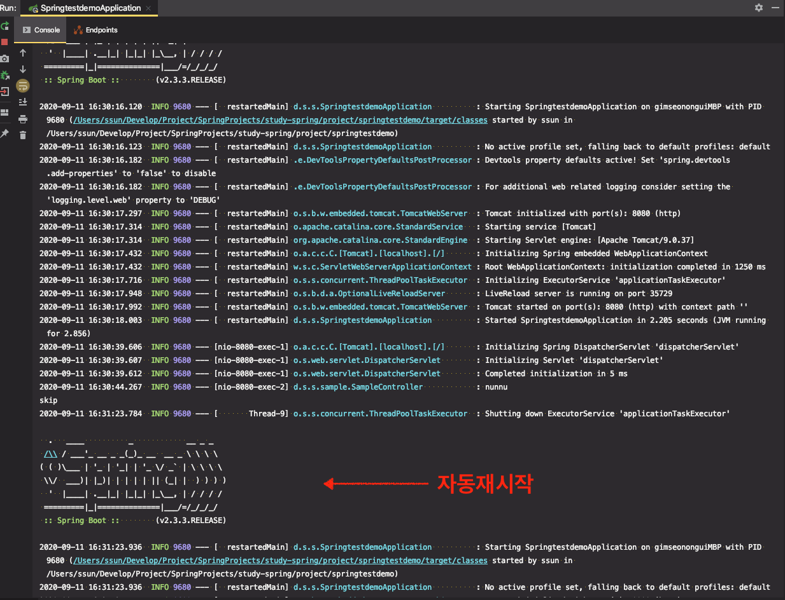

# Spring Boot Devtools

* 캐시 설정을 개발 환경에 맞게 변경.

* 클래스패스에 있는 파일이 변경 될 때마다 자동으로 재시작.
  *  직접 껐다 켜는거 (cold starts)보다 빠르다. 왜?
  * 릴로딩 보다는 느리다. (JRebel 같은건 아님)
  * 리스타트 하고 싶지 않은 리소스는? spring.devtools.restart.exclude
  * 리스타트 기능 끄려면? spring.devtools.restart.enabled = false

* 라이브릴로드? 리스타트했을때브라우저자동리프레시하는기능
  *  브라우저 플러그인 설치해야 함.
  * 라이브 릴로드 서버 끄려면? spring.devtools.liveload.enabled = false
* 글로벌설정
  * ~/.spring-boot-devtools.properties
* 리모트 애플리케이션

---

* [Spring Docs](https://docs.spring.io/spring-boot/docs/2.2.4.RELEASE/reference/html/using-spring-boot.html#using-boot)

### Devtools

* 스프링부트가 제공하는 옵셔널한 툴
* 의존성을 추가해서 부가 기능을 사용할 수 있다.

```xml
<dependency>
  <groupId>org.springframework.boot</groupId>
  <artifactId>spring-boot-devtools</artifactId>
</dependency>
```


### Property 기본값

Spring Boot가 지원하는 몇 라이브러리는 **성능 향상을 위해 캐시를 사용**한다.

production에서는 캐싱이 이익이지만 개발 시에 불편할 수 있어서 `spring-boot-devtools`는 **디폴트로 캐싱을 비활성화**한다.

(개발 시에 변경한 내용이 캐시 때문에 즉시 적용이되지 않기 때문에, 브라우저에서 직접 캐시를 지우지 않아도 된다.)

* 캐싱 옵션 : `application.properties`에서 설정
* production용으로 패키징할 때는 캐싱이 자동 활성화

`spring-boot-devtools` 모듈을 적용하면 기본적으로 properties가 자동 적용이 된다.

* devtools가 적용된 전체 property는 [DevToolsPropertyDefaultsPostProcessor](https://github.com/spring-projects/spring-boot/tree/v2.2.4.RELEASE/spring-boot-project/spring-boot-devtools/src/main/java/org/springframework/boot/devtools/env/DevToolsPropertyDefaultsPostProcessor.java) 에서 확인


### 자동 재시작(Restart)

`spring-boot-devtools`를 사용하는 애플리케이션은 classpath 위의 파일이 변경될때마다 자동적으로 재시작된다.

기본적으로 classpath에 있는 엔트리는 변경사항이 모니터링 된다. 하지만 static assets와 view template 등 특정 리소스는 애플리케이션을 다시 시작할 필요가 없다.

> 자동 재시작은 LiveLoader와 잘 연동이 됩니다. JRebel을 쓸 경우, 자동재시작이 꺼지고, dynamic class reloading이 사용됩니다.

> Devtools는 `spring-boot`, `spring-boot-devtools`, `spring-boot-autoconfigure`, `spring-boot-actuator`, and `spring-boot-starter` 이름을 가진 프로젝트는 classpath가 갱신되었을 때 자동재시작하는 것을 무시합니다.

> Devtools는 `ResourceLoader`를 커스터마이징해야 합니다. 직접적인 `getResource` 메소드를 오버라이드하는 것은 지원되지 않습니다.


※ [예제]

1. SampleService의 return 문자열을 수정한 뒤, 빌드(`cmd + F9`)

```java
@Service
public class SampleService {
    public String getName() {
        return "Holar"; //<-- 값 변경
    }
}
```

```java
@RestController
public class SampleController {   
    @Autowired
    private SampleService sampleService;

    @GetMapping("/hello")
    public String hello() {
        return "hello " + sampleService.getName();
    }
}
```

```java
@SpringBootApplication
public class SpringtestdemoApplication {
    public static void main(String[] args) {
        SpringApplication.run(SpringtestdemoApplication.class, args);
    }
}
```


2. 애플리케이션이 자동 재시작된다.



3. 브라우저에서 새로고침하면 서버가 업데이트된 것을 확인할 수 있다. 


#### Restart vs Reload

restart : 서버를 재시작, reload : 

- base classloader
  - 써드 파티 안의 jar 파일
  - 우리가 코드를 바꾸지 않는 의존성 라이브러리 파일을 읽어들인다.
- restart classloader
  - 사용자가 만드는 클래스를 읽어들인다. 

이러한 접근은 재시작이 *cold start(완전히 껏다가 다시 켜는 것)*보다 훨씬 빨리 동작한다.

아직 재시작(restart)가 느리게 느껴진다면, JRebel 같은 reloading 기술을 이용할 수도 있다. JRebel은 릴로딩이 편하도록 클래스를 다시 만든다.


### Live Reload

`spring-boot-devtools` 모듈은 LiveReload 서버를 포함하고 있다.

리소스가 바뀌면 `브라우저`를 자동으로 새로고침해주는 트리거이다. 파일을 수정하고, 빌드만 하면 브라우저에서 자동으로 새로고침도 해준다. (브라우저에 라이브리로드 확장 설치 필요)

* `spring.devtools.livereload.enabled` 속성 : false → LiveReload 서버 끄기

⇒ 잘 안될 수 있다. (99.9%의 신뢰도(reliability)를 가진 서비스가 아니면 사용하기 불편하다.)


### 글로벌 설정

* `~/.spring-boot-devtools.properties` 

  * 1순위 우선순위 : 유저 홈 디렉토리에 있는 spring-boot-dev-tools.properties

  * devtools 플러그인이 있다면 위 파일이 1순위 우선순위를 가진다.


### Remote Applications

원격으로 애플리케이션을 띄워놓고, 로컬에서 앱을 실행할 수 있다.

⇒ 절대로 production용이 아니다. 

결국 운영용이 아니라 개발용인데, 개발을 굳이 remote로 해야할까? 되도록이면 이런 환경을 가지지 않도록 해야한다. (굉장히 불편)


※ devtools 를 직접 쓰기보다 devtools가 적용된 property 설정([DevToolsPropertyDefaultsPostProcessor](https://github.com/spring-projects/spring-boot/tree/v2.2.4.RELEASE/spring-boot-project/spring-boot-devtools/src/main/java/org/springframework/boot/devtools/env/DevToolsPropertyDefaultsPostProcessor.java))에서 필요한 설정(ex. 캐시 끄는 옵션)만 가져와서 test properties를 만들어서 사용해도 좋다.


---

참고 : [강의가 잘 정리된 블로그글](https://wordbe.tistory.com/entry/Spring-Boot-Devtools-restart-reloading)


