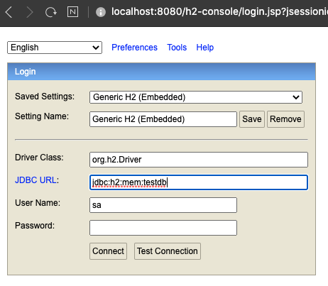
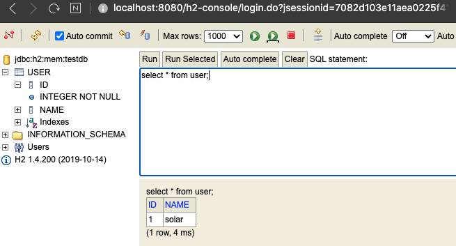

# 스프링 데이터 2부: 인메모리 데이터베이스

지원하는 인-메모리 데이터베이스

* **H2 (추천, 콘솔 때문에...)**
* HSQL
* Derby

Spring-JDBC가 클래스패스에 있으면 자동 설정이 필요한 빈을 설정 해줍니다.

* DataSource
* JdbcTemplate

인-메모리 데이터베이스 기본 연결 정보 확인하는 방법

* URL: "testdb"
* username: "sa"
* password: "" (empty string)
* URL을 "testdb"로 고정하고 싶으면 application.properties에 `spring.datasource.generate-unique-name=false` 속성 추가

H2 콘솔 사용하는 방법 2가지

1. 의존성에 spring-boot-devtools를 추가

2. application.properties에 spring.h2.console.enabled=true 추가.

* /h2-console로 접속 (이 path도 바꿀 수 있음)

실습 코드

```mysql
CREATE TABLE USER (ID INTEGER NOT NULL, name VARCHAR(255), PRIMARY KEY (id))
INSERT INTO USER VALUES (1, ‘keesun’)
```

---

※ 프로젝트 : `springbootjdbc` - Web, Jdbc, H2 추가

Spring-JDBC가 클래스패스에 있으면 자동 설정이 필요한 빈을 설정 해준다.

⇒ 확인 : `org.springframework.boot.autoconfigure > jdbc > ` 에서 `DataSourceAutoConfiguration`, `JdbcTemplateAutoConfiguration` 이 적용됨


의존성만 추가해도 바로 DB를 사용할 수 있다.

H2 의존성이 클래스패쓰에 들어있고, 아무런 Datasource 설정을 하지 않으면, 스프링부트는 자동으로 인-메모리 데이터베이스 설정을 해주기 때문이다.


### 1. Runner 추가

`DataSource`는 기본적으로 빈으로 등록되기 때문에 바로 주입받아서 사용 가능


### 2. DB 쿼리 실행 - 기본 JDBC API 사용

* DataSource의 Connection 이용

**접속할 DB의 정보를 확인**

* Connection 의 MetaData를 확인하면 된다. getMetaData()로 URL과 UserName 확인가능

  (*DataSourceProperties*에서도 확인 가능)

* connection은 마지막에 close 해줄 것.

* DB 쿼리 실행 시 트랜젝션(Transaction)[^1] 처리를 해줘야 한다.

  sql 실행은 try ~ catch, try ~ with resources로 묶어서 에러 발생 시 롤백 해줘야함

[^1]: 작업의 안정성을 보장


```java
@Component
public class H2Runner implements ApplicationRunner {
    private static final Logger log = LoggerFactory.getLogger(H2Runner.class);

    @Autowired
    DataSource dataSource;

    @Override
    public void run(ApplicationArguments args) throws Exception {
        try (Connection connection = dataSource.getConnection()) {
            // 접속할 DB에 대한 정보 확인
            log.debug("URL : {}, UserName : {}",
                    connection.getMetaData().getURL(),
                    connection.getMetaData().getUserName());
            Statement statement = connection.createStatement();
            String sql = "CREATE TABLE user (id INTEGER NOT NULL, name VARCHAR(255), PRIMARY KEY (id)));
            statement.executeUpdate(sql);
        }
    }
}
```


### 3. DB 데이터 확인 - H2 콘솔 사용

H2 콘솔 사용하는 방법 2가지

1. 의존성에 spring-boot-devtools를 추가

2. application.properties에 spring.h2.console.enabled=true 추가


웹브라우저로 콘솔 접속 : http://localhost:8080/h2-console

* JDBC URL 잘 확인할 것.






### 4.  DB 쿼리 실행 - JDBC Template이용

기본 JDBC API를 사용하는 것보다 훨씬 장점이 많음

**JDBC Template 장점**

* 스프링 JDBC가 제공하는 JDBC Template을 사용하면 코드를 훨씬 간결하게 sql을 사용할 수 있다. 

* 리소스 반납 처리가 잘 되어있어서 안전하게 사용가능

* 에러 계층구조를 잘 만들어놓았기 때문에, 예외를 던질 때, 가독성이 높은 에러메시지를 확인할 수 있다.

```java
jdbcTemplate.execute("CREATE TABLE user (id INTEGER NOT NULL, name VARCHAR(255), PRIMARY KEY (id));\n" +
                     "INSERT INTO user VALUES (1, 'solar')");
```


---

##### 질문

> connection.getMetaData().getURL()
>
> 실행 시 testdb가 아니고 jdbc:h2:mem:07741a0e-9a63-4b70-a46c-678c5bf65bfd 와 같이 출력 되고 실행시 마다 바뀝니다.
>
> 연결할때도 testdb가 아니고 저쪽으로 연결해야되고 
> 뭐가 문제인가요 ... ?

좋은 질문 감사합니다. 문제는 아니지만 스프링 부트 2.3부터 변경된 내용중 하나인데 스프링 부트 기본 인메모리 DB 설정이 매번 새로운 이름으로 만들어 지도록 2.3부터 변경되서 그렇습니다. testdb로 고정하고 싶으시다면 다음 설정을 application.properties에 추가하세요.

spring.datasource.generate-unique-name=false


