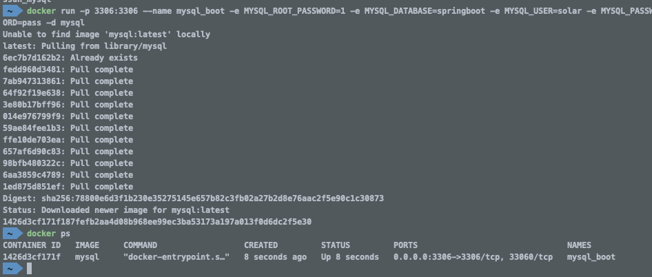
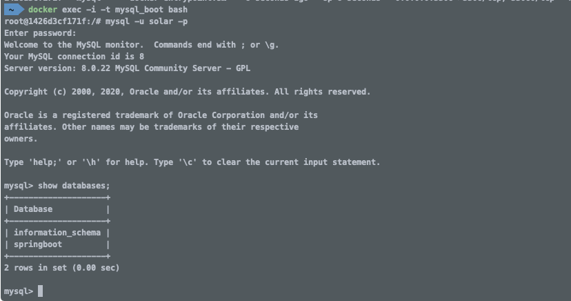
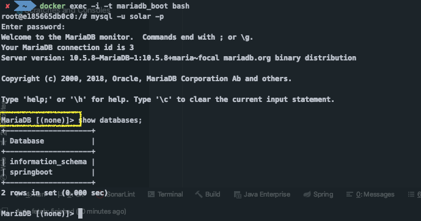

# 스프링 데이터 3부: MySQL

지원하는 DBCP

1. [**HikariCP**](https://github.com/brettwooldridge/HikariCP) **(기본)**
   * https://github.com/brettwooldridge/HikariCP#frequently-used
2. [Tomcat CP](https://tomcat.apache.org/tomcat-7.0-doc/jdbc-pool.html)
3. [Commons DBCP2](https://commons.apache.org/proper/commons-dbcp/)

DBCP 설정

application.properites 에 `spring.datasource.사용할DBCP` 추가

* **spring.datasource.hikari.\***
* spring.datasource.tomcat.*
* spring.datasource.dbcp2.*

MySQL 커넥터 의존성 추가

```xml
<dependency>
   <groupId>mysql</groupId>
   <artifactId>mysql-connector-java</artifactId>
</dependency>
```

MySQL 추가 (도커 사용)

```sh
# 인스턴스 생성
docker run -p 3306:3306 --name mysql_boot -e MYSQL_ROOT_PASSWORD=1 -e MYSQL_DATABASE=springboot -e MYSQL_USER=solar -e MYSQL_PASSWORD=pass -d mysql

# mysql_boot 인스턴스 내에서 bash를 실행
docker exec -i -t mysql_boot bash

# mysql 접속
mysql -u root -p
```


MySQL용 Datasource 설정

* spring.datasource.url=jdbc:mysql://localhost:3306/springboot?useSSL=false
* spring.datasource.username=solar
* spring.datasource.password=pass

MySQL 접속시 에러

MySQL 5.* 최신 버전 사용할 때 

| 문제 | Sat Jul 21 11:17:59 PDT 2018 WARN: Establishing SSL connection without server's identity verification is not recommended. **According to MySQL 5.5.45+, 5.6.26+ and 5.7.6+ requirements SSL connection must be established by default if explicit option isn't set.** For compliance with existing applications not using SSL the **verifyServerCertificate property is set to 'false'**. You need either to explicitly disable SSL by setting **useSSL=false**, or set **useSSL=true and provide truststore** for server certificate verification. |
| ---- | ------------------------------------------------------------ |
| 해결 | jdbc:mysql:/localhost:3306/springboot?**useSSL=false**<br />또는, set **useSSL=true and provide truststore** for server certificate verification. |

MySQL 8.* 최신 버전 사용할 때

| 문제 | com.mysql.jdbc.exceptions.jdbc4.MySQLNonTransientConnectionException: Public Key Retrieval is not allowed |
| ---- | ------------------------------------------------------------ |
| 해결 | jdbc:mysql:/localhost:3306/springboot?useSSL=false&**allowPublicKeyRetrieval=true** |

MySQL 라이센스 (GPL) 주의

* MySQL 대신 MariaDB 사용 검토
* 소스 코드 공개 의무 여부 확인 

---


# DBCP

* DataBase Connection Pool

* DBCP에서 Connection을 만드는 과정이 상당히 많은 작업이 이루어진다. 그래서 이 Connection을 만드는 과정이 짧지 않기 때문에 Connection을 미리 여러개 만들어 놓고 애플리케이션이 필요로 할 때마다 미리 만들어놓은 커넥션을 가져다 쓰는 개념

* 몇 개를 미리 만들 것인지, 얼마동안 쓰이지 않으면 커넥션을 몇 개 없앨 것인지, 최소한 몇개를 유지할 것인지, 등등 여러가지 설정들을 할 수 있다.

* **DBCP가 애플리케이션 성능에 아주 핵심적인 역할을 한다.** 

  ⇒ DBCP에 버그가 있으면 디버깅하기도 힘든 애플리케이션에 아주 심각한 문제가 생길 수 있다.

  ⇒ 따라서, DBCP는 학습을 충분히 많이하고 신중하게 선택하는 것이 좋다. 선택한 DBCP에 대해서 설정관련 부분, 버그 리포팅을 예의주의해서 관리해야 한다.


# 지원하는 DBCP

스프링 부트는 기본적으로 `HikariCP`라는 DBCP를 선택했다.

아래 3가지 DBCP가 클래스패쓰에 있는 경우, HikariCP를 사용하게 된다.

1. [**HikariCP**](https://github.com/brettwooldridge/HikariCP) **(기본)**
   * [주요 설정  Docs](https://github.com/brettwooldridge/HikariCP#frequently-used)
   * autoCommit:true → sql을 실행할 때 마다 commit이라고 명시하지 않아도 바로바로 적용이 된다.
   * connectionTimeout → DBCP Pool에서 connection객체를 애플리케이션에 전달을 못하는 경우, 어느정도 지났을 때 에러를 발생할 것인지
   * maximumPoolSize → 커넥션 객체를 몇개 유지할 것인지 (기본값 : 10개) ★ 중요 ★
     * 커넥션 객체를 많게 설정한 경우 애플리케이션이 커넥션 객체를 모두 가져간다고 해도, 그 걸 다 한번에 실행할 수 없다. 동시에 일을 할 수 있는 커넥션은 **CPU 코어갯수와 동일**하다. 코어 갯수를 넘어간 스레드들은 대기상태로 있다. 
     * **애플리케이션 성능 최적화 시 중요하게 살펴볼 요인이다.**
2. [Tomcat CP](https://tomcat.apache.org/tomcat-7.0-doc/jdbc-pool.html)
3. [Commons DBCP2](https://commons.apache.org/proper/commons-dbcp/)


### DBCP 설정

application.properites 에 `spring.datasource.사용할DBCP` 추가

* **spring.datasource.hikari.\***
* spring.datasource.tomcat.*
* spring.datasource.dbcp2.*


---

# MySQL 사용

### 1. MySQL 커넥터 의존성 추가

* MySQL을 추가한 것이 아니라 MySQL에 접속할 수 있는 커넥터를 추가
* DataSource 구현체

```xml
<dependency>
   <groupId>mysql</groupId>
   <artifactId>mysql-connector-java</artifactId>
</dependency>
```

### 2. MySQL 추가 (도커 사용)

docker run -p 3306:3306 --name {container name} -e MYSQL_ROOT_PASSWORD={root password} -e MYSQL_DATABASE={db name} -e MYSQL_USER={user name} -e MYSQL_PASSWORD={password} -d mysql

```sh
# 인스턴스 생성
docker run -p 3306:3306 --name mysql_boot -e MYSQL_ROOT_PASSWORD=1 -e MYSQL_DATABASE=springboot -e MYSQL_USER=solar -e MYSQL_PASSWORD=pass -d mysql

# mysql_boot 인스턴스 내에서 bash를 실행
docker exec -i -t mysql_boot bash

# mysql 접속
mysql -u root -p
```






### 3. MySQL용 Datasource 설정

docker 인스턴스에 접근하기위한 정보 설정

* spring.datasource.url=jdbc:mysql://localhost:3306/springboot?useSSL=false
* spring.datasource.username=solar
* spring.datasource.password=pass


MySQL 접속시 에러

MySQL 5.* 최신 버전 사용할 때 

* 특정 버전 이상 부터 SSL 커넥션을 강제화하기 때문에 이를 우회하기 위한 옵션

| 문제 | Sat Jul 21 11:17:59 PDT 2018 WARN: Establishing SSL connection without server's identity verification is not recommended. **According to MySQL 5.5.45+, 5.6.26+ and 5.7.6+ requirements SSL connection must be established by default if explicit option isn't set.** For compliance with existing applications not using SSL the **verifyServerCertificate property is set to 'false'**. You need either to explicitly disable SSL by setting **useSSL=false**, or set **useSSL=true and provide truststore** for server certificate verification. |
| ---- | ------------------------------------------------------------ |
| 해결 | jdbc:mysql:/localhost:3306/springboot?**useSSL=false**<br />또는, set **useSSL=true and provide truststore** for server certificate verification. |

MySQL 8.* 최신 버전 사용할 때

| 문제 | com.mysql.jdbc.exceptions.jdbc4.MySQLNonTransientConnectionException: Public Key Retrieval is not allowed |
| ---- | ------------------------------------------------------------ |
| 해결 | jdbc:mysql:/localhost:3306/springboot?useSSL=false&**allowPublicKeyRetrieval=true** |


MySQL 라이센스 (GPL) 주의

* 상용 애플리케이션에서 사용할 때는 엔터프라이즈 라이센스를 구매해서 1년 마다 갱신해서 써야함 (오라클에 결제)
* 라이센스비를 내고싶지 않은 경우 MySQL 대신 MariaDB 사용 검토
* 소스 코드 공개 의무 여부 확인 
* MariaDB : 커뮤니티 버전의 MySQL. GPL이기 때문에 소스코드 공개의무가 있을 수 있다.

```sh
docker run -p 3306:3306 --name mariadb_boot -e MYSQL_ROOT_PASSWORD=1 -e MYSQL_DATABASE=springboot -e MYSQL_USER=solar -e MYSQL_PASSWORD=pass -d mariadb
```



