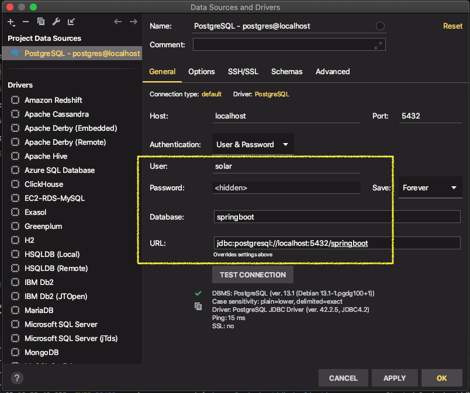
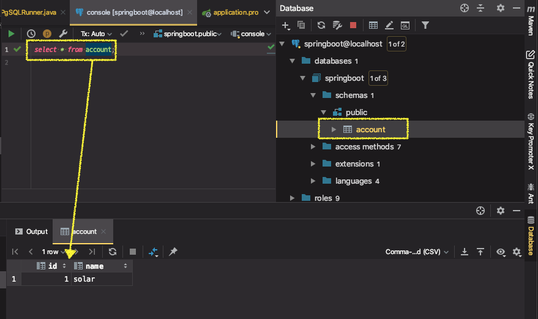
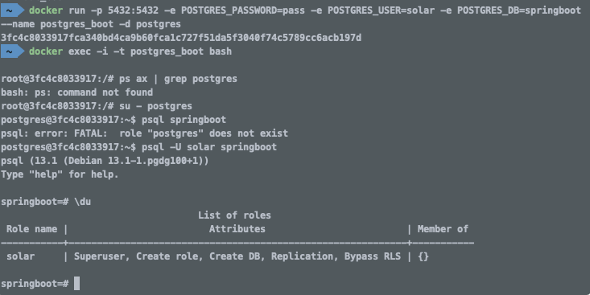

# 스프링 데이터 4부: PostgreSQL

의존성 추가

```xml
<dependency>
   <groupId>org.postgresql</groupId>
   <artifactId>postgresql</artifactId>
</dependency>
```

PostgreSQL 설치 및 서버 실행 (docker)

```sh
docker run -p 5432:5432 -e POSTGRES_PASSWORD=pass -e POSTGRES_USER=solar -e POSTGRES_DB=springboot --name postgres_boot -d postgres

docker exec -i -t postgres_boot bash

su - postgres

psql springboot

# 데이터베이스 조회
\list

# 테이블 조회
\dt

# 쿼리
SELECT * FROM account;
```

PostgreSQL 경고 메시지

| 경고 | org.postgresql.jdbc.PgConnection.createClob() is not yet implemented |
| ---- | ------------------------------------------------------------ |
| 해결 | spring.jpa.properties.hibernate.jdbc.lob.non_contextual_creation=true |

**※ Postgres에서는 `USER`가 키워드이미므로 테이블명으로 `USER`를 사용할 수 없다.**


---

# PostgreSQL 사용

### 1. 의존성 추가

```xml
<dependency>
   <groupId>org.postgresql</groupId>
   <artifactId>postgresql</artifactId>
</dependency>
```


### 2. Datasource 설정

* default port : 5432

```
spring.datasource.url=jdbc:postgresql://localhost:5432/springboot
spring.datasource.username=solar
spring.datasource.password=pass
```


### 3. PostgreSQL 설치 및 서버 실행 (docker)

```shell
docker run -p 5432:5432 -e POSTGRES_PASSWORD=pass -e POSTGRES_USER=solar -e POSTGRES_DB=springboot --name postgres_boot -d postgres

# postgres_boot 컨테이너 내에서 bash를 interactive 모드로 실행
docker exec -i -t postgres_boot bash

# postgres 프로세스 확인
ps ax | grep postgres

# 방법1
# user를 postgres로 변경
su - postgres

# 사용할 DB에 접근
# psql DB명
psql springboot

# 방법 2
# POSTGRES_USER에 설정한 계정으로 DB에 접근
psql -U solar springboot

# 데이터베이스 조회
\list
\l

# 테이블 조회
\dt

# 데이터베이스 삭제
DROP DATABASE springboot;

# 테이블 삭제
DROP TABLE account;

# 데이터베이스 선택
\connect 데이터베이스명
\c DB명

# 쿼리
SELECT * FROM account;

# psql 종료
\q
```


### 4. 애플리케이션 실행

```
DBCP : class com.zaxxer.hikari.pool.HikariProxyConnection, DB : PostgreSQL JDBC Driver, URL : jdbc:postgresql://localhost:5432/springboot, UserName : solar
```


#### DB driver

application.properties에서 driver-class를 설정해줄 수 있지만 스프링부트가 URL을 보고 값을 추측하여 설정해주기 때문에 굳이  설정하지 않아도 된다.

```properties
spring.datasource.driver-class-name=
```


### Datagrip

docker에 DB서버를 띄워두고 콘솔에서 접근할 수도 있지만, Datagrip으로 접근해서 사용하는 것도 편리



* `database > postgres > schemas > public`에 테이블 확인




---

#### Error

```
postgres@3fc4c8033917:~$ psql springboot
psql: error: FATAL:  role "postgres" does not exist
```

*"PostgreSQL을 설치했다면 `postgres`라는 유저 및 같은 이름의 role이 만들어진다. 기본값으로서 `postgres` role은 PostgreSQL의 슈퍼유저이면서 role 변경 권한을 가지고 있다."* 라고 하는데 postgres 유저가 **role**이 없다고 나옴.

* 해결

  postgres 슈퍼유저 계정이 아닌 내가 만든 POSTGRES_USER의 계정명으로 접근하도록 지정

  ```sh
  psql -U solar springboot
  ```

  `\du` 명령으로 현재  role의 리스트를 확인해보면 POSTGRES_USER 계정밖에 나오지 않는다. 그래서 postgres 계정으로 접속이 안되는 듯




#### PostgreSQL 접속

PostgreSQL을 설치했다면 `postgres`라는 유저 및 같은 이름의 role이 만들어진다. 기본값으로서 `postgres` role은 PostgreSQL의 슈퍼유저이면서 role 변경 권한을 가지고 있다.

그러므로 아래와 같이 계정을 바꾸고 PostgreSQL에 로그인할 수 있다.

```
$ su - postgres
$ psql
psql (10.4)
Type "help" for help.
postgres=#
```

유저 이름을 사용하지 않고 psql을 명령어를 사용하면 현재 시스템 유저와 같은 이름으로 PostgreSQL을 사용할 수 있다. 즉, 위 셸 명령어는 아래와 같은 명령어를 의미한다.

```
psql --username=postgres --dbname=postgres
```

postgres라는 이름의 계정은 PostgreSQL의 슈퍼유저이기 때문에 PostgreSQL에 접속할 수 있을 것이다. psql에서 `\du` 또는 `SELECT rolname FROM pg_roles;` 명령어로 현재 role의 리스트를 파악할 수 있다. 현재는 아무런 role로 만들지 않았기 때문에 기본값인 상황이다.

```
postgres=# \du
                             List of roles
 Role name |                   Attributes                   | Member of
-----------+------------------------------------------------+-----------
 postgres  | Superuser, Create role, Create DB, Replication | {}
```

다른 role을 만들지 않고 postgres 계정으로 데이터베이스를 이용하는 것도 가능하겠지만 슈퍼유저로만 데이터베이스를 이용하는 것은 보안에 문제가 생길 수 있다. 슈퍼유저가 아닌 유저 계정으로 데이터베이스를 이용하기 위해서 role을 만드는 것이 훨씬 좋다.


#### REF

[Ubuntu 환경에서 PostgreSQL 설치 후 리모트 접속하기](https://yeojin-dev.github.io/blog/postgresql-ubuntu/)

