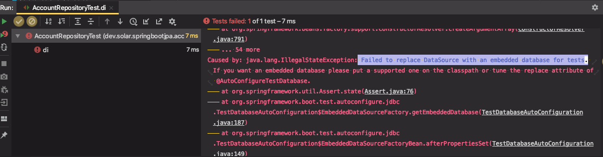
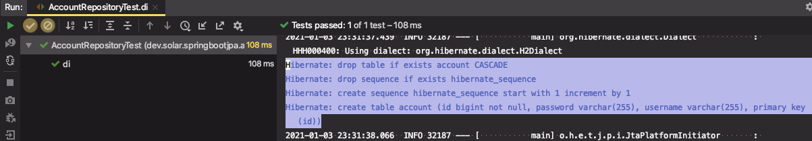
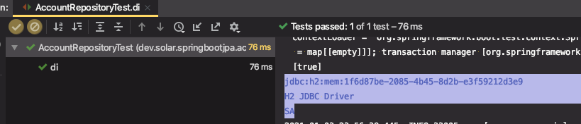
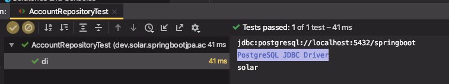

# 스프링 데이터 6부: Spring-Data-JPA 연동

스프링 데이터 JPA 의존성 추가

* 의존성만 추가하면 바로 사용할 수 있다.

```xml
<dependency>
   <groupId>org.springframework.boot</groupId>
   <artifactId>spring-boot-starter-data-jpa</artifactId>
</dependency>
```

스프링 데이터 JPA 사용하기

* @Entity 클래스 만들기
* Repository 만들기

스프링 데이터 리파지토리 테스트 만들기

* H2 DB를 테스트 의존성에 추가하기
* @DataJpaTest (슬라이스 테스트) 작성

---

※ 프로젝트 : `springbootjpa` - web, postgresql DB 사용


## 스프링 데이터 JPA 사용

1. @Entity 클래스 만들기

   Account 엔티티 생성 (hashCode()와 equals()는 만들어주는 것이 좋다.)

   ```java
   @Entity
   public class Account {
   
       @Id
       @GeneratedValue
       private Long id;
   
       private String username;
   
       private String password;
     	// getter, setter, equals(), hashCode()
   }
   ```

2. Repository 만들기

   ```java
   import org.springframework.data.jpa.repository.JpaRepository;
   
   public interface AccountRepository extends JpaRepository<Account, Long> {
   }
   ```


## 스프링 데이터 리파지토리 테스트 만들기

* H2 DB를 테스트 의존성에 추가하기
* @DataJpaTest (슬라이스 테스트) 작성

슬라이싱 테스트를 만들 것이기 때문에 `@DataJpaTest` 애노테이션 추가

※ 슬라이싱 테스트 : 레파지토리(포함)와 관련된 빈들만 등록을 해서 테스트를 만드는 것


(1) 비어있는 테스트를 실행시켜서 잘 뜨는지 확인

```java
@RunWith(SpringRunner.class)
@DataJpaTest
public class AccountRepositoryTest {

    @Autowired
    DataSource dataSource;

    @Autowired
    JdbcTemplate jdbcTemplate;

    @Autowired
    AccountRepository accountRepository;

    @Test
    public void di() {
        
    }
}
```

확인하는 내용

* @Autowired로 주입받으려는 빈들이 잘 등록이 되었는지
* 테스트 애플리케이션이 잘 실행이되는지 확인할 수 있다.


테스트 실패



```
Caused by: java.lang.IllegalStateException: Failed to replace DataSource with an embedded database for tests. If you want an embedded database please put a supported one on the classpath or tune the replace attribute of @AutoConfigureTestDatabase.
```

**이유 : 슬라이싱 테스트를 할 때는 인-메모리 데이터베이스가 반드시 필요하다.**

해결 : H2를 test scope로 의존성을 추가해준다.

```xml
<dependency>
    <groupId>com.h2database</groupId>
    <artifactId>h2</artifactId>
    <scope>test</scope>
</dependency>
```


테스트 성공

Hibernate 로그로 테이블을 drop 후, create하는 것 확인




---

## DB 추가

1. Postgresql 의존성 추가

```xml
<dependency>
    <groupId>org.postgresql</groupId>
    <artifactId>postgresql</artifactId>
</dependency>
```

2. PostgreSQL 설치 및 서버 실행 (docker)

```sh
docker run -p 5432:5432 -e POSTGRES_PASSWORD=pass -e POSTGRES_USER=solar -e POSTGRES_DB=springboot --name postgres_boot -d postgres

docker exec -i -t postgres_boot bash

su - postgres

psql springboot

# 데이터베이스 조회
\list

# 테이블 조회
\dt

# 쿼리
SELECT * FROM account;
```

3. Datasoure 설정

(datasource를 설정하지 않으면 기본적으로 인-메모리DB를 사용하기 때문에 반드시 URL 설정을 해줘야함)

```properties
spring.datasource.url=jdbc:postgresql://localhost:5432/springboot
spring.datasource.username=solar
spring.datasource.password=pass
```


⇒ 애플리케이션 동작 OK


---

### 슬라이싱 테스트 vs 통합 테스트

```java
@Test
public void di() throws SQLException {
    try(Connection connection = dataSource.getConnection()) {
        DatabaseMetaData metaData = connection.getMetaData();
        System.out.println(metaData.getURL());
        System.out.println(metaData.getDriverName());
        System.out.println(metaData.getUserName());
    }
}
```


1. `@DataJpaTest` 애노테이션으로 테스트를 만든 경우 사용되는 DB 정보를 확인

⇒ 우리가 설정한대로 test용 인메모리DB인 H2를 사용한다.



* 인메모리 DB가 빠르고 결코 나쁘지 않다. DB를 별도로 사용하므로 안전함


2. `@SpringBootTest` 애노테이션으로 테스트를 만들 수도 있다.

이렇게 만들면 이 테스트는 통합테스트(Integration Test)가 된다. 애플리케이션의 main `@SpringBootApplication`을 찾아서 모든 빈이 등록된다. 즉, `application.properties`가 적용이된다.

⇒ 따라서 **PostgreSQL** DB를 사용하게 된다. (권장하지 않음. )



이 방법도 나쁘지 않지만, 느리고 테스트용 DB가 별도로 필요하다. 대부분 테스트용 DB설정을 `test/` 에 properties 파일을 만들어서 사용한다.


url 설정을 해주면 이 값이 오버라이딩돼서 적용된다.

```java
@SpringBootTest(properties = "spring.datasource.url=''")
```


---

## 슬라이싱 테스트

```java
public interface AccountRepository extends JpaRepository<Account, Long> {
    Account findByUsername(String username);
}
```

```java
@Test
public void di() throws SQLException {
  Account account = new Account();
  account.setUsername("solar");
  account.setPassword("pass");

  Account newAccount = accountRepository.save(account);

  assertThat(newAccount).isNotNull();

  Account existingAccount = accountRepository.findByUsername(newAccount.getUsername());
  assertThat(existingAccount).isNotNull();

  Account nonExistingAccount = accountRepository.findByUsername("holari");
  assertThat(nonExistingAccount).isNull();

}
```

우리는 테스트를 만들면서 `findByUsername()`이라는 메서드만 추가했을 뿐인데, 이것에 대한 실제 구현체를 만들어서 빈으로 등록하는 것을 스프링 데이터 JPA가 알아서 해주는 것이다.

SQL은 스프링 데이터 JDBC를 쓰는 일은 거의 없고, JPA API를 써서 쓴다.

SQL을 쓰고 싶어서 JPA를 통해서 쓸 수 있다.

보통 `@Query`로 nativeQuery 옵션을 줘서 쓸 수 있고,

````java
@Query(nativeQuery = true, value = "select * from account where username = '{0}'")
Account findByUsername(String username);
````

기본값으로는 `JPQL`을 쓰도록 되어있다.

※ [git code](https://github.com/blossun/study-spring/commit/5e2a94cb9d1e6c8db78c41251b62c4f8e007106a)

---

### Optional 로 값을 반환할 수 있다.

```java
public interface AccountRepository extends JpaRepository<Account, Long> {
    Optional<Account> findByUsername(String username);
}
```

※ [git code](https://github.com/blossun/study-spring/commit/d034c3a4c5c598e3fb230892027efc63c6b98b25)


