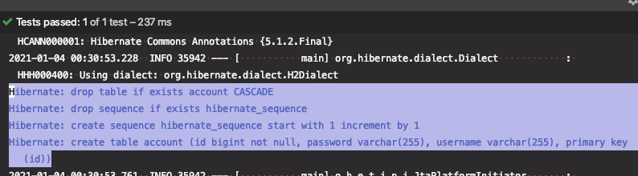

# 스프링 데이터 7부: 데이터베이스 초기화

JPA를 사용한 데이터베이스 초기화

* spring.jpa.hibernate.ddl-auto
* spring.jpa.generate-dll=true로 설정 해줘야 동작함.

SQL 스크립트를 사용한 데이터베이스 초기화

* schema.sql 또는 schema-${platform}.sql
* data.sql 또는 data-${platform}.sql
* ${platform} 값은 spring.datasource.platform 으로 설정 가능.

---

## JPA를 사용한 데이터베이스 초기화

이전 실습에서 테스트를 돌리면 스키마가 자동으로 생성되는 것을 확인할 수 있다. (H2 database)



실제 메인 애플리케이션을 실행할 때는 (아직 아무런 설정도 하지 않은 상태)

애플리케이션은 구동되지만 스크마는 생성되지 않는다.


* `spring.jpa.generate-dll=true` : hibernate.ddl-auto 옵션을 사용할지 여부를 설정(default값이 false이다.)

* `spring.jpa.hibernate.ddl-auto` 를 셋팅하면 자동생성할 수 있다.

  * update : 기존의 스키마는 그대로 두고, 추가된 정보만 스키마를 변경한다.

    (※ 기존의 속성명을 변경하면 어떤 컬럼명이 어떻게 바뀌었는지 하이버네이트는 알지 못하므로 변경이 되지 않는다. 개발시에는 편리하지만 운영시에는 위험할 수 있다. 안쓰는 컬럼이 그대로 남아있어서)

    컬럼이 추가되면 ALTER TABLE로 변경이 적용된다.

  * create-drop : 처음 동작할 때 테이블을 만들어주고 애플리케이션 종료시 스키마를 삭제(기존 데이터가 삭제)

  * create : 초반에 구동할 때 지우고 새로 만든다.(기존 데이터가 삭제)

```properties
spring.jpa.hibernate.ddl-auto=update|create-drop|create
```

※ 실제 운영시 설정

* `spring.jpa.generate-dll=false` : 실제 ddl에 변경을 하지 않음

* `spring.jpa.hibernate.ddl-auto=validate` : 현재 엔티티 매핑이 릴레이션에 매핑되는지 검증만 한다.


그 외 설정

* `spring.jpa.show-sql=true` : sql문을 로그에 찍어주는 설정 


## SQL 스크립트를 사용한 데이터베이스 초기화

`resources/`에 파일 생성. 호출 순서

1. schema.sql 또는 schema-${platform}.sql

2. data.sql 또는 data-${platform}.sql : 초기 데이터값

* ${platform} 값은 spring.datasource.platform 으로 설정 가능.


테스트를 실행하면 스키마를 자동으로 설정해주므로 이 때 출력되는 SQL을 복사해서 사용할 수 있다.

1. `spring.jpa.show-sql=true` : sql문을 로그에 찍어주는 설정

2. 테스트시에 application.properties 파일도 읽어서 적용되므로 ddl-auto가 validate라면 테스트에서도 스키마를 검증만 한다.

   이를 테스트 시에 잠시 주석처리해서 쿼리를 출력

3. schema.sql에 스키마 sql을 넣어주면, 

   `spring.jpa.generate-dll=false` 로 설정되어있어도 schema.sql로 스키마가 생성되기 때문에 테스트를 돌릴 때 문제가 되지 않는다.

   ```sql
   drop table if exists account CASCADE;
   drop sequence if exists hibernate_sequence;
   create sequence hibernate_sequence start with 1 increment by 1;
   create table account (id bigint not null, password varchar(255), username varchar(255), primary key (id));
   ```


* plaform을 설정해서 plaform에 특화된 스크립트도 정의할 수 있다.

  * 파일명 : schema-postgres.sql

  * properties 설정

    ```properties
    spring.datasource.platform=postgresql
    ```

    

> 개발 시에는 update로 설정해서 사용하다가 (이때는 쿼리가 지저분하고, 안쓰는 컬럼이 남아있을 수 있다.) 배포 전에 테스트를 돌려서 깔끔하게 출력된 스키마 쿼리로 schema.sql을 만든 후, create 등의 설정으로 변경해서 배포한다.
>
> 운영 시에 update로 설정하면 위험하니 조심

