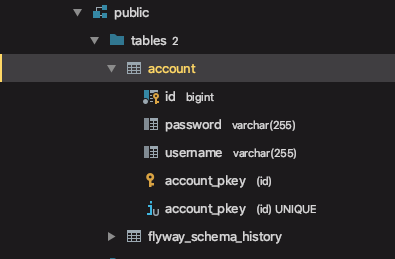
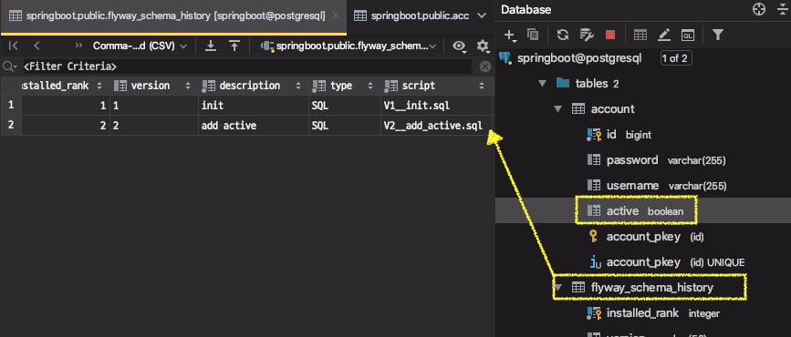

# 스프링 데이터 8부: 데이터베이스 마이그레이션

Flyway와 Liquibase가 대표적인데, 지금은 Flyway를 사용하겠습니다.

https://docs.spring.io/spring-boot/docs/2.0.3.RELEASE/reference/htmlsingle/#howto-execute-flyway-database-migrations-on-startup

의존성 추가

* org.flywaydb:flyway-core

마이그레이션 디렉토리

* db/migration 또는 db/migration/{vendor}
* spring.flyway.locations로 변경 가능

마이그레이션 파일 이름

* V숫자__이름.sql
* V는 꼭 대문자로.
* 숫자는 순차적으로 (타임스탬프 권장)
* 숫자와 이름 사이에 언더바 **두 개**.
* 이름은 가능한 서술적으로.

---

##  데이터베이스 마이그레이션

스키마와 데이터를 체계적으로 관리하고 싶다면 DB 마이그레이션 툴을 사용하면 된다.

DB스키마와 데이터의 변경사항을 버전관리를 할 수 있다.

Flyway는 기본적으로 sql 파일을 사용한다.


### (실습)

의존성 추가

* org.flywaydb:flyway-core

마이그레이션 디렉토리

* db/migration 또는 db/migration/{vendor}
  * 벤더마다 만들어 줄 수도 있다.
* spring.flyway.locations로 변경 가능

마이그레이션 파일 이름 규칙

* 예시) `V숫자__이름.sql`
* V는 꼭 대문자로.
* 숫자는 순차적으로 (타임스탬프 권장)
* 숫자와 이름 사이에 언더바 **두 개**.
* 이름은 가능한 서술적으로.


마이그레이션 파일에 스키마 sql 저장

* `V1__init.sql` 

```sql
drop table if exists account CASCADE;
drop sequence if exists hibernate_sequence;
create sequence hibernate_sequence start with 1 increment by 1;
create table account (id bigint not null, password varchar(255), username varchar(255), primary key (id));
```


application.properties 설정

* ddl-auto=validate

* 하이버네이트는 엔티티와 DB의 맵핑 검증만 한다.

```properties
spring.jpa.hibernate.ddl-auto=validate
spring.jpa.generate-ddl=false
spring.jpa.show-sql=true
```


##### 동작 순서

flywqy가 먼저 마이그레이션 디렉토리 경로에 파일이 있는지 확인

파일을 찾아서 쿼리를 실행하면 스키마가 생성된다.

그 후, 하이버네이트가 (ddl-auto=validate로 설정했으므로) validate을 수행한다. 스키마가 잘 생성되었다면 문제없이 애플리케이션이 실행되고 테이블도 만들어 진 것 확인 가능



* flyway_schema_histroy : flyway가 자기 정보를 관리하는 테이블


### 엔티티에 속성을 추가하면?

flyway는 스키마파일의 변동이 없으므로 아무런 변화도 일어나지 않고,

하이버네이트에서는 validation하다가 맵핑이되지 않으므로 에러가 발생한다.

⇒ 에러메시지 : account 테이블에 active 컬럼이 없다.

```
Caused by: org.hibernate.tool.schema.spi.SchemaManagementException: Schema-validation: missing column [active] in table [account]
```


> 그렇다면 스키마를 어떻게 변경해야하나?
>
> 기존에 적용된 `V1__init.sql` 파일을 수정해야할까?

**★ 절대로 한 번 적용된 스크립트는 건드리면 안 된다.★** 

어떠한 변경이던지 새파일로 만들어서 써야한다.

`V2__add_active.sql` 파일을 만들어서 수정된 사항을 반영한다.

```sql
ALTER TABLE account ADD COLUMN active BOOLEAN;
```


flyway가 두 번째 스크립트를 찾아서 적용해주고, 하이버네이트가 validation하고 이상이 없으므로 정상적으로 떠있게 된다.



