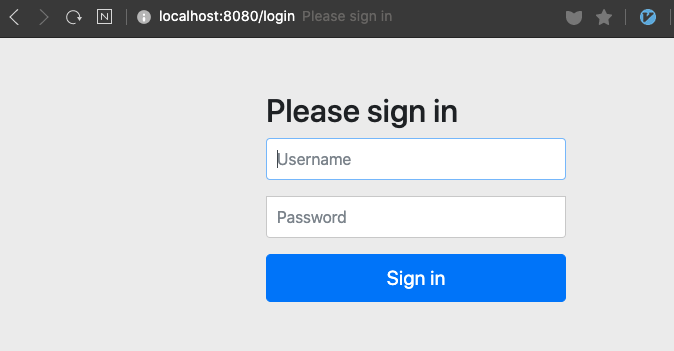
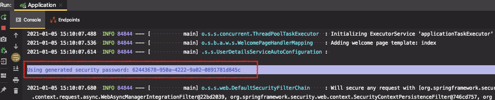
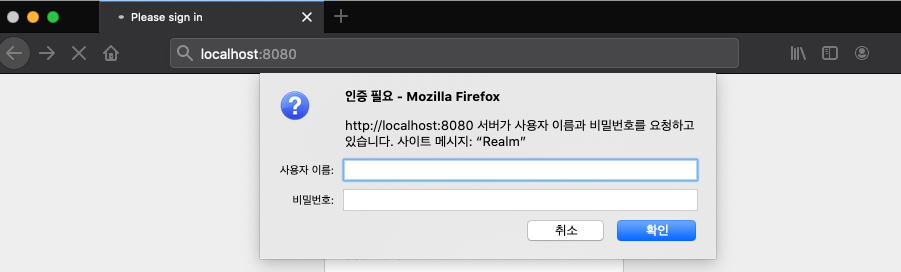
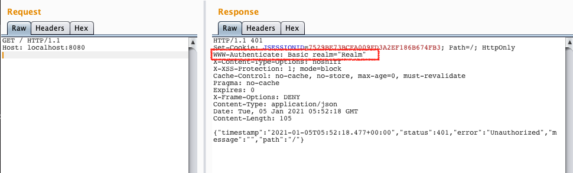
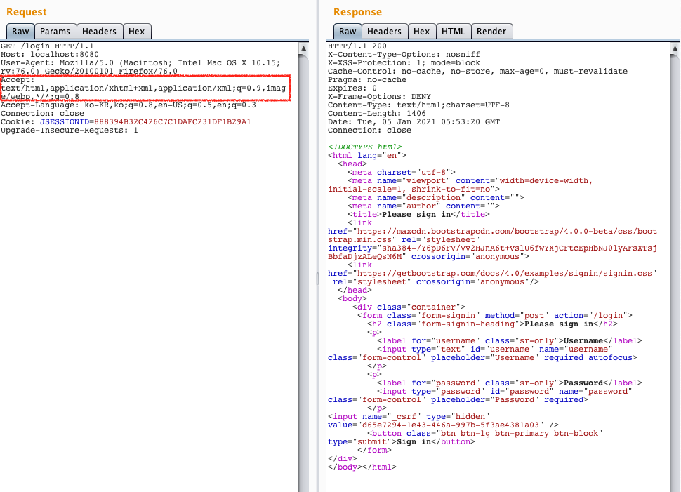

# 스프링 시큐리티 1부: spring-boot-starter-security

스프링 시큐리티

* 웹 시큐리티
* 메소드 시큐리티
* 다양한 인증 방법 지원
  * LDAP, 폼 인증, Basic 인증, OAuth, ...

스프링 부트 시큐리티 자동 설정

* spring-boot-starter-security 의존성을 추가하면 다음 두가지 자동설정이 적용된다.
  * 스프링 시큐리티 5.* 의존성 추가

* SecurityAutoConfiguration → 사실상 스프링 시큐리티가 제공해주는 기능을 그대로 사용
* UserDetailsServiceAutoConfiguration → 보통(100%) UserDetailsService를 만들어서 사용하므로 자동설정 사용할 일이 없음
* 모든 요청에 인증이 필요함.
* 기본 사용자 생성
  * Username: user
  * Password: 애플리케이션을 실행할 때 마다 랜덤 값 생성 (콘솔에 출력 됨.)
  * spring.security.user.name
  * spring.security.user.password
* 인증 관련 각종 이벤트 발생
  * DefaultAuthenticationEventPublisher 빈 등록
  * 다양한 인증 에러 핸들러 등록 가능

스프링 부트 시큐리티 테스트

* https://docs.spring.io/spring-security/site/docs/current/reference/html/test-method.html

---

스프링부트 프로젝트에 `spring-boot-starter-security` 의존성만 추가하면 스프링 시큐리티를 사용할 수 있다.

※ 프로젝트 : springbootsecurity - 의존성:web


**(실습 준비)**

* `/hello`, `/my`에 대한 요청을 처리하는 컨트롤러 추가
* index.html, hello.html, my.html 페이지 추가
* 컨트롤러 테스트 추가

* Thymleaf로 뷰 렌더링

#### 목표

* /hello : 모든 사용자가 접근 가능
* /my : 로그인한 사용자만 접근 가능


## 실습

1. 스프링 시큐리티 의존성 추가

```xml
<dependency>
    <groupId>org.springframework.boot</groupId>
    <artifactId>spring-boot-starter-security</artifactId>
</dependency>
```


2. 테스트 코드

```java
@Test
public void hello() throws Exception {
    mockMvc.perform(get("/hello")
                .accept(MediaType.TEXT_HTML))
            .andDo(print())
            .andExpect(status().isOk())
            .andExpect(view().name("hello"));
}

@Test
public void my() throws Exception {
    mockMvc.perform(get("/my"))
            .andDo(print())
            .andExpect(status().isOk())
            .andExpect(view().name("my"));
}
```


⇒ 시큐리티를 추가하면 테스트가 깨진다.

* "/my" ⇒ 401 Unauthorized 응답 : *"Basic 인증"*

  ```
  MockHttpServletResponse:
             Status = 401
      Error message = Unauthorized
            Headers = [WWW-Authenticate:"Basic realm="Realm"", X-Content-Type-Options:"nosniff", X-XSS-Protection:"1; mode=block", Cache-Control:"no-cache, no-store, max-age=0, must-revalidate", Pragma:"no-cache", Expires:"0", X-Frame-Options:"DENY"]
  ```

  Accect 헤더에 별도로 값을 지정하지 않았기 때문에 서버는 클라이언트에게 Basic인증을 요청하게 된다.


* "/hello" ⇒ 302 Redirect 응답 : *"폼 인증"*

  ```
  MockHttpServletResponse:
             Status = 302
      Error message = null
            Headers = [X-Content-Type-Options:"nosniff", X-XSS-Protection:"1; mode=block", Cache-Control:"no-cache, no-store, max-age=0, must-revalidate", Pragma:"no-cache", Expires:"0", X-Frame-Options:"DENY", Location:"http://localhost/login"]
       Content type = null
               Body = 
      Forwarded URL = null
     Redirected URL = http://localhost/login
            Cookies = []
  ```

  Accept 헤더에 "text/html"을 담았기 때문에 서버는 폼인증을 받기위한 (스프링부트가 기본으로 만들어주는 )로그인 페이지로 리다이렉트 한다. 


> why??

스프링부트가 제공하는 시큐리티 자동설정 중 하나이다.

* 모든 요청이 스프링 시큐리티로 인해 `인증`이 필요하게 된다.

* Basic Authentication과 Form 인증이 둘 다 적용된다.


Basic Authentication는 Accept 헤더에 따라 달라진다. (* Accept 헤더 : 요청이 원하는 응답의 형태)

우리는 따로 Accept 헤더에 `text/html`을 담아서 보내지 않았기 때문에, Basic 인증을 응답으로 보낸다.

브라우저가 `Basic Authentication` 응답을 받으면 브러우저의 내장된 Basic Authentication Form을 띄우게 된다. 

보통 브라우저에서 요청하는 HTTP Accept 헤더에는 `text/html`이 들어간다. 그런 경우 폼 인증으로 넘어간다.

(⇒ ***폼인증 vs Basic 인증 vs 다이제스트 인증*** 의 차이점과 보안 취약점을 확인해보자)


3. 웹브라우저에서 루트(/)에 접근하면 자동으로 로그인 페이지로 넘어간다.



폼 로그인 관련 설정이 자동으로 적용돼서 루트(/)를 요청했지만 인증정보가 없기 때문에 스프링 시큐리티에서 자동으로 만들어준 로그인 폼 페이지가 띄워진다. 

폼에 입력할 수 있는 정보를 스프링 시큐리티가 자동으로 만들어준다. (스프링부트가 제공하는 자동설정에 의해서 만들어진 정보)

* Username : user
* Password : 애플리케이션을 실행할 때 마다 랜덤 값 생성 (콘솔에 출력 됨.)



위 정보로 로그인 후 모든 페이지에 접근 가능하다.


## 스프링 부트 시큐리티 자동 설정

### SecurityAutoConfiguration

스프링 시큐리티가 의존성 추가되면 자동으로 설정되는 파일

`DefaultAuthenticationEventPublisher` 가 등록되어 있다. 

⇒ 스프링 시큐리티 기능이므로 스프링 부트를 쓰지 않더라도 이 빈을 등록하면 사용할 수 있다.

DefaultAuthenticationEventPublisher 는 SpringBootWebSecurityConfiguration 을 import해서 사용되고, SpringBootWebSecurityConfiguration 는 WebSecurityConfigurerAdapter를 상속받아 만든다.

* 인증 관련 각종 이벤트 발생

  * DefaultAuthenticationEventPublisher 빈 등록

  * 다양한 인증 에러 핸들러 등록 가능

    "비번이 틀렸다", "User가 틀렸다", "account가 expired되었다." 여러 경우에 대해서 이벤트를 발생시키고, 우리는 그 이벤트 핸들러를 등록해서 유저의 상태를 변경하는 등 여러가지 일을 할 수 있다.

* WebSecurityConfigurerAdapter

  스프링 시큐리티 자바 기반의 설정을 만들 때 사용할 기본 클래스이다. 이 클래스를 보통 상속받아 만들게 되어있다.

  ```java
  @Configuration(proxyBeanMethods = false)
  @ConditionalOnDefaultWebSecurity
  @ConditionalOnWebApplication(type = Type.SERVLET)
  class SpringBootWebSecurityConfiguration {
  
     @Bean
     @Order(SecurityProperties.BASIC_AUTH_ORDER)
     SecurityFilterChain defaultSecurityFilterChain(HttpSecurity http) throws Exception {
        http.authorizeRequests().anyRequest().authenticated().and().formLogin().and().httpBasic();
        return http.build();
     }
  
  }
  ```

  * `getHttp()` : 이 메서드에 정의된 설정들이 적용된다. 

  * `configure()`

    스프링 시큐리티가 제공해주는 설정으로 (스프링부트가 별도의 설정이 없다면) 이 설정을 그대로 적용한다.

    ```java
    protected void configure(HttpSecurity http) throws Exception {
       this.logger.debug("Using default configure(HttpSecurity). "
             + "If subclassed this will potentially override subclass configure(HttpSecurity).");
       http.authorizeRequests((requests) -> requests.anyRequest().authenticated()); //모든 요청을 가로채서 인증을 받도록 한다.
       http.formLogin(); //form 로그인 사용
       http.httpBasic(); //basic 인증도 사용
    }
    ```


※ SecurityAutoConfiguration 자동설정을 쓰지않고 다음과 같이 직접 빈을 등록해서 거의 동일한 기능을 사용할 수 있는 우리만의 웹 시큐리티 설정을 사용할 수 있다.

```java
import org.springframework.context.annotation.Configuration;
import org.springframework.security.config.annotation.web.configuration.WebSecurityConfigurerAdapter;

@Configuration
public class WebSecurityConfig extends WebSecurityConfigurerAdapter {
}
```


### UserDetailsServiceAutoConfiguration

* 스프링 부트가 제공해주는 기능

* 스프링부트 애플리케이션이 구동될 때, 아래 클래스가 없다면, `inMemoryUserDetailsManager`를 만들어서 랜덤한 유저 객체 하나를 생성해서 만들어준다.

  ```java
  @ConditionalOnMissingBean(
        value = { AuthenticationManager.class, AuthenticationProvider.class, UserDetailsService.class },
  ```

  `inMemoryUserDetailsManager`를 사용하고 싶지 않다면 `UserDetailsService`를 만들어서 사용하면 된다.

* **보통 (100%) 스프링 시큐리티를 적용하는 프로젝트들은 프로젝트만의 `UserDetailsService`를 등록하게 되어있다.**


> ⇒ 스프링부트가 제공하는 스프링 시큐리티에 관련된 기능들은 사실상 거의 사용될 일이 없다.


## 깨진 테스트 수정


---

### Basic 인증 vs 폼 인증

※ Basic 인증






※ 폼 인증




---

※ Basic 인증 보안 주의

​	[HTTP 인증 Docs](https://developer.mozilla.org/ko/docs/Web/HTTP/Authentication)

​	[[보안\] 폼인증 vs Basic 인증 vs 다이제스트 인증](https://jamie95.tistory.com/entry/보안-다이제스트-인증)


