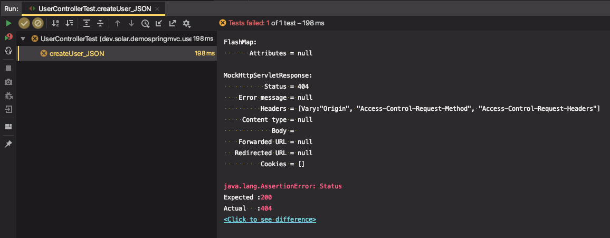
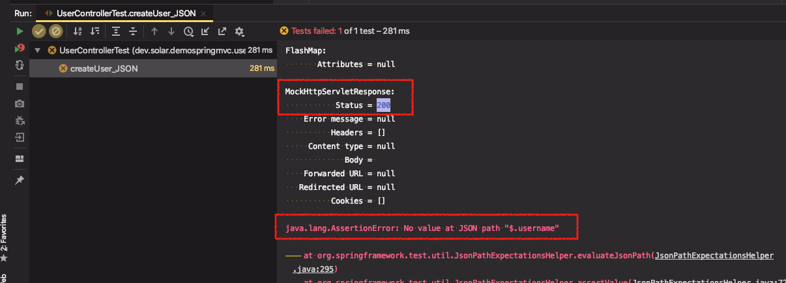

# 스프링 웹 MVC 2부: HttpMessageConverters

https://docs.spring.io/spring/docs/5.0.7.RELEASE/spring-framework-reference/web.html#mvc-config-message-converters

HTTP 요청 본문을 객체로 변경하거나, 객체를 HTTP 응답 본문으로 변경할 때 사용.

```
{“username”:”keesun”, “password”:”123”} <-> User
```

* @ReuqestBody
* @ResponseBody

---

## HttpMessageConverters

SpringFramework에서 제공하는 인터페이스. 스프링 MVC의 일부분

HTTP 요청 본문을 객체로 변경하거나, 객체를 HTTP 응답 본문으로 변경할 때 사용

```
{“username”:”keesun”, “password”:”123”} <-> User
```

주로 다음 애노테이션과 함께 사용된다.

* @ReuqestBody
* @ResponseBody


 어떤 요청을 받았는지 또는 어떤 응답을 보내야하는지에 따라서 사용되는 HttpMessageConverters가 다르다.

JSON 타입의 본문 요청이 들어온다면 ? (Content-type : JSON) JSON HttpMessageConverter가 사용돼서 JSON 데이터를 User 객체로 컨버팅해준다.

리턴할 때 User 타입의 객체를 리턴할 때, 객체 자체를 리턴할 수 없으니 변환해야 하는데 기본적으로 JSON MessageConverter가 사용된다.

Composition 타입이 아닌 String 문자열(int etc..) 리턴타입인 경우 String MessageConverter가 사용된다.

* @RestController 가 붙어있으면 `@ResponseBody` 애노테이션 생략 가능
  * BeanNameResolver를 타지않고, 바로 메시지컨버터를 타서 응답 본문으로 내용이 전달된다.
* @Controller 를 사용할 때는 `@ResponseBody` 애노테이션을 써줘야 메시지컨버터가 적용된다.
  * BeanNameResolver를 사용해서 이 이름에 해당하는 뷰를 찾으려고 시도하게된다.


#### 실습

메시지 컨버터를 사용하려면 Composition[^1] 객체를 만들어야한다.

1. User를 생성하는 테스트 코드 작성


* MediaType : SpringFramework가 제공하는 상수를 모아놓은 클래스

```java
@Test
public void createUser_JSON() throws Exception {
    String userJson = "";
    mockMvc.perform(post("/users/create")
            .contentType(MediaType.APPLICATION_JSON) //content type 지정 → JSON 타입
            .accept(MediaType.APPLICATION_JSON) //응답으로 어떤 것을 원하는지 지정 → JSON 타입
            .content(userJson)) //응답 본문에 넣을 데이터
      .andExpect(status().isOk())
      .andExpect(jsonPath("$.username",
                                is(equalTo("solar")))) //json 본문에 username키에 solar값 확인
                        .andExpect(jsonPath("$.password",
                                is(equalTo("123"))));
}
```

→ 테스트 실행하면 404 error로 Status() 확인 부분에서 에러발생

​	why? "/users/create" 요청을 처리하는 핸들러를 못찾았기 때문에




2. 컨트롤러 생성

```java
@PostMapping("/users/create")
public User create() {
    return null;
}
```



⇒ 400 error. 원하는 응답을 받지 못함


전달받은 User 객체를 다시 응답으로 return하도록 수정

```java
@PostMapping("/users/create")
public User create(@RequestBody User user) {
  return user;
}
```

⇒ 500 error. User가 없음


3. User 구현

자바 빈 규약에 따라서 Getter, Setter를 사용해서 바인딩을 해주므로 만들어줘야한다.

```java
package dev.solar.demospringmvc.user;

public class User {

    private Long id;

    private String username;

    private String password;

    public Long getId() {
        return id;
    }

    public void setId(Long id) {
        this.id = id;
    }

    public String getUsername() {
        return username;
    }

    public void setUsername(String username) {
        this.username = username;
    }

    public String getPassword() {
        return password;
    }

    public void setPassword(String password) {
        this.password = password;
    }
}
```

⇒ 테스트 통과


[^1]: Composition(조합) 여러 객체를 합하여 다른 하나로 만드는 것. 어떤 객체가 다른 객체의 일부분인 경우