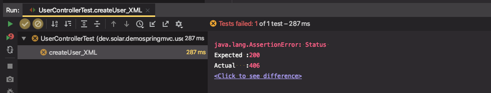
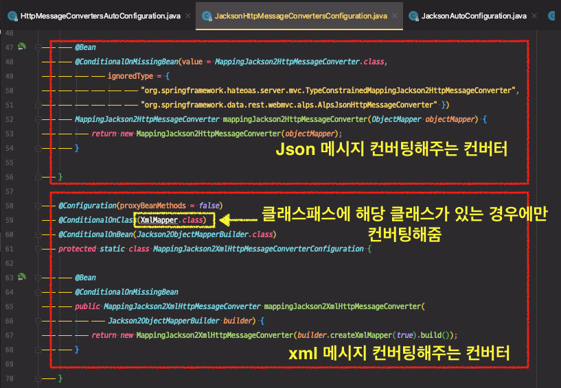
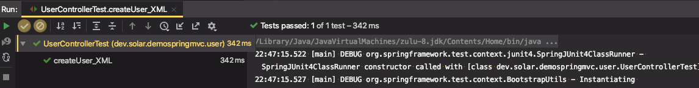

# 스프링 웹 MVC 3부: ViewResolver

스프링 부트

* 뷰 리졸버 설정 제공
* HttpMessageConvertersAutoConfiguration

XML 메시지 컨버터 추가하기

```xml
<dependency>
   <groupId>com.fasterxml.jackson.dataformat</groupId>
   <artifactId>jackson-dataformat-xml</artifactId>
   <version>2.9.6</version>
</dependency>
```

---

### ContentNegotiatingViewResolver

* ViewResolver 중 하나
* 들어오는 Accept 헤더에 따라 응답이 달라진다.
* Accept 헤더 : 브라우저 또는 클라이언트가 "어떠한 타입의 본문을 원한다"라고 서버에게 알려주는 정보

달라지는 구체적인 [뷰 리졸버 Spring docs](https://docs.spring.io/spring-framework/docs/5.0.7.RELEASE/spring-framework-reference/web.html#mvc-multiple-representations)를 확인하면 된다. 뷰 설정&로직이 복잡

요청이 들어오면 요청에 응답을 만들 수 있는 모든 뷰를 찾아내서, 최종적으로 Accept 타입과 비교를 해서 클라이언트가 원하는 뷰를 리턴한다.

클라이언트가 어떠한 뷰를 원하는지 판단하기에 가장 좋은 정보는 Accept 헤더이다.

경우에 따라서는 Accept헤더를 제공하지않는 요청들도 있다. 그러한 경우에는 `"/path?format=pdf"` 와 같이 `format`이라는 파라미터를 제공한다. format에 있는 ppt, json, xml과 같은 타입으로 전달해주면 된다.

예전 초창기 Spring3에서는 *"/users/create.json"* 과 같은 `.` 형식도 지원했지만 이제는 매핑도 해주지 않음

이러한 요청은 더이상 쓰면 안된다.

 

#### 실습

ContentNegotiatingViewResolver 가 이미 등록이 되어있다.

요청은 JSON으로 보내고 응답은 XML로 받아보자

* `.accept(MediaType.APPLICATION_XML)`

* `.andExpect(xpath("$.username").string("solar"))`

```java
@Test
public void createUser_XML() throws Exception {
  String userJson = "{\"username\":\"solar\", \"password\":\"123\"}";
  mockMvc.perform(post("/users/create")
                  .contentType(MediaType.APPLICATION_JSON)
                  .accept(MediaType.APPLICATION_XML)
                  .content(userJson))
    .andExpect(status().isOk())
    .andExpect(xpath("/User/username")
               .string("solar"))
    .andExpect(xpath("/User/password")
               .string("123"));
}
```

⇒ 테스트 결과

```
Resolved Exception:
             Type = org.springframework.web.HttpMediaTypeNotAcceptableException
```



 

이러한 에러는 Media 타입을 처리할 HttpMessageConverter가 없어서 발생하는 것이다.

`HttpMessageConvertersAutoConfiguration` 으로 적용된다. 


### HttpMessageConvertersAutoConfiguration

HttpMessageConverter 자동 설정 파일

(shift + shift) 로 파일 내용확인

`XmlMapper` 클래스가 클래스 패스에 있을 때만 등록이되도록 설정이 되어있다. 현재는 xml 메시지를 컨버팅할 수 있는 컨버터가 없는 상태이다. 



> 클래스패스에 넣어주는 방법?

의존성추가 → XML 메시지 컨버터 추가하기

```xml
<dependency>
   <groupId>com.fasterxml.jackson.dataformat</groupId>
   <artifactId>jackson-dataformat-xml</artifactId>
   <version>2.9.6</version>
</dependency>
```


⇒ 테스트 성공




※ 테스트에 실패한 경우 자동으로 `.andDo(print())` 가 실행되서 요청과 응답 정보를 출력해준다. (성공하면 출력해주지 않음)

