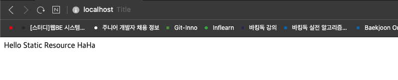
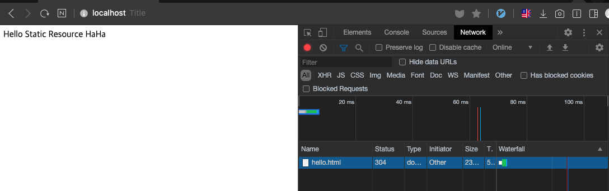
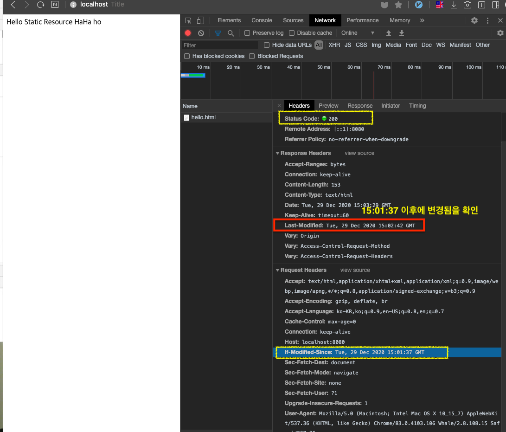

# 스프링 웹 MVC 4부: 정적 리소스 지원

정적 리소스 맵핑 “/**”

* 기본 리소스 위치
  * classpath:/static
  * classpath:/public
  * classpath:/resources/
  * classpath:/META-INF/resources
  * 예) “/hello.html” => /static/hello.html
  * spring.mvc.static-path-pattern: 맵핑 설정 변경 가능
  * spring.mvc.static-locations: 리소스 찾을 위치 변경 가능 (추천하지 않음)
* Last-Modified 헤더를 보고 304 응답을 보냄.
* ResourceHttpRequestHandler가 처리함.
  * WebMvcConfigurer의 addResourceHandlers로 커스터마이징 할 수 있음 (권장하는 방법)

```java
@Override
public void addResourceHandlers(ResourceHandlerRegistry registry) {
   registry.addResourceHandler("/m/**")
           .addResourceLocations("classpath:/m/")
           .setCachePeriod(20);
```

---


# 정적 리소스

* 웹브라우저에서 요청이 들어왔을 때 해당하는 리소스가 이미 만들어져있고, 이 리소스를 그대로 반환해주는 것
* 서버에서 어떤 작업을 처리해서 요청이 들어왔을 때 뷰를 만드는 것이 아니라 이미 리소스가 만들어져 있는 것


## 기본 리소스 위치

기본 4가지 위치에 있는 리소스들은 `/**` 요청에 매핑돼서 제공된다. 예를 들어 `/hello.html` 요청이 들어오면 `/static/hello.html` 파일이 있으면 요청이 들어온 곳으로 해당 내용을 보내준다.

기본 리소스 위치 4가지

* classpath:/static
* classpath:/public
* classpath:/resources/
* classpath:/META-INF/resources


디렉토리를 직접 설정할 수 있다.

* spring.mvc.static-path-pattern: 맵핑 설정 변경 가능
* spring.mvc.static-locations: 리소스 찾을 위치 변경 가능

→ 기본 리소스 디렉토리는 오버라이딩되어서 사용하지 않고, 직접 설정한 내용을 쓰게 된다.


#### 실습

resources/static/hello.html 파일 생성

```html
<!DOCTYPE html>
<html lang="en">
<head>
    <meta charset="UTF-8">
    <title>Title</title>
</head>
<body>
Hello Static Resource HaHa
</body>
</html>
```

스프링 서버 실행 후, 브라우저에서 확인



ResourceHttpRequestHandler가 처리하는데 Last-Modified 헤더를 보고 304 응답을 보내기도 한다.

 


#### 캐싱

내용 수정 후, 재빌드(cmd + F9)하면 브라우저에서 새로고침(cmd + R)하면 반영된다.

resource 자체를 다시 내려보내진 않는다. 

내용 수정 후, Request Header를 확인하면, `If-Modified-Since` 값이 있다. 이 이후에 변경된 사항이 있다면 변경된 내용을 요청하게 된다. `Last-Modified` 시간이 더 이후이므로 변경된 resource를 클라이언트에게 보내고 200 을 보낸다.

 

⇒ 이 상태에서 refresh를 하면 서버는 Last-Modified 값이 변경되지 않았으므로 상태값을 304로 보내고 resource는 보내지 않는다.

훨씬 응답이 빨라진다. 이런식으로 캐싱이 동작한다.


## 접근 url path 설정 - 리소스 루트 변경

기본적으로 리소스들은 루트부터 매핑되어있다.

디렉토리를 직접 설정할 수 있다.

* spring.mvc.static-path-pattern: 맵핑 설정 변경 가능
* spring.mvc.static-locations: 리소스 찾을 위치 변경 가능

→ 기본 리소스 디렉토리는 오버라이딩되어서 사용하지 않고, 직접 설정한 내용을 쓰게 된다. (기본 위치를 사용하지 않게되므로 권장하지 않음)


매핑을 변경하고 싶다면, `application.properties` 에 다음과 같이 설정하면 된다.

```properties
spring.mvc.static-path-pattern=/static/**
```

→ 요청에 `/static`을 붙여야한다.

```
http://localhost:8080/static/hello.html
```


## 리소스 핸들러 커스터마이징

WebMvcConfigurer의 addResourceHandlers로 커스터마이징 할 수 있음

기존에 스프링부트가 제공하는 리소스 핸들러는 그대로 유지하면서 원하는 리소스핸들러만 따로 추가할 수 있다.

`config/WebConfig.java` 를 만들고 코드 추가

`WebMvcConfigurer` 를 커스터마이징하기 위해 인터페이스로 구현한 클래스를 선언하고, `addResourceHandlers` 로 리소스 핸들러를 추가한다.

ex) /m/ 으로 시작하는 요청이오면, classpath기준으로 /m/ 디렉토리 위치에서 리소스를 제공하겠다.

```java
@Configuration
public class WebConfig implements WebMvcConfigurer {

  @Override
  public void addResourceHandlers(ResourceHandlerRegistry registry) {
    registry.addResourceHandler("/m/**")
      .addResourceLocations("classpath:/m/")
      .setCachePeriod(20);
  }
}
```

→  `http://localhost:8080/m/hello.html` 요청이 오면 `resources/m/hello.html` 을 찾아서 보내준다.


**※ 주의사항!!** 

**addResourceLocations() 에 넣어주는 경로가 반드시 `/`로 끝나야 한다.**

```java
.addResourceLocations("classpath:/m/") // (OOO)
.addResourceLocations("classpath:/m") // (XXX)
```

⇒ 캐싱전략은 원하는 대로 설정해줘야 한다.