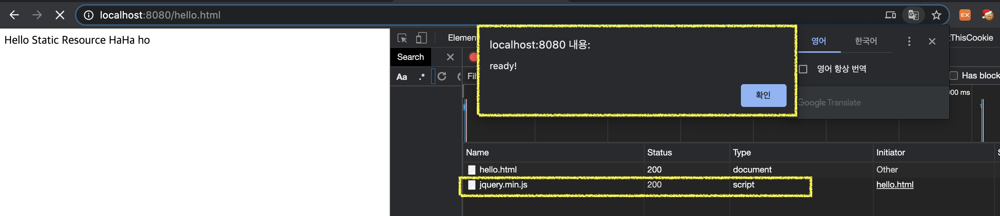

# 스프링 웹 MVC 5부: 웹JAR

웹JAR 맵핑 “/webjars/**” 

* 버전 생략하고 사용하려면
  * webjars-locator-core 의존성 추가

```html
<script src="/webjars/jquery/dist/jquery.min.js"></script>
<script>
   $(function() {
       console.log("ready!");
   });
</script>
```


---

클라이언트에서 사용하는 자바스크립트 라이브러리(jQuery, Bootstrap, React, VueJS, AngularJS) 모두 Jar 파일로 추가할 수 있다. 이런 것들이 `webjar`

jar 파일로 디팬던시 추가하고, 템플릿을 사용해서 동적으로 컨텐츠를 생성할 때, 또는 정적 리소스에서도 웹jar에 있는 css, js를 참조할 수 있다.


(실습)

1. MVNRepository에서 JQuery 의존성 찾아서 추가

```xml
<dependency>
    <groupId>org.webjars.bower</groupId>
    <artifactId>jquery</artifactId>
    <version>3.5.1</version>
</dependency>
```

2. JS 코드 추가

보통 문서 끝단에 추가한다. 그래야 문서가 로딩된 후에 JS가 로딩되니깐 화면이 빨리 뜬다.

* 버전 명시해줘야 함

```html
<script src="/webjars/jquery/3.5.1/dist/jquery.min.js"></script>
<script>
    $(function() {
        alert("ready!");
    });
</script>
```




### 버전 생략

*  스프링부트가 제공해주는 기능
* jQuery 버전을 올릴 때마다 소스코드에서 버전을 수정해주기에 번거롭다.
* `webjars-locator-core` 의존성을 추가해줘야 함

```xml
<!-- https://mvnrepository.com/artifact/org.webjars/webjars-locator-core -->
<dependency>
    <groupId>org.webjars</groupId>
    <artifactId>webjars-locator-core</artifactId>
    <version>0.46</version>
</dependency>
```

> 어떻게 동작하는지 궁금하면 `Springframework Resource Chaining` 검색

```html
<script src="/webjars/jquery/dist/jquery.min.js"></script>
<script>
    $(function() {
        console.log("ready!");
    });
</script>
```


