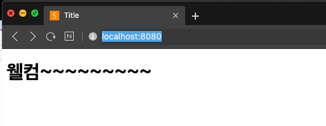

# 스프링 웹 MVC 6부: index 페이지와 파비콘

웰컴 페이지

* index.html 찾아 보고 있으면 제공.
* index.템플릿 찾아 보고 있으면 제공.
* 둘 다 없으면 에러 페이지.

파비콘

* favicon.ico
* 파이콘 만들기 https://favicon.io/
* 파비콘이 안 바뀔 때?
  * https://stackoverflow.com/questions/2208933/how-do-i-force-a-favicon-refresh

---

## 웰컴 페이지

* 루트(/) 경로 요청시 보여지는 페이지
* 정적 리소스를 매핑해주는 기본 리소스 위치에서 파일을 찾음

* index.html 찾아 보고 있으면 제공.
* index.템플릿 찾아 보고 있으면 제공.
* 둘 다 없으면 에러 페이지. (Whitelabel Error Page - (톰캣아님) 스프링부트의 에러핸들러가 만들어주는 에러페이지.)


## 파비콘

파비콘 사이트에서 파비콘 생성 후, resources 디렉터리에 저장

> 파비콘 안 바뀔 때

1. 브라우저에서 파비콘 파일을 직접 요청

   ```
   http://localhost:8080/favicon.ico
   ```

2. 브라우저 종료 후 재시작해서 접속

   

