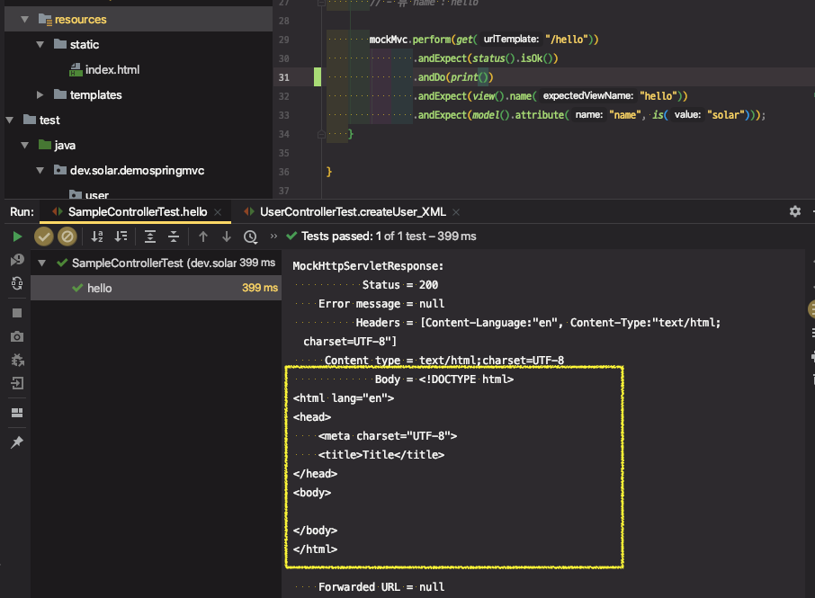
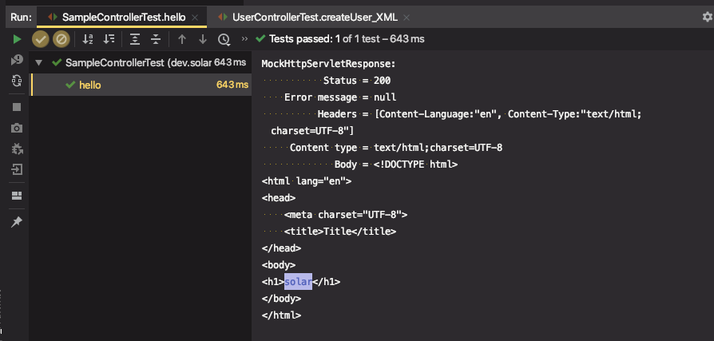

# 스프링 웹 MVC 7부: Thymeleaf

스프링 부트가 자동 설정을 지원하는 템플릿 엔진

* FreeMarker
* Groovy
* **Thymeleaf**
* Mustache

JSP를 권장하지 않는 이유

* JAR 패키징 할 때는 동작하지 않고, WAR 패키징 해야 함.
* Undertow는 JSP를 지원하지 않음.
* https://docs.spring.io/spring-boot/docs/current/reference/htmlsingle/#boot-features-jsp-limitations

Thymeleaf 사용하기

* https://www.thymeleaf.org/
* [Thymeleaf 5분안에 익히기 - 핵심내용](https://www.thymeleaf.org/doc/articles/standarddialect5minutes.html)
* 의존성 추가: spring-boot-starter-thymeleaf
* 템플릿 파일 위치: /src/main/resources/**template/**
* 예제: https://github.com/thymeleaf/thymeleafexamples-stsm/blob/3.0-master/src/main/webapp/WEB-INF/templates/seedstartermng.html

---

템플릿 엔진

* 주로 뷰를 만드는 데 사용
  * 동적 컨텐츠 생성

* 뷰 만드는 것 이외에 여러가지 용도로 사용 가능
  * Code Generation, Email Template, 

> 뷰를 만들 때 템플릿 엔진을 쓰는 이유?

기본적인 템플릿은 같은데 안에 들어가는 값들만 경우에 따라서 조금씩 다를 때, 정적인 컨텐츠를 사용할 수 없고 동적으로 컨텐츠를 생성해서 응답으로 보낼 때 사용할 수 있다.


## 스프링 부트가 자동 설정을 지원하는 템플릿 엔진

* FreeMarker
* Groovy
* **Thymeleaf**
* Mustache

JSP를 권장하지 않는 이유

* JSP는 자동 설정을 지원하지 않음

* SpringBoot가 지향하는 바와 충돌이 있다.

* 스프링 부트는 독립적으로 실행가능한 embedded tomcat으로 애플리케이션을 빠르고 쉽게 만들어서 배포하고자 한다.

  JSP를 사용하게되면 JAR로 패키징한 파일을 사용하지못하고, WAR로 패키징한 파일을 사용해야 한다.

  (물론, WAR로 패키징하더라도 `java -jar`로 embedded tomcat 으로 실행할 수 있긴 하다. 다른 서블릿 엔진으로 배포할 수도 있다.)

  하지만 최근에 만들어진 Undertow라는 서블릿 엔진은 JSP를 지원하지 않음

  그렇기 때문에 이런 제약사항들이 있기 때문에 요즘에는 잘 쓰지 않는다.


## Thymeleaf 사용하기

* 의존성 추가: spring-boot-starter-thymeleaf

  ```xml
  <dependency>
    <groupId>org.springframework.boot</groupId>
    <artifactId>spring-boot-starter-thymeleaf</artifactId>
  </dependency>
  ```

* 템플릿 파일 위치: /src/main/resources/**template/**

  * 자동 설정이 완료되면 모든 동적으로 생성되는 뷰는 템플릿 파일 위치에서 찾게된다.

* 예제: https://github.com/thymeleaf/thymeleafexamples-stsm/blob/3.0-master/src/main/webapp/WEB-INF/templates/seedstartermng.html


#### 실습

1. 테스트 코드 작성

```java
import static org.hamcrest.Matchers.is;
import static org.springframework.test.web.servlet.request.MockMvcRequestBuilders.get;
import static org.springframework.test.web.servlet.result.MockMvcResultMatchers.*;

@RunWith(SpringRunner.class)
@WebMvcTest(SampleController.class)
public class SampleControllerTest {

    @Autowired
    MockMvc mockMvc;

    @Test
    public void hello() throws Exception {
        // 요청 "/hello"
        // 응답
        // - 모델 name : solar
        // - 뷰 name : hello

        mockMvc.perform(get("/hello"))
                .andExpect(status().isOk())
                .andExpect(view().name("hello"))
                .andExpect(model().attribute("name", is("solar")));
    }
}
```


2. 컨트롤러 추가

```java
import org.springframework.stereotype.Controller;
import org.springframework.ui.Model;
import org.springframework.web.bind.annotation.GetMapping;

@Controller
public class SampleController {

    @GetMapping("/hello")
    public String hello(Model model) { //Model : 전달할 데이터 (Map Type)
        model.addAttribute("name", "solar");
        return "hello"; //본문의 hello가 아님(@RestController가 아니라 @Controller이기 때문에)
    }
}
```


→ 테스트 오류 : hello 템플릿을 찾지 못함

```
org.thymeleaf.exceptions.TemplateInputException: Error resolving template [hello], template might not exist or might not be accessible by any of the configured Template Resolvers
```


3. 템플릿 생성

`resources/templates/`에 `hello.html` 파일 생성


→ 테스트 성공

​	테스트는 뷰에 랜더링이 어떻게 되는지까지는 확인하지 않는다. view를 만드는데 사용하는 이름과 Model에 들어있는 데이터만 확인하는 코드이다.

`andDo(print())` 로 Request, Response Http 메시지를 출력

⇒ `Thymleaf` 를 쓰기 때문에 `Content Body` 값을 가져올 수 있어서 랜더링 결과도 확인할 수 있다.

(JSP를 사용하면 실제 랜더링된 결과인 본문을 확인하기 힘들다. 실제 랜더링을 서블릿 엔진이 해야하기 때문에, 서블릿 엔진이 템플릿을 완성시킨다. 따라서 서블릿이 개입해야 응답으로 내보낼 뷰를 확인할 수 있다.)

Thymleaf는 독자적으로 최정적인 뷰를 완성한다. 실질적으로 서블릿 컨테이너의 개입없이 (`MockMvc`는 실제 서블릿 컨테이너를 띄우지 않음. 가짜 서블릿 컨테이너이기 때문에 실제 서블릿 컨테이너가 하는 역할을 모두 하지 못함.) 독립적으로 뷰의 랜더링되는 결과값도 확인할 수 있는 것이다.



※ `HtmlUnit` 이라는 테스팅 툴을 사용하면 정확하게 확인할 수 있다.


4. Model이 전달받은 데이터를 뷰에서 사용

템플릿 엔진에 Thymleaf의 XML 네임스페이스를 추가

```html
<html xmlns:th="http://www.thymeleaf.org">
```

`th`라는 네임스페이스를 추가하였기 때문에, `th:text=""` 등등 사용할 수 있다.

`name` 속성에 값이 들어오면 "Name" 대신에 출력되고, 값이 없다면 "Name" 문자열로 출력된다.

```html
<h1 th:text="${name}">Name</h1>
```

※ hello.html

```html
<!DOCTYPE html>
<html lang="en" xmlns:th="http://www.thymeleaf.org">
<head>
    <meta charset="UTF-8">
    <title>Title</title>
</head>
<body>
<h1 th:text="${name}">Name</h1>
</body>
</html>
```


테스트 추가 후 성공

```java
.andExpect(content().string(containsString("solar")));
```




