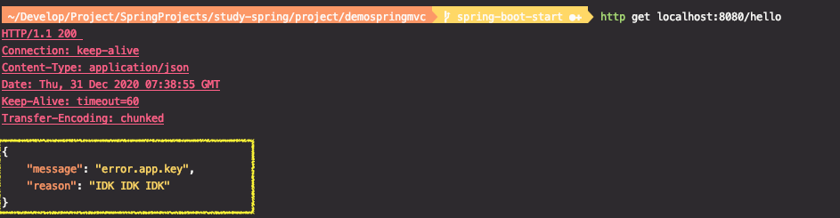
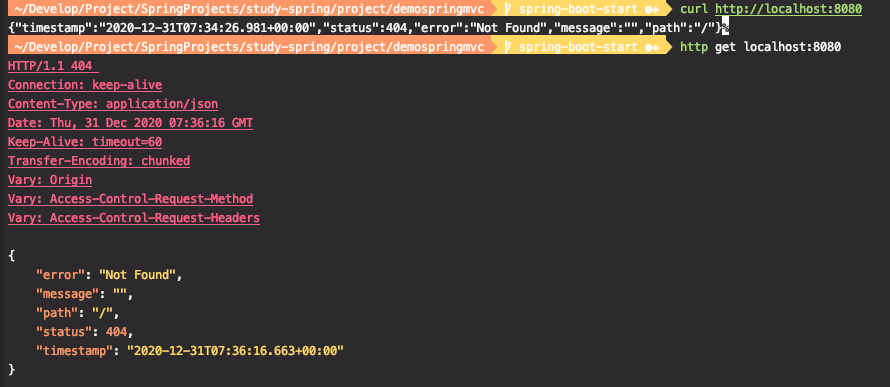

# 스프링 웹 MVC 9부: ExceptionHandler

스프링 @MVC 예외 처리 방법

* @ControllerAdvice
* @ExchangepHandler

스프링 부트가 제공하는 기본 예외 처리기

* BasicErrorController
  * HTML과 JSON 응답 지원
* 커스터마이징 방법
  * ErrorController 구현

커스텀 에러 페이지

* 상태 코드 값에 따라 에러 페이지 보여주기
* src/main/resources/static|template/error/
* 404.html
* 5xx.html
* ErrorViewResolver 구현

---

## 스프링 @MVC 예외 처리 방법

* @ControllerAdvice : 전역적인 에러 처리

  별도의 에러를 처리하는 클래스를 생성 후, `@ControllerAdvice` 붙인 후, 내부에 여러 ExceptionHandler를 정의하면 여러 컨트롤러에서 발생하는 Exception을 처리할 수 있다.

* @ExchangepHandler : 해당 컨트롤러 내의 에러만 처리


1. 에러 정보를 담고 있는 앱에서 만든 커스텀한 클래스가 있는 경우, 해당 클래스로 바로 반환

   * AppError 클래스 생성 : 앱에 특화되어있는 에러 정보를 담고 있는 커스텀한 클래스를 만들어서 사용

   메서드 파라미터로 해당하는 Exception을 받아올 수 있다.

   Exception 정보를 기반으로 AppError 정보를 채워주면 된다.

   에러에 어떠한 메시지를 줄지, Message key를 주고, key에 해당하는 실제 메시지는 메시지 리소스에서 문자열을 읽어와서 보여주는 식

   * sampleController.java

   ```java
   @Controller
   public class SampleController {
   
       @GetMapping("/hello")
       public String hello() {
           throw new SampleException();
       }
   
       @ExceptionHandler(SampleException.class) //이 SampleController안에서 SampleException이 발생하면 이 핸들러를 사용하겠다.
       public @ResponseBody AppError sampleError(SampleException e) {
           AppError appError = new AppError(); //Exception 정보를 기반으로 AppError 정보를 채워주면 된다.
           appError.setMessage("error.app.key");
           appError.setReason("IDK IDK IDK");
           return appError;
       }
   
   }
   ```

   * AppError.java

   ```java
   public class AppError {
   
       private String message;
   
       private String reason;
   
       // getter, setter...
   }
   ```

   * SampleException.java

   ```java
   public class SampleException extends RuntimeException {
   }
   ```

   


2. ResponseEntity로 반환


## 스프링 부트가 제공하는 기본 예외 처리기

스프링부트 애플리케이션은 기본적으로 에러핸들러가 등록되어있다.

### BasicErrorController

* 기본 에러 핸들링 로직이 들어있다.

* HTML과 JSON 응답 지원

  


기본 맵핑이 `/error`로 되어있다.

* ${error.path:/error} :  `error.path` 키값에 해당하는 프로퍼티가 있으면 사용하고, 없으면 `/error`을 사용한다.
* ${server.error.path:${error.path:/error}} : 프로퍼티에 `server.error.path`가 정의되어있으면 그 값을 사용하고, 아니라면 (우측의 값) `${error.path:/error}` 을 사용한다.

```java
@Controller
@RequestMapping("${server.error.path:${error.path:/error}}") 
public class BasicErrorController extends AbstractErrorController {
```


별도로 정의한게 없으면 결국 `/error`을 사용하게 된다. 어떠한 에러가 발생하면 /error로 보내게 정의되어있음.

그리고 Request의 Accept 헤더에 따라 (ex. "text/html") 처리되는 결과가 달라진다.


* 커스터마이징 방법

  * 여러가지가 있다.

  * 에러핸들러를 직접 구현하면 된다. `ErrorController` 타입의 클래스를 만들어서 구현 후 빈으로 등록하면 된다.

    `BasicErrorController`클래스를 상속받아서 이미 만들어진 기능을 활용하면서 새로 만들어도 상관없다. (추천)


## 커스텀 에러 페이지

* 상태 코드 값에 따라 에러 페이지 보여주기
* src/main/resources/static|template/error/
* 404.html
* 5xx.html
* ErrorViewResolver 구현


