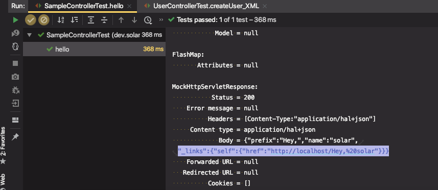

# 스프링 웹 MVC 10부: Spring HATEOAS

**H**ypermedia **A**s **T**he **E**ngine **O**f **A**pplication **S**tate

* 서버: 현재 리소스와 **연관된 링크 정보**를 클라이언트에게 제공한다.
* 클라이언트: **연관된 링크 정보**를 바탕으로 리소스에 접근한다.
* 연관된 링크 정보
  * **Rel**ation
  * **H**ypertext **Ref**erence)
* spring-boot-starter-hateoas 의존성 추가

HATEOAS 이해하기 (순서대로 링크를 참고해서 읽으면 됨)

* https://spring.io/understanding/HATEOAS
* https://spring.io/guides/gs/rest-hateoas/
* https://docs.spring.io/spring-hateoas/docs/current/reference/html/
* (깃헙 API에 적용되어있음)

ObjectMapper 제공

* spring.jackson.*
* Jackson2ObjectMapperBuilder

LinkDiscovers 제공

* 클라이언트 쪽에서 링크 정보를 Rel 이름으로 찾을때 사용할 수 있는 XPath 확장 클래스

---

## Spring HATEOAS

HATEOAS를 구현하는데 편리한 기능을 제공해주는 라이브러리

> HATEOAS 란?

**H**ypermedia **A**s **T**he **E**ngine **O**f **A**pplication **S**tate

* 서버: 현재 리소스와 **연관된 링크 정보**를 클라이언트에게 제공한다.
* 클라이언트: **연관된 링크 정보**를 바탕으로 리소스에 접근한다.
* 연관된 링크 정보
  * **Rel**ation
  * **H**ypertext **Ref**erence)


#### HATEOAS 원리

ex ) 클라이언트가 리소스를 요청했을 때,  (서버가) 리소스에 대한 정보를 제공할 때, 리소스와 연관되어있는 링크 정보들 까지 같이 제공하고 , (클라이언트) 같이 제공된 연관된 링크 정보를 가지고 리소스에 접근한다.

루트 페이지에 대한 요청했을 때, 루트 페이지에 대한 리소스 정보 - Relation : self(나자신), HRef : 루트 링크

온라인 서점 웹사이트, 북을 조회할 수 있는 페이지가 있을 때, Relation : Books, HRef : /books 

연관된 링크정보들을 넣어주면 클라이언트는 루트를 요청한 다음에 루트와 연관된 리소스들을 파악하고 거기서 Book과 관련된 페이지를 가고 싶다면 Book Relation에 해당하는 HRef를 읽어서 해당 url로 요청을 보내게 된다.


#### 실습

1. spring-boot-starter-hateoas 의존성 추가

   ```xml
   <dependency>
     <groupId>org.springframework.boot</groupId>
     <artifactId>spring-boot-starter-hateoas</artifactId>
   </dependency>
   ```

   ⇒ 스프링 부트가 여러가지 자동설정을 해준다.

   * ObjectMapper 제공

     우리가 제공하는 리소스를 JSON으로 변환할 때 사용하는 인터페이스

     spring-boot-starter-web 만 의존성을 추가해도 빈으로 등록해준다.

   * LinkDiscovers 제공 (직접 사용하게될 일이 많지 않음)

2. 테스트 코드 작성

   반환하는 Hello에 link정보를 넣지 않았으므로 테스트는 실패한다.

   * [git code](https://github.com/blossun/study-spring/commit/160bd4c36a66bd0c1b63bc71a5d1d3f541f0bf5b)

   ```java
   @RunWith(SpringRunner.class)
   @WebMvcTest(SampleController.class)
   public class SampleControllerTest {
   
       @Autowired
       MockMvc mockMvc;
   
       @Test
       public void hello() throws Exception {
           mockMvc.perform(get("/hello"))
                   .andDo(print())
                   .andExpect(status().isOk())
                   .andExpect(jsonPath("$._links.self").exists()); //_links 는 기본적으로 들어온다. self 정보가 있는지 확인
       }
   }
   ```

   ```java
   @RestController
   public class SampleController {
       @GetMapping("/hello")
       public Hello hello() {
           Hello hello = new Hello();
           hello.setPrefix("Hey,");
           hello.setName("solar");
           return hello;
       }
   }
   ```

3. 링크 정보 추가

   * 다양한 방법들이 존재

   스프링 부트 Resource 변경 내용

   - `ResourceSupport` is now `RepresentationModel`
   - `Resource` is now `EntityModel`
   - `Resources` is now `CollectionModel`
   - `PagedResources` is now `PagedModel`
   - linkTo 임포트

     ```java
     import static org.springframework.hateoas.server.mvc.WebMvcLinkBuilder.*;
     ```
   
   * ControllerLinkBuilder → WebMvcLinkBuilder 로 변경
   
   
   
   methodOn(SampleController.class).hello()에 해당하는 링크를 따서 Self라는 Relation에 추가한다.
   
   ```java
   EntityModel<Hello> helloEntityModel = new EntityModel<>(hello);
   helloEntityModel.add(linkTo(methodOn(SampleController.class).hello()).withSelfRel());
   ```
   
   EntityModel은 우리가 제공할 리소스에 + Link 정보를 추가할 수 있다. spring hateoas에서 제공되는 기능
   
   ```java
   @RestController
   public class SampleController {
   
       @GetMapping("/hello")
       public EntityModel<Hello> hello() {
           Hello hello = new Hello();
           hello.setPrefix("Hey,");
           hello.setName("solar");
   
           EntityModel<Hello> helloEntityModel = EntityModel.of(hello,
                   linkTo(SampleController.class).slash(hello).withSelfRel());
   
           return helloEntityModel;
       }
   ```
   
   

링크정보(`_links`)가 추가된 것 확인



* [git code](https://github.com/blossun/study-spring/commit/4356c0b7aa32a7ba796d3ad46b21aabb56e51241)


이렇게 관련된 링크 정보들을 리소스에 추가해서 반환하는 식으로 구현하고, 클라이언트도 이 링크 정보를 활용하는 것이 "진정한 RestAPI라면 해야하는" 수준의 고급 API를 만들 수 있는 기능


## ObjectMapper

* JSON ←→ 객체 변환

* 따로 빈으로 등록할 필요없이 @Autowired로 주입받아서 사용하면 된다.

  ```java
  @Autowired
  ObjectMapper objectMapper;
  ```

* ObjectMapper를 커스터마이징하고 싶다면 `spring.jackson.*` 하위의 것들을 사용하면 된다.


## LinkDiscovers

* XPath를 확장해서 만든 HATEOAS용 클라이언트 API이다.
* RestAPI로 다른 쪽 서버 API를 요청해서 응답을 받았는데, 해당 API가 HATEOAS를 지원한다면 (즉, link 정보가 들어있다.) link 정보에서 메서드를 사용해서 self에 해당하는 링크 정보를 가져오는 등... 유틸리티성 클래스를 지원
* 빈으로 등록되어있기 때문에 주입받아 사용하면 된다.


---

##### 질문

> 강의에서 Resource를 이용한 URI생성을 보여주셨는데요. 호출된 리소스에 대한 URI가 아닌 다른 하이퍼링크에 대한 Hateoas는 어떤식으로 생성하는 방법이 있을지요.. 예를들어, 게시판에서 게시글들을 보여주는 API를 호출하였을 때, 각각의 게시글들을 상세하게 볼 수 있는 하이퍼링크를 담게 하려면 어떻게 해야할까요?? 

지금 질문하신 문제를 REST API 개발하기에서 다루고 있습니다. 간단하게 말씀 드리자면, List를 순회하면서 각 엔티티를 리소스로 변환하면서 링크를 넣어주는 방식입니다. 그런데 Spring DATA JPA와 스프링 부트 그리고 스프링 웹 MVC를 조합해서 쓰면 간단하게 해결할 수 있습니다.


##### 참고

[[[Spring Boot\] 게시판 예제를 이용하여 더욱 RESTFul API 개발하기#3 (ExceptionHandler 내용 추가, Spring HATEOAS 추가)](https://sas-study.tistory.com/369)](https://sas-study.tistory.com/369)

