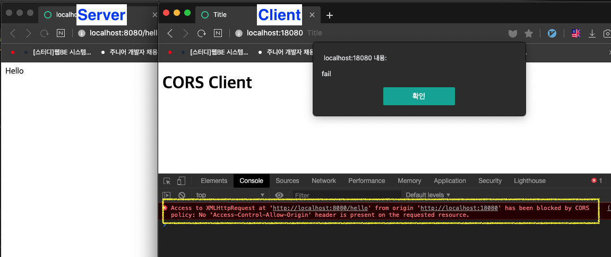
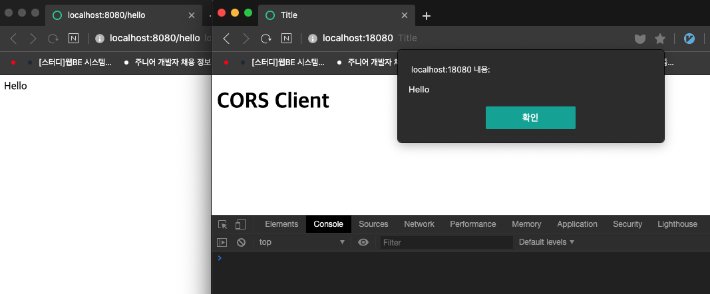

# 스프링 웹 MVC 11부: CORS

SOP과 CORS

* Single-Origin Policy

* Cross-Origin Resource Sharing
* Origin?
  * URI 스키마 (http, https)
  * hostname (whiteship.me, localhost)
  * 포트 (8080, 18080)
* 스프링 MVC @CrossOrigin
  * https://docs.spring.io/spring/docs/5.0.7.RELEASE/spring-framework-reference/web.html#mvc-cors
  * @Controller나 @RequestMapping에 추가하거나
  * WebMvcConfigurer 사용해서 글로벌 설정 

---

## CORS (Cross-Origin Resource Sharing)

* Single-Origin Policy 를 우회하기 위한 표준 기술 (웹브라우저 지원 기술)

* Single-Origin Policy : 같은 Origin에만 요청을 보낼 수 있다.
* CORS : 서로 다른 Origin 끼리 리소스를 공유할 수 있는 표준 기술

* 기본적으로 SOP가 적용되어 있다.

### Origin ?

* URL 스키마, hostname, 포트 3가지를 조합한 것이 Origin이다.

* 이 하나의 Origin이 또 다른 Origin을 호출할 수 없다.

* RestAPI를 제공하는 서버가 `http://localhost:8080`에서 제공되고 있고, 그 RestAPI를 `http://localhost:18080` 을 사용하는 애플리케이션에서 호출한다 ? 호출하지 못한다.

  `18080` 웹 브라우저에서 `8080`에 띄워져있는 서버의 리소스를 가져오려고하면 SOP에 위반이되기 때문에 호출할 수 없다.

* SOP를 우회하는 표준 기술이 생겼고 Spring MVC가 이 기능을 지원한다.

* SpringBoot가 해주는 일

  * Spring MVC에서 CORS를 사용하려면 여러가지 빈 설정을 해줘야하는데, 이러한 빈 설정들을 자동으로 해준다. 

    별도의 빈 설정없이 `@CrossOrigin` 애노테이션을 사용해서 SpringMVC가 지원하는 CORS기능을 사용할 수 있다.


#### (실습)

* RestAPI를 제공하는 서버 : `springcorsserver` : Spring Initializr, java 8, (dependency) Spring Web

* RestAPI를 요청하는 클라이언트 : `springcorssclient ` : Spring Initializr, java 8, (dependency) Spring Web

  * 18080포트에 애플리케이션 띄우는 설정 - `application.properties`

    ```properties
    server.port=18080
    ```

  * JQuery를 추가해서 ajax로 API 호출

    ```xml
    <dependency>
      <groupId>org.webjars.bower</groupId>
      <artifactId>jquery</artifactId>
      <version>3.5.1</version>
    </dependency>
    ```

    ```html
    <!DOCTYPE html>
    <html lang="en">
    <head>
        <meta charset="UTF-8">
        <title>Title</title>
    </head>
    <body>
    <h1>CORS Client</h1>
    <script src="/webjars/jquery/3.5.1/dist/jquery.min.js"></script>
    <script>
        $(function() {
            $.ajax("http://localhost:8080/hello")
            .done(function (msg) {
                alert(msg)
            })
            .fail(function () {
                alert("fail");
            })
        })
    </script>
    </body>
    </html>
    ```

  

### SOP 정책으로 요청 Fail



```
Access to XMLHttpRequest at 'http://localhost:8080/hello' from origin 'http://localhost:18080' has been blocked by CORS policy: No 'Access-Control-Allow-Origin' header is present on the requested resource.
```

서버로 부터 `Access-Control-Allow-Origin` 헤더가 오고있지 않다. 이 Origin(`http://localhost:18080`)은 `http://localhost:8080/hello`에 접속할 수 없다.

⇒ 서버가 `Access-Control-Allow-Origin` 헤더를 보내줘야 한다.


* Access-Control-Allow-Origin : 어떤 Origin이 나(서버)에게 접근할 수 있는지 알려주는 헤더이다.

  이 헤더에 있는 정보와 자신의 정보가 매치되면 실제 요청을 보내는 것이다.


### 서버에서 CORS를 지원하는 코드 추가

* 서버의 리소스를 가져갈 수 있는 Origin들을 설정

* ```
  @CrossOrigin(origins = "http://localhost:18080")
  ```

```java
@SpringBootApplication
@RestController
public class SpringcorsserverApplication {

    @CrossOrigin(origins = "http://localhost:18080")
    @GetMapping("/hello")
    public String hello() {
        return "Hello";
    }

    public static void main(String[] args) {
        SpringApplication.run(SpringcorsserverApplication.class, args);
    }

}
```


⇒ 리소스 요청 성공




### 웹 설정 파일로 CORS 지원 설정 추가

설정을 모든 메서드마다 할 수 없음. 허용할 컨트롤러에 붙이거나, 여러 컨트롤러에 걸쳐 설정해야 한다면 WebConfig 설정 파일을 만들어서 설정할 수 있다.

