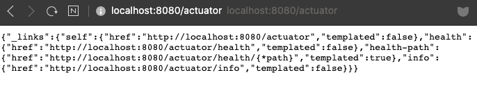
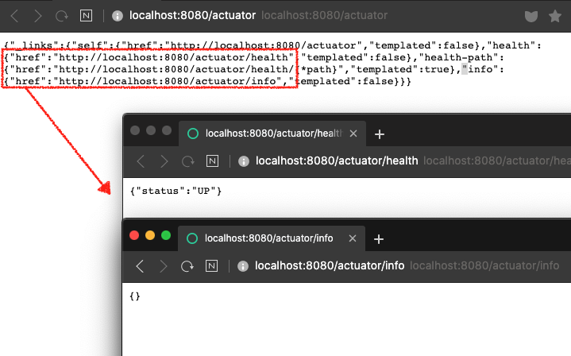

## 스프링 부트 운영

스프링 부트는 애플리케이션 운영 환경에서 유용한 기능을 제공합니다. 스프링 부트가 제공하는 엔드포인트와 메트릭스 그리고 그 데이터를 활용하는 모니터링 기능에 대해 학습합니다.

## 스프링 부트 Actuator 1부: 소개

https://docs.spring.io/spring-boot/docs/current/reference/htmlsingle/#production-ready-endpoints

의존성 추가

* spring-boot-starter-actuator

애플리케이션의 각종 정보를 확인할 수 있는 Endpoints

* 다양한 Endpoints 제공.
* JMX 또는 HTTP를 통해 접근 가능 함.
* shutdown을 제외한 모든 Endpoint는 기본적으로 **활성화** 상태.
* 활성화 옵션 조정
  * management.endpoints.enabled-by-default=false
  * management.endpoint.info.enabled=true

---

#### 실습

※ 프로젝트: springbootactuator - 의존성:web

의존성 추가

* spring-boot-starter-actuator

애플리케이션의 각종 정보를 확인할 수 있는 Endpoints

* 다양한 [Endpoints](#endpoints) 제공.

* JMX 또는 HTTP를 통해 접근 가능 함.

  * HTTP로 확인
  
    ```
  {URL}/actuator
    ```

* shutdown을 제외한 모든 Endpoint는 기본적으로 **활성화** 상태.

* 활성화 옵션 조정

  * management.endpoints.enabled-by-default=false
  * management.endpoint.info.enabled=true
  
* 공개여부 (Expose)

  * 활성화와 공개 여부는 따로 관리한다.
  * (default) JMX는 대부분 공개, WEB은 `/health`와 `/info`만 공개
  * [Exposing Endpoints Docs](https://docs.spring.io/spring-boot/docs/current/reference/htmlsingle/#production-ready-endpoints)


엔드포인트 확인 

→ HATEOAS 형식(현재 리소스와 연관되어있는 링크정보)



http를 사용할 때는 공개된 정보가  `/health`와 `/info` 밖에 없다.




<a name="endpoints"></a>

### Endpoints

`ID`에 해당하는 actuator 정보들이 활성화 된다.

* `auditevents` 인증 이벤트 : "~가 인증정보를 획득했다.", "인증에 실패했다."

* `beans` : 등록된 빈
* `conditions` : "어떤 조건에 의해서 어떤 자동설정이 적용(안)되었다."

* `configprops` : application property에 적용가능한 것들
* `env` : ConfigurableEnvironment 내의 프로퍼티를 보여줌
* `flyway` : flyway 마이그레이션 정보
* `health` : 애플리케이션이 잘 구동 중인지
* `httptrace` : 최근 100개의 HTTP 요청과 응답관련 정보
* `info` : 애플리케이션 관련된 임의의 정보

* `loggers` : 어떤 패키지가 어떤 로깅 레벨을 가지고 있는지 확인. 운영 중에 로깅 레벨 수정 가능

* `liquibase` : liquibase 마이그레이션 정보

* `metrics` : 애플리케이션의 핵심 정보. 애플리케이션 사용 메모리, CPU ... 여러 (제 3의) 모니터링 애플리케이션에서 사용할 수 있는 공통 포맷으로 정보를 만들어서 제공해줌

  모니터링 서비스를 연동해서 좀 더 그래픽적인 화면으로 모니터링 가능. 특정 수치에 alert을 발생하게 할 수 있다.

* `mappings` : 컨트롤러 매핑 정보

* `scheduledtasks` :  scheduled tasks 정보 (주기적인 배치 작업 애노테이션 tasks)

* `sessions` : 스프링 세션 관련

* `shutdown` : 애플리케이션을 끌 수 있는 엔드포인트 (**이 엔드포인트만 기본적으로 *<u>비활성화</u>* 되어있다.**)

* `threaddump` : thread dump를 뜰 수 있다.

#### Web application인 경우

* `heapdump` : 힙 덤프 뜨기

* `jolokia` : 졸로키아를 사용해서 JMX 빈을 HTTP 뷰에서도 볼 수 있다.

  ※ JMX 빈 : java management bean. JMX 표준의 준하는 빈을 만들면 애플리케이션 밖에서 그 빈의 오퍼레이션을 호출할 수 있다.

  기본적으로 엔드포인트에 해당하는 빈들은 전부 JMX로 등록으로 된다.

* `logfile` : 로그 파일 확인
* `prometheus` : metrics를 prometheus 서버에서 캡쳐해갈 수 있는 형태로 변환해준다.


