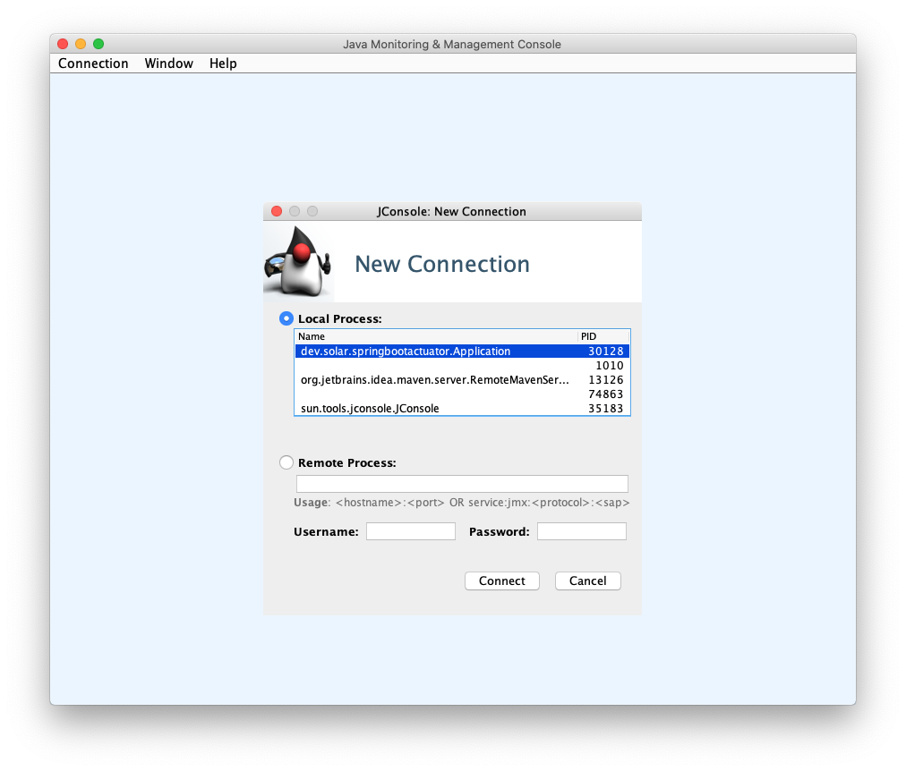
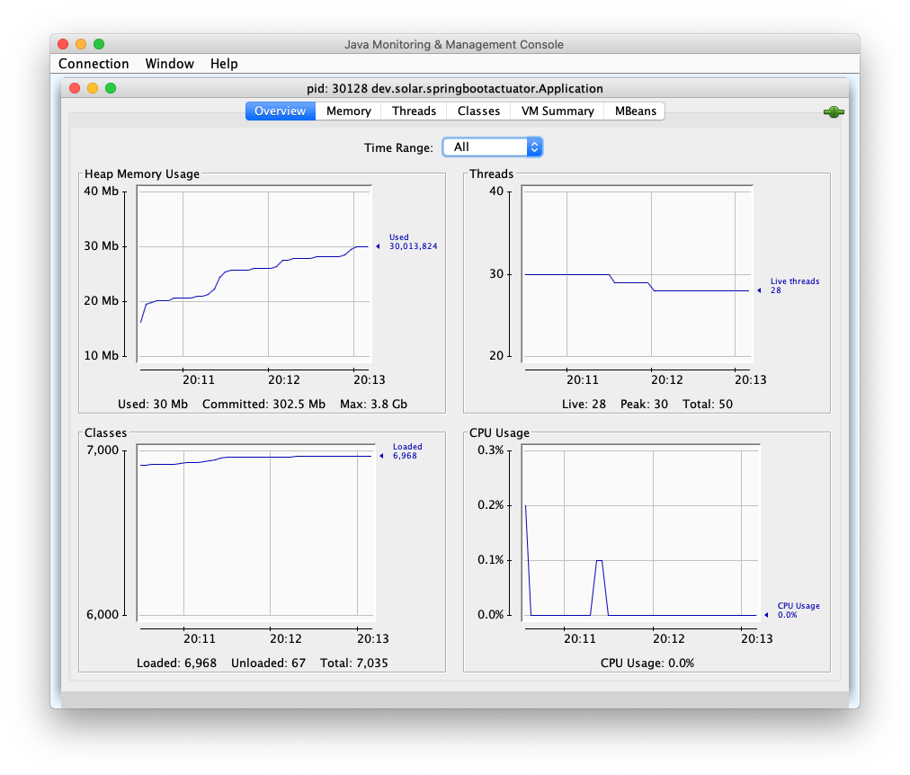
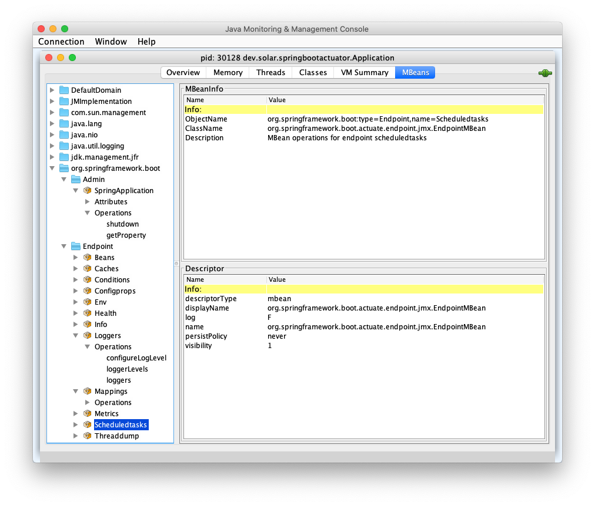
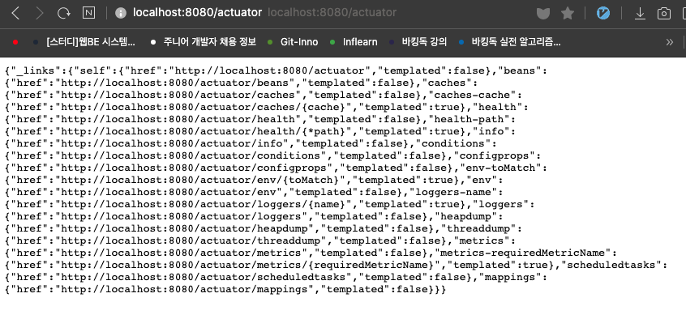

# 스프링 부트 Actuator 2부: JMX와 HTTP

JConsole 사용하기

* https://docs.oracle.com/javase/tutorial/jmx/mbeans/
* https://docs.oracle.com/javase/7/docs/technotes/guides/management/jconsole.html

VisualVM 사용하기

* https://visualvm.github.io/download.html

HTTP 사용하기

* /actuator
* health와 info를 제외한 대부분의 Endpoint가 기본적으로 **비공개** 상태
* 공개 옵션 조정
  * management.endpoints.web.exposure.include=*
  * management.endpoints.web.exposure.exclude=env,beans

---

## JConsole 사용하기

* 애플리케이션 실행 후, 터미널에서 `jconsole`로 실행
* Local Process에서 실행한 애플리케이션 확 → [connect] > [Insecure connection]

* 사용량 확인

* [MBeans] : MBean으로 노출된 여러 기능 사용 가능

  HTTP로 볼 때보다 많은 정보를 확인할 수 있다. (가독성이 안좋음)

## VisualVM 사용하기

JConsole로 정보를 확인할 수는 있지만 가독성이 안좋아서 활용하기가 힘들다.

원래 자바에 기본적으로 visualvm이 들어가 있어서 `jvisualvm`으로 실행할 수 있었지만 java 10부터 없어짐.

따로 [여기서](https://visualvm.github.io/download.html) 파일을 다운 받아 설치해야함. (그냥 압축해제 후 실행)

JConsole과 거의 똑같지만 플러그인이 있어서 좀 더 다양하게 제공해줘서 보기에 조금 더 편하다.

* [MBean] 플러그인 추가 : [Tool] > [Plugins] > [Available Plugins] > 'mbean' 검색해서 추가

## HTTP 사용하기

* 접속 :  **{url}/actuator**
* health와 info를 제외한 대부분의 Endpoint가 기본적으로 **비공개** 상태
* 공개 옵션 조정 (application.properties)
  * management.endpoints.web.exposure.include=*
  * management.endpoints.web.exposure.exclude=env,beans

※ **스프링 시큐리티를 적용해서 특정 유저(admin)만 접근 가능하도록 설정해야 한다.**

