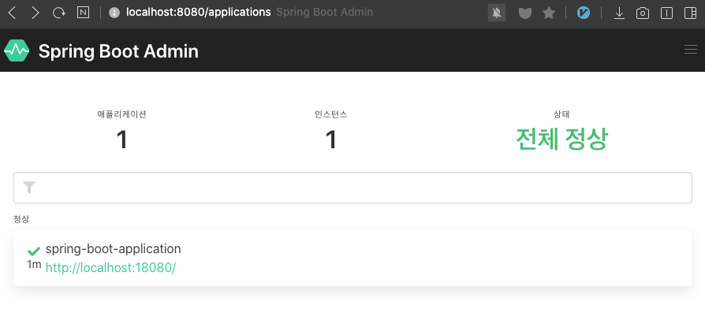
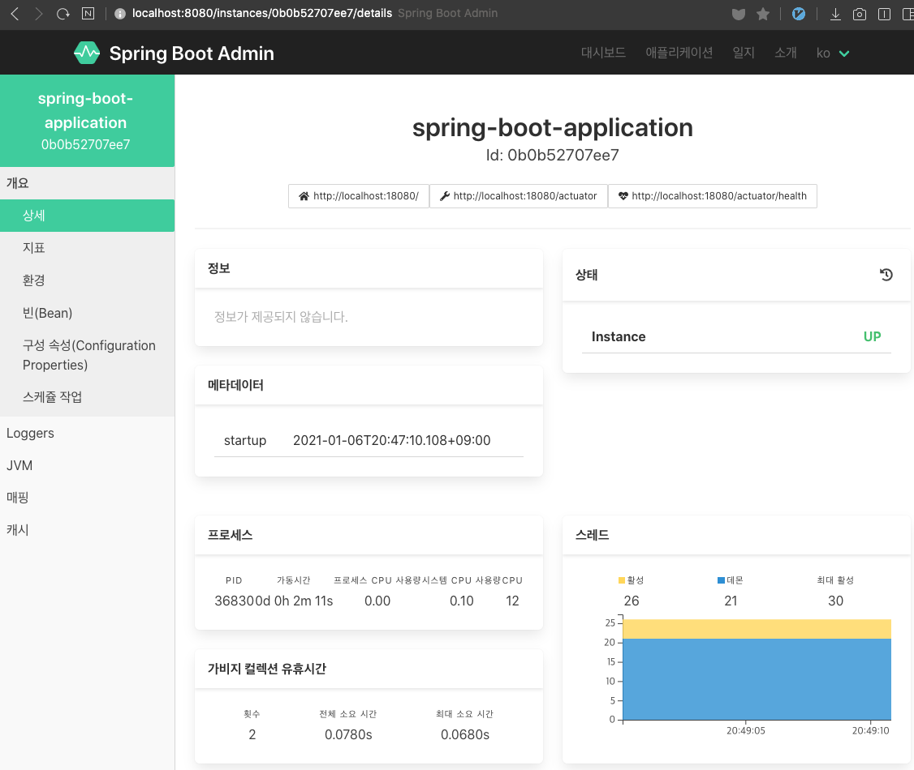
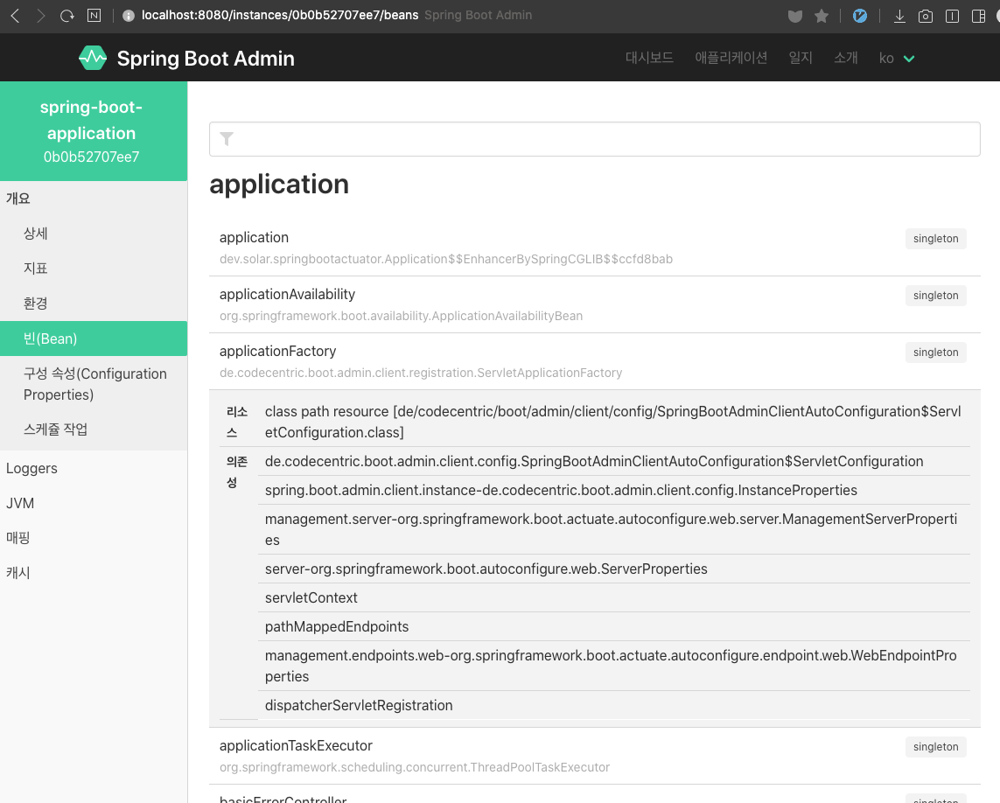

## 스프링 부트 Actuator 3부: Spring-Boot-Admin

https://github.com/codecentric/spring-boot-admin

스프링 부트 Actuator UI 제공

* 어드민 서버 설정

```xml
<dependency>
    <groupId>de.codecentric</groupId>
    <artifactId>spring-boot-admin-starter-server</artifactId>
    <version>2.0.1</version>
</dependency>
```

```java
@EnableAdminServer
```

* 클라이언트 설정

```xml
<dependency>
    <groupId>de.codecentric</groupId>
    <artifactId>spring-boot-admin-starter-client</artifactId>
    <version>2.0.1</version>
</dependency>
```

```properties
spring.boot.admin.client.url=http://localhost:8080
management.endpoints.web.exposure.include=*
```

---

## Spring-Boot-Admin

스프링진영이 제공하는 애플리케이션이 아니라 제 3자가 제공하는 오픈 소스 애플리케이션이다.

스프링 부트 Actuator 정보를 확인할 수 있는 UI 제공


### 어드민 서버 설정

서버 역할을 할 프로젝트를 하나 더 생성

※ 프로젝트 : demospringmonitor - 의존성: web

* 의존성 추가

  (에러나면 최신 버전으로 시도해볼 것)

  ```xml
  <dependency>
    <groupId>de.codecentric</groupId>
    <artifactId>spring-boot-admin-starter-server</artifactId>
    <version>2.3.1</version>
  </dependency>
  ```

* `@EnableAdminServer` 추가

  ```java
  @SpringBootApplication
  @EnableAdminServer // 추가
  public class DemospringmonitorApplication {
      public static void main(String[] args) {
          SpringApplication.run(DemospringmonitorApplication.class, args);
      }
  }
  ```

  

### 클라이언트 설정

* 의존성 추가

  ```xml
  <dependency>
      <groupId>de.codecentric</groupId>
      <artifactId>spring-boot-admin-starter-client</artifactId>
      <version>2.3.1</version>
  </dependency>
  ```

* properties에 클라이언트가 접속할 서버의 정보를 설정

  ```properties
  management.endpoints.web.exposure.include=*
  #접속할 어드민 서버의 주소
  spring.boot.admin.client.url=http://localhost:8080
  #서버를 8080에 띄워놔서 다른 포트에 띄우도록 설정
  server.port=18080
  ```

  

## 모니터링

* 모니터링 서버 접속

```
http://localhost:8080/applications
```



애플리케이션을 선택하면 모니터링할 수 있다.




* 빈 설정도 가독성 좋게 확인 가능




> **주의!!** **민감한 정보가 노출되기 때문에 어드민 서버에 시큐리티를 적용해야함!!** ★ 
>
> - 특정 url 이후는 특정한 유저만 접근할 수 있도록 설정


---

> springboot 2.3.1 과 admin 2.0.1 을 함께 사용하면 에러가 발생합니다. 알맞는 버전으로 다들 바꿔주세요
>
> https://github.com/codecentric/spring-boot-admin/issues/1054
>
> springboot 버전과 admin 의존성 버전을 맞춰주어야 하기 때문에 maven repository에서 가장 최신 version을 가져와서 사용하세요 :)