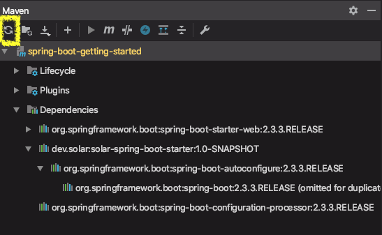
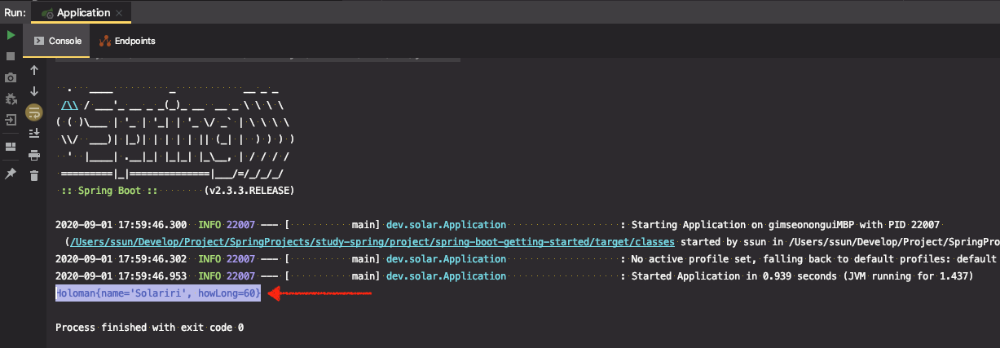

# 자동 설정 만들기 2부 : @ConfigurationProperties

* 덮어쓰기 방지하기
  * @ConditionalOnMissingBean
* 빈 재정의 수고 덜기
  * @ConfigurationProperties(“holoman”)
  * @EnableConfigurationProperties(HolomanProperties)
  * 프로퍼티 키값 자동 완성

```xml
<dependency>
	<groupId>org.springframework.boot</groupId>
	<artifactId>spring-boot-configuration-processor</artifactId>
	<optional>true</optional>
</dependency>
```


---

앞서 강의에서 발생했던 문제점을 해결해보자

### 자동 설정 파일 문제점

명시적으로 Holoman 빈을 등록하는 경우, 스프링부트 어플리케이션이 빈을 2단계로 등록하기 때문에,
먼저 `@ComponentScan`으로 우리가 작성한 빈등록 코드로 Holoman이 빈으로 등록된다. 그리고나서 `@EnableAutoConfiguration`로 읽어온 빈을 등록하려고 하기 때문에 (1)오버라이딩이 막혀있어 어플리케이션이 실행되지 않는다. (2)AutoConfiguration 설정으로 재정의 돼서 빈으로 등록되어 실행된다.


### 해결방법 1. @ComponentScan 이 무조건 우선시되도록 한다.

* (자동 설정을 구현한 프로젝트에서)

* 자동 설정 파일에 `@ConditionalOnMissingBean` 어노테이션 추가

`holoman` 빈이 존재하지 않는 경우에만 AutoConfiguration 설정에 따라 빈을 등록한다.

이미 ComponentScan으로 빈이 등록된 상황이라면 다시 빈을 만들지 않게 된다.

```java
@Configuration
public class HolomanConfiguration {

    @Bean
    @ConditionalOnMissingBean // <-- 어노테이션 추가
    public Holoman holoman() {
        Holoman holoman = new Holoman();
        holoman.setHowLong(5);
        holoman.setName("Solar");
        return holoman;
    }
}
```

위와 같이 코드를 수정 후, build → install (CLI : mvn install)


* ([spring-boot-getting-started] 프로젝트에서) 의존성 refresh



다시 실행해보면 명시적으로 등록한 빈의 설정값으로 잘 출력되는 것을 확인할 수 있다.




⇒ 스프링부트가 제공하는 여러가지 기본 설정(기능)들을 커스터마이징할 수 있는 기본 방법 중 하나이다.


### 해결방법 2. 내가 굳이 `빈을 등록하는 코드`까지 써야할까? 빈의 설정 값만 변경하고 싶다.

빈을 재정의하는 수고를 덜어보자

##### 빈 자동 설정 시, `application.properties` 파일에서 속성값을 읽어와 빈을 생성하도록 코드를 수정

* (자동 설정을 구현한 프로젝트에서)

[src] > [main] > [java] > [resources] > `application.properties` 파일 생성

```properties
holoman.name = solarccc
holoman.how-long = 55
```

( * howLong 변수 명은 동일하게 camel case로 작성해도 되고, dash(-)를 써도 된다. )


* `properties` 를 쓰려면 별도로 정의를 해줘야 한다.

(1) HolomanProperties.java 파일 생성

`@ConfigurationProperties("prefix")` 어노테이션 추가 - prefix에 사용할 이름을 적어준다.

```java
package dev.solar;

import org.springframework.boot.context.properties.ConfigurationProperties;

@ConfigurationProperties("holoman")
public class HolomanProperties {

    private String namek;

    private int howLong;

    public String getNamek() {
        return namek;
    }

    public void setNamek(String namek) {
        this.namek = namek;
    }

    public int getHowLong() {
        return howLong;
    }

    public void setHowLong(int howLong) {
        this.howLong = howLong;
    }
}
```


(2) 의존성 추가

```xml
<dependency>
    <groupId>org.springframework.boot</groupId>
    <artifactId>spring-boot-configuration-processor</artifactId>
    <optional>true</optional>
</dependency>
```

( → 여기까지해서 오류메시지가 나옴. @EnableConfigurationProperties 설정을 해주면 사라진다. )


(3) 설정한 properties 값을 사용하도록 HolomanConfiguration 클래스 편집

* `@EnableConfigurationProperties(HolomanProperties.class)` 어노테이션 추가

* 빈 주입 받음
* 속성값을 HolomanProperties.class 로 부터 가져와서 사용

```java
@Configuration
@EnableConfigurationProperties(HolomanProperties.class) //HolomanProperties 를 사용하겠다고 선언
public class HolomanConfiguration {

    @Bean
    @ConditionalOnMissingBean
    public Holoman holoman(HolomanProperties properties) { //HolomanProperties 빈을 주입받음
        Holoman holoman = new Holoman();
       // Before
       // holoman.setHowLong(5);
       // holoman.setName("Solar");
       // After
        holoman.setHowLong(properties.getHowLong());
        holoman.setName(properties.getName());
        return holoman;
    }
}
```

위와 같이 코드를 수정 후, build → install (CLI : mvn install)


##### 자동 설정을 properties를 이용해 다른 프로젝트에서 사용

* ([spring-boot-getting-started] 프로젝트에서) 의존성 refresh

[src] > [main] > [java] > [resources] > `application.properties` 파일 생성

```properties
holoman.name = solarcc
holoman.how-long = 999
```


```java
@SpringBootApplication
public class Application {

    public static void main(String[] args) {
        SpringApplication application = new SpringApplication(Application.class);
        application.setWebApplicationType(WebApplicationType.NONE); //좀 더 빨리 실행되도록 타입 변경
        application.run(args);
    }

  // Holoman 빈을 정의하는 코드를 삭제
//    @Bean
//    public Holoman holoman() {
//        Holoman holoman = new Holoman();
//        holoman.setName("Solariri");
//        holoman.setHowLong(60);
//        return holoman;
//    }
}
```

실행결과

```
Holoman{name='solarcc', howLong=999}
```


 ⇒  빈을 재정의하지 않고, `application.properties` 의 값을 변경하는 것만으로 설정 값을 바꿀 수 있다.


@Conditional..xxx 어노테이션이 다양하다.

이름으로 어떤 상황에 쓰이는 빈인지 추측할 수 있다. 이를 통해 AutoConfiguration 설정을 읽을 수 있으므로, AutoConfiguration의 Properties를 읽으면 어떻게 커스터마이징할 수 있을지 감을 잡을 수 있다. → 3부 활용 파트에서

